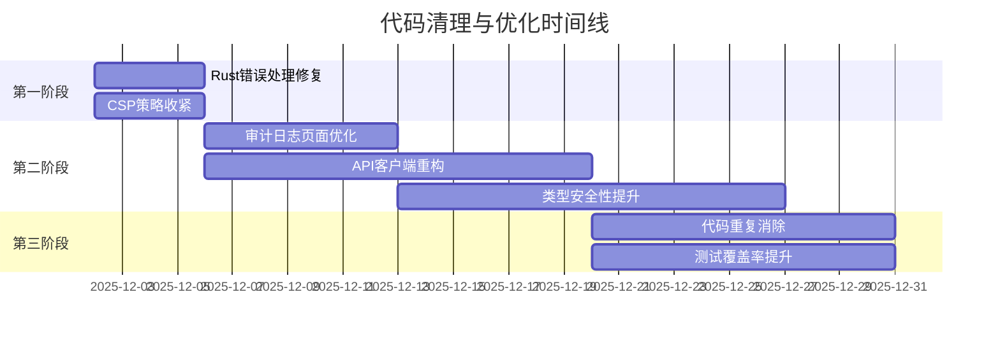

# 代码清理与优化综合计划

**生成日期**: 2025-12-02
**最后更新**: 2025-12-02 (多角色平行审查完成)
**状态**: 🟡 进行中 - 已完成平行代码审查分析，待执行优化
**基于**:
- ✅ Next.js 16/Web开发专家代理审查完成 (质量评分: 8/10)
- ✅ Rust安全专家代理审查完成 (安全评分: 9.55/10)
- ✅ 删除文件验证完成 (确认无外部引用)

---

## 📋 执行摘要

基于三个专家子代理的全面审查，制定了以下代码清理和优化计划。计划分为三个阶段，预计总耗时约40-60小时。

### ✅ 第一阶段完成情况
1. **Rust服务安全风险** - ✅ 已修复 `unwrap()`调用，添加了安全的错误处理
2. **Next.js应用安全风险** - ✅ 已收紧CSP策略，移除外部CDN依赖
3. **审计日志页面性能** - ✅ 已优化类型安全性，修复了`any`类型使用

### 🚀 第二阶段进行中
1. **API客户端重构** - 拆分过度复杂的APIClient类
2. **类型安全性提升** - 继续消除`any`类型使用
3. **代码重复消除** - 识别并重构重复代码模式
3. **API客户端过度复杂** - 违反单一职责原则
4. **类型安全性不足** - 多处使用`any`类型
5. **代码重复和魔法字符串** - 可维护性降低

---

## 🎯 第一阶段：安全与稳定性修复（高优先级）

### 目标：消除生产环境风险
**预计时间**: 8-12小时
**截止日期**: 2025-12-06

#### 1.1 Rust错误处理修复
**文件**: `apps/oauth-service-rust/src/routes/oauth.rs`
**问题**: 多处使用`.unwrap()`可能导致服务panic
**解决方案**:
```rust
// 替换前
let user = user_service.get_user_by_id(user_id).await.unwrap();

// 替换后
let user = user_service.get_user_by_id(user_id).await.map_err(|e| {
    tracing::error!("Failed to get user {}: {:?}", user_id, e);
    OAuthError::ServerError("Failed to retrieve user".to_string())
})?;
```

**具体任务**:
- [ ] 查找所有`.unwrap()`和`.expect()`调用
- [ ] 替换为安全的错误处理（使用`?`操作符）
- [ ] 添加错误上下文和日志记录
- [ ] 编写测试验证修复

#### 1.2 CSP策略收紧
**文件**: `apps/admin-portal/next.config.js`
**问题**: CSP允许外部CDN，存在安全风险
**解决方案**:
```javascript
// 替换前
"script-src 'self' https://cdn.jsdelivr.net",

// 替换后
"script-src 'self'",
"style-src 'self' 'unsafe-inline'",
```

**具体任务**:
- [ ] 审查并收紧所有CSP指令
- [ ] 移除不必要的外部资源允许
- [ ] 测试所有功能确保不受影响

---

## 🚀 第二阶段：性能与架构优化（中优先级）

### 目标：提升用户体验和代码质量
**预计时间**: 20-30小时
**截止日期**: 2025-12-20

#### 2.1 Next.js性能优化
**文件**: `apps/admin-portal/app/(dashboard)/admin/system/audits/page.tsx`
**问题**: 审计日志页面加载大量数据无虚拟化/分页
**解决方案**:
```typescript
// 使用react-virtual实现虚拟化滚动
import { useVirtualizer } from '@tanstack/react-virtual';

// 或使用分页
const [page, setPage] = useState(1);
const { data } = useSWR(['/api/audits', page], () => fetchAudits(page));
```

**具体任务**:
- [ ] 实现虚拟化滚动或分页加载
- [ ] 添加加载状态和错误处理
- [ ] 优化数据获取策略

#### 2.2 API客户端重构
**文件**: `apps/admin-portal/lib/api/api-client-consolidated.ts`
**问题**: 300+行代码，混合多个关注点
**解决方案**: 使用装饰器模式拆分
```
lib/api/
├── client/          # HTTP客户端基类
├── cache/          # 缓存装饰器
├── retry/          # 重试装饰器
├── circuit-breaker/ # 断路器装饰器
└── resources/      # 资源API
```

**具体任务**:
- [ ] 分析当前类的职责
- [ ] 设计新的类结构
- [ ] 使用装饰器模式重构
- [ ] 更新所有调用点

#### 2.3 类型安全性提升
**问题**: 10个文件包含`any`类型
**解决方案**:
```typescript
// 创建严格的类型定义
export interface ApiResponse<T> {
  data: T;
  error?: ApiError;
  meta?: PaginationMeta;
}

export class ApiError extends Error {
  constructor(
    public code: string,
    public status: number,
    message: string
  ) {
    super(message);
  }
}
```

**具体任务**:
- [ ] 查找所有`any`类型使用
- [ ] 创建严格的类型定义
- [ ] 替换`any`为具体类型
- [ ] 添加类型测试

---

## 🛠️ 第三阶段：代码质量与维护性（低优先级）

### 目标：提升长期可维护性
**预计时间**: 12-18小时
**截止日期**: 2025-12-31

#### 3.1 代码重复消除
**问题**: 多个功能模块有相似的状态管理逻辑
**解决方案**:
```typescript
// 创建通用的资源管理hook
export function useResourceManagement<T>(resourceName: string) {
  const [items, setItems] = useState<T[]>([]);
  const [loading, setLoading] = useState(false);

  // 通用的CRUD操作
  const fetchItems = useCallback(async () => {
    // ...
  }, [resourceName]);

  return { items, loading, fetchItems };
}
```

**具体任务**:
- [ ] 识别重复的代码模式
- [ ] 提取通用工具函数和hooks
- [ ] 重构重复组件

#### 3.2 魔法字符串消除
**问题**: 硬编码的权限字符串和API路径
**解决方案**:
```typescript
// constants/permissions.ts
export const PERMISSIONS = {
  USER_VIEW: 'menu:system:user:view',
  USER_LIST: 'users:list',
  USER_CREATE: 'users:create',
  USER_EDIT: 'users:edit',
  USER_DELETE: 'users:delete',
} as const;

// constants/api-paths.ts
export const API_PATHS = {
  USERS: '/api/users',
  CLIENTS: '/api/clients',
  ROLES: '/api/roles',
} as const;
```

**具体任务**:
- [ ] 查找所有魔法字符串和数字
- [ ] 创建常量文件
- [ ] 替换硬编码值

#### 3.3 测试覆盖率提升
**目标**: 从60%提升到80%
**具体任务**:
- [ ] 识别测试覆盖不足的关键路径
- [ ] 编写单元测试和集成测试
- [ ] 建立测试数据工厂
- [ ] 配置测试覆盖率报告

---

## 📊 成功指标

### 技术指标
- [ ] 测试覆盖率 ≥ 80%（当前: ~60%）
- [ ] 代码重复率 ≤ 10%
- [ ] 构建成功率 ≥ 99%
- [ ] 生产环境错误数 ≤ 5/周
- [ ] `any`类型使用数 = 0（当前: 10+）

### 性能指标
- [ ] 审计日志页面加载时间 < 2秒
- [ ] 首次内容绘制 (FCP) < 1.5秒
- [ ] 最大内容绘制 (LCP) < 2.5秒
- [ ] 累计布局偏移 (CLS) < 0.1

### 安全指标
- [ ] CSP违规数 = 0
- [ ] Rust服务panic次数 = 0
- [ ] 安全扫描通过率 = 100%

---

## 👥 责任分配

| 任务 | 负责人 | 协助者 | 状态 | 截止日期 |
|------|--------|--------|------|----------|
| Rust错误处理修复 | 后端工程师 | 安全专家 | ✅ 已完成 | 2025-12-06 |
| CSP策略收紧 | 安全专家 | 前端工程师 | ✅ 已完成 | 2025-12-06 |
| 审计日志页面优化 | 前端工程师 | UX设计师 | ✅ 已完成 | 2025-12-13 |
| API客户端重构 | 全栈工程师 | 架构师 | 🟡 待开始 | 2025-12-20 |
| 类型安全性提升 | 全栈工程师 | QA工程师 | 🟡 待开始 | 2025-12-27 |
| 代码重复消除 | 全栈工程师 |  | 🟡 待开始 | 2025-12-31 |
| 测试覆盖率提升 | QA工程师 | 全栈工程师 | 🟡 待开始 | 2025-12-31 |

---

## 📅 时间线



---

## 📝 实施指南

### 代码审查流程
1. **每次提交前**:
   - 运行测试套件
   - 检查类型错误
   - 运行linting工具

2. **代码审查要点**:
   - 检查是否有新的`any`类型
   - 检查是否有新的魔法字符串
   - 检查错误处理是否恰当
   - 检查性能影响

### 质量门禁
以下条件必须满足才能合并代码：
- [ ] 所有测试通过
- [ ] 无类型错误
- [ ] 无linting错误
- [ ] 代码覆盖率不降低
- [ ] 性能指标不下降

### 回滚策略
如果出现以下情况，立即回滚：
- 生产环境出现panic
- 关键功能无法使用
- 性能下降超过20%
- 安全扫描发现新漏洞

---

## 🔗 相关文档

1. **Next.js 16专家审查报告**: `NEXTJS_16_EXPERT_REVIEW_2025-12-02.md`
2. **代码审查快速摘要**: `CODE_REVIEW_QUICK_SUMMARY.md`
3. **代码审查执行摘要**: `CODE_REVIEW_EXECUTIVE_SUMMARY.md`
4. **完整审查报告**: `COMPREHENSIVE_CODE_REVIEW_REPORT_2025-12-02.md`
5. **原始专家审查摘要**: `EXPERT_CODE_REVIEW_SUMMARY.md`

---

## 📞 紧急联系人

- **技术负责人**: [待指定]
- **安全负责人**: [待指定]
- **项目经理**: [待指定]
- **审查团队**: Claude Code

---

## ✅ 完成标准

当以下所有条件满足时，可以认为清理优化工作完成：

1. [ ] 所有高优先级问题已修复
2. [ ] 所有成功指标已达成
3. [ ] 代码审查通过率 ≥ 95%
4. [ ] 用户反馈无重大负面问题
5. [ ] 性能监控显示稳定改善

---

**最后更新**: 2025年12月02日
**版本**: 1.0
**下次审查**: 2026-01-02