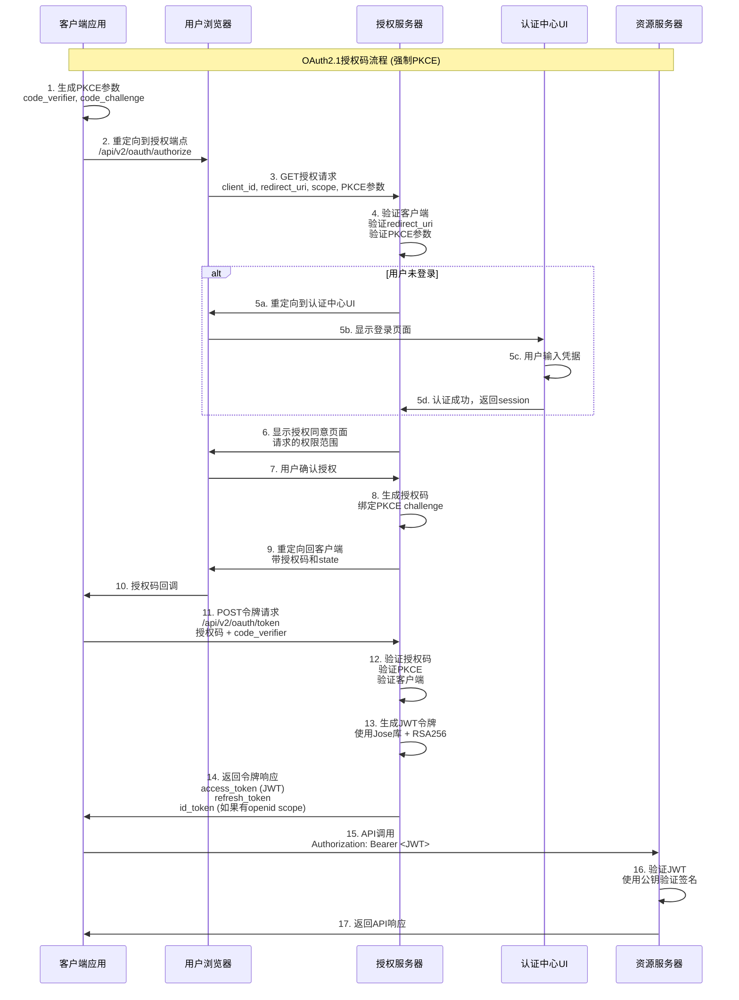

# JWT认证授权使用说明文档

**文档版本**: v3.0  
**创建日期**: 2024-01-15  
**最后更新**: 2024-12-21  
**文档状态**: 正式版  
**维护团队**: 认证授权团队  

**文档摘要**: 本文档详细说明了OAuth2.1认证授权中心中如何获取、验证和使用JWT令牌。本系统严格遵循OAuth2.1标准，**绝对没有独立的login端点**，所有认证操作必须通过标准的OAuth2.1授权码流程完成。

**🚨 重要声明**: 
- ❌ **本系统绝对不提供** `/api/v2/auth/login` 端点
- ❌ **完全不支持直接用户名/密码认证API**
- ❌ **绝不使用jsonwebtoken库** 
- ✅ **100%只支持OAuth2.1授权码流程**
- ✅ **强制使用PKCE安全机制 (S256)**
- ✅ **100%使用Jose库 (v6.0.11) 处理JWT**
- ✅ **固定使用RSA256签名算法**

**技术栈确认**:
```json
{
  "JWT处理库": "jose@6.0.11",
  "签名算法": "RS256",
  "认证流程": "OAuth2.1 + 强制PKCE",
  "令牌格式": "JWT (自包含)",
  "框架": "Next.js 15",
  "数据库": "Prisma + SQLite/PostgreSQL",
  "jsonwebtoken": "绝对不使用"
}
```

## 目录

1. [系统认证架构](#1-系统认证架构)
2. [Jose库技术规范](#2-jose库技术规范)
3. [OAuth2.1授权码流程](#3-oauth21授权码流程)
4. [客户端凭证模式](#4-客户端凭证模式)
5. [JWT令牌结构与验证](#5-jwt令牌结构与验证)
6. [OIDC集成](#6-oidc集成)
7. [API调用示例](#7-api调用示例)
8. [错误处理指南](#8-错误处理指南)
9. [安全最佳实践](#9-安全最佳实践)

## 1. 系统认证架构

### 1.1 去中心化认证设计

本OAuth2.1认证授权中心采用**去中心化认证设计**，不依赖传统的login端点：

**核心理念**:
- 🔒 **无直接登录接口**: 系统内不存在 `/api/v2/auth/login` 端点
- 🔄 **标准OAuth2.1流程**: 所有认证通过授权码流程完成  
- 🛡️ **强制PKCE保护**: 所有客户端必须使用PKCE (S256)
- 🔑 **Jose库处理**: 100%使用Jose库处理所有JWT操作

### 1.2 认证流程架构图



### 1.3 端点概览

| 端点 | 功能 | 状态 | 说明 |
|------|------|------|------|
| `/api/v2/oauth/authorize` | 授权端点 | ✅ **必须使用** | 启动OAuth2.1流程 |
| `/api/v2/oauth/token` | 令牌端点 | ✅ **必须使用** | 交换授权码获取JWT |
| `/api/v2/oauth/userinfo` | 用户信息端点 | ✅ 可选使用 | 获取用户详细信息 |
| `/.well-known/jwks.json` | 公钥端点 | ✅ **验证必需** | JWT签名验证 |
| `/.well-known/openid-configuration` | OIDC配置 | ✅ 发现服务 | 自动发现端点 |
| `/api/v2/auth/login` | 直接登录 | ❌ **不存在** | 系统不提供此端点 |

## 2. Jose库技术规范

### 2.1 Jose vs jsonwebtoken 对比

本系统选择 **Jose (v6.0.11)** 作为JWT处理的核心库：

| 特性对比 | Jose | jsonwebtoken |
|----------|------|--------------|
| **Web标准兼容性** | ✅ RFC 7515-7519完全兼容 | ❌ 部分兼容 |
| **TypeScript支持** | ✅ 原生TypeScript | ⚠️ 需要@types包 |
| **异步操作** | ✅ Promise/async-await | ❌ 只支持回调 |
| **性能优化** | ✅ 现代算法实现 | ⚠️ 性能较低 |
| **安全性** | ✅ 内置安全防护 | ⚠️ 需手动处理 |
| **错误处理** | ✅ 详细错误类型 | ⚠️ 通用错误 |
| **维护状态** | ✅ 活跃维护 | ⚠️ 维护减少 |
| **包大小** | ✅ 较小 | ⚠️ 较大 |

### 2.2 Jose核心API使用

#### 2.2.1 JWT签名 (创建令牌)

```typescript
import * as jose from 'jose';

// 1. 导入RSA私钥
const privateKey = await jose.importPKCS8(
  process.env.JWT_PRIVATE_KEY_PEM,
  'RS256'
);

// 2. 创建JWT访问令牌
const jwt = await new jose.SignJWT({
  // 标准声明
  sub: 'user_123',                    // Subject (用户ID)
  aud: 'api_resource',                // Audience (API资源)
  iss: 'https://auth.company.com',    // Issuer (签发者)
  jti: crypto.randomUUID(),           // JWT ID (唯一标识)
  
  // OAuth2特定声明
  client_id: 'example_client',        // 客户端ID
  scope: 'openid profile api:read',   // 权限范围
  
  // 扩展声明
  permissions: ['user:read', 'api:access'],  // 具体权限
  user_type: 'admin',                        // 用户类型
})
  .setProtectedHeader({ 
    alg: 'RS256',              // 签名算法
    kid: 'key-2024-01',        // 密钥ID
    typ: 'JWT'                 // 令牌类型
  })
  .setIssuedAt()               // 签发时间 (iat)
  .setExpirationTime('1h')     // 过期时间 (exp)
  .sign(privateKey);

console.log('生成的JWT:', jwt);
```

#### 2.2.2 JWT验证

```typescript
import * as jose from 'jose';

// 使用JWKS端点验证 (推荐方式)
const JWKS = jose.createRemoteJWKSet(
  new URL('https://auth.company.com/.well-known/jwks.json')
);

try {
  const { payload, protectedHeader } = await jose.jwtVerify(jwt, JWKS, {
    // 必需验证项
    issuer: 'https://auth.company.com',     // 验证签发者
    audience: 'api_resource',               // 验证受众
    algorithms: ['RS256'],                  // 允许的算法
    
    // 可选验证项
    clockTolerance: '30s',                  // 时钟偏差容忍
    maxTokenAge: '1h',                      // 最大令牌年龄
  });
  
  // 验证成功，访问声明
  console.log('✅ JWT验证成功');
  console.log('用户ID:', payload.sub);
  console.log('客户端ID:', payload.client_id);
  console.log('权限范围:', payload.scope);
  console.log('具体权限:', payload.permissions);
  console.log('过期时间:', new Date(payload.exp * 1000));
  
} catch (error) {
  console.error('❌ JWT验证失败:');
  
  if (error instanceof jose.errors.JWTExpired) {
    console.error('令牌已过期');
  } else if (error instanceof jose.errors.JWTClaimValidationFailed) {
    console.error(`声明验证失败: ${error.claim} - ${error.reason}`);
  } else if (error instanceof jose.errors.JWSSignatureVerificationFailed) {
    console.error('签名验证失败 - 令牌可能被篡改');
  } else if (error instanceof jose.errors.JWKInvalid) {
    console.error('密钥无效');
  } else if (error instanceof jose.errors.JOSENotSupported) {
    console.error('不支持的JOSE操作');
  } else {
    console.error('其他验证错误:', error.message);
  }
  
  throw error;
}
```

#### 2.2.3 本地密钥验证 (备选方案)

```typescript
// 使用本地公钥验证 (仅在无法访问JWKS时使用)
const publicKey = await jose.importSPKI(
  process.env.JWT_PUBLIC_KEY_PEM,
  'RS256'
);

const { payload } = await jose.jwtVerify(jwt, publicKey, {
  issuer: 'https://auth.company.com',
  audience: 'api_resource',
});
```

### 2.3 系统JWTUtils实现

我们的系统使用统一的 `JWTUtils` 类处理所有JWT操作：

```typescript
// lib/auth/oauth2.ts 中的实际实现
export class JWTUtils {
  /**
   * 创建访问令牌
   * 使用Jose库 + RSA256签名
   */
  static async createAccessToken(tokenData: {
    client_id: string;
    user_id?: string;
    scope?: string;  
    permissions?: string[];
    expiresIn?: string;
  }): Promise<string> {
    const algorithm = 'RS256';  // 固定使用RSA256
    const keyId = process.env.JWT_KEY_ID || 'default-kid';

    const jwtPayload: jose.JWTPayload = {
      // OAuth2标准声明
      client_id: tokenData.client_id,
      sub: tokenData.user_id || tokenData.client_id,
      aud: this.getAudience(),
      iss: this.getIssuer(),  
      jti: crypto.randomUUID(),
      iat: Math.floor(Date.now() / 1000),
      
      // 权限相关
      scope: tokenData.scope,
      permissions: tokenData.permissions || [],
    };

    return await new jose.SignJWT(jwtPayload)
      .setProtectedHeader({ alg: algorithm, kid: keyId })
      .setExpirationTime(tokenData.expiresIn || '1h')
      .sign(await this.getRSAPrivateKeyForSigning());
  }

  /**
   * 验证访问令牌  
   * 使用JWKS端点进行验证
   */
  static async verifyAccessToken(token: string): Promise<{
    valid: boolean;
    payload?: jose.JWTPayload;
    error?: string;
  }> {
    try {
      const jwksUri = process.env.JWKS_URI;
      if (!jwksUri) {
        throw new Error('JWKS_URI not configured');
      }

      const JWKS = jose.createRemoteJWKSet(new URL(jwksUri));
      
      const { payload } = await jose.jwtVerify(token, JWKS, {
        issuer: this.getIssuer(),
        audience: this.getAudience(),
        algorithms: ['RS256'],
      });

      return { valid: true, payload };
      
    } catch (error) {
      return { 
        valid: false, 
        error: error instanceof jose.errors.JWTExpired ? 'Token expired' : error.message
      };
    }
  }

  /**
   * 获取RSA私钥用于签名
   */
  private static async getRSAPrivateKeyForSigning(): Promise<jose.KeyLike> {
    const privateKeyPem = process.env.JWT_PRIVATE_KEY_PEM;
    if (!privateKeyPem) {
      throw new Error('JWT_PRIVATE_KEY_PEM not configured');
    }
    
    return await jose.importPKCS8(privateKeyPem, 'RS256');
  }
}
```

## 3. OAuth2.1授权码流程

### 3.1 完整流程图


### 3.2 步骤详解

#### 步骤1: 生成PKCE参数
```typescript
// 客户端生成PKCE参数
function generatePKCEParams(): {
  codeVerifier: string;
  codeChallenge: string;
  codeChallengeMethod: 'S256';
} {
  // 生成43-128字符的随机字符串
  const codeVerifier = crypto.randomBytes(32).toString('base64url');
  
  // 生成SHA256哈希并Base64URL编码
  const codeChallenge = crypto
    .createHash('sha256')
    .update(codeVerifier)
    .digest('base64url');
  
  return {
    codeVerifier,
    codeChallenge,
    codeChallengeMethod: 'S256'
  };
}

// 使用示例
const pkceParams = generatePKCEParams();
// 存储codeVerifier，将在步骤11中使用
sessionStorage.setItem('code_verifier', pkceParams.codeVerifier);
```

#### 步骤2-3: 构建授权URL并重定向
```typescript
// 构建授权URL
function buildAuthorizationUrl(config: {
  clientId: string;
  redirectUri: string;
  scope: string;
  state?: string;
}): string {
  const pkceParams = generatePKCEParams();
  const state = config.state || crypto.randomBytes(16).toString('base64url');
  
  // 存储PKCE和state参数
  sessionStorage.setItem('code_verifier', pkceParams.codeVerifier);
  sessionStorage.setItem('oauth_state', state);
  
  const authUrl = new URL('/api/v2/oauth/authorize', 'https://auth.company.com');
  authUrl.searchParams.set('response_type', 'code');
  authUrl.searchParams.set('client_id', config.clientId);
  authUrl.searchParams.set('redirect_uri', config.redirectUri);
  authUrl.searchParams.set('scope', config.scope);
  authUrl.searchParams.set('state', state);
  authUrl.searchParams.set('code_challenge', pkceParams.codeChallenge);
  authUrl.searchParams.set('code_challenge_method', 'S256');
  
  return authUrl.toString();
}

// 重定向用户到授权页面
const authUrl = buildAuthorizationUrl({
  clientId: 'your_client_id',
  redirectUri: 'https://yourapp.com/callback',
  scope: 'openid profile api:read',
  state: 'random_state_value'
});

// 重定向到授权服务器
window.location.href = authUrl;
```

#### 步骤4-10: 服务器端处理（授权服务器）
```typescript
// 授权端点处理逻辑 (简化版)
export async function GET(request: NextRequest) {
  const url = new URL(request.url);
  const params = {
    client_id: url.searchParams.get('client_id'),
    redirect_uri: url.searchParams.get('redirect_uri'),
    response_type: url.searchParams.get('response_type'),
    scope: url.searchParams.get('scope'),
    state: url.searchParams.get('state'),
    code_challenge: url.searchParams.get('code_challenge'),
    code_challenge_method: url.searchParams.get('code_challenge_method'),
  };
  
  // 1. 验证客户端
  const client = await validateClient(params.client_id);
  if (!client) {
    return redirectWithError(params.redirect_uri, 'invalid_client', params.state);
  }
  
  // 2. 验证redirect_uri
  if (!validateRedirectUri(params.redirect_uri, client.redirectUris)) {
    return new Response('Invalid redirect_uri', { status: 400 });
  }
  
  // 3. 验证PKCE参数
  if (!params.code_challenge || params.code_challenge_method !== 'S256') {
    return redirectWithError(params.redirect_uri, 'invalid_request', params.state, 'PKCE required');
  }
  
  // 4. 检查用户认证
  const user = await getCurrentUser(request);
  if (!user) {
    // 重定向到认证中心登录页面
    return redirectToLogin(request.url);
  }
  
  // 5. 检查用户同意
  const hasConsent = await checkUserConsent(user.id, client.id, params.scope);
  if (!hasConsent) {
    // 重定向到同意页面
    return redirectToConsent(params);
  }
  
  // 6. 生成授权码
  const authCode = await createAuthorizationCode({
    userId: user.id,
    clientId: client.id,
    scope: params.scope,
    codeChallenge: params.code_challenge,
    redirectUri: params.redirect_uri,
  });
  
  // 7. 重定向回客户端
  const callbackUrl = new URL(params.redirect_uri);
  callbackUrl.searchParams.set('code', authCode);
  if (params.state) {
    callbackUrl.searchParams.set('state', params.state);
  }
  
  return NextResponse.redirect(callbackUrl.toString());
}
```

#### 步骤11-14: 令牌交换
```typescript
// 客户端: 处理授权码回调
async function handleAuthorizationCallback(callbackUrl: string): Promise<TokenResponse> {
  const url = new URL(callbackUrl);
  const code = url.searchParams.get('code');
  const state = url.searchParams.get('state');
  const error = url.searchParams.get('error');
  
  // 检查错误
  if (error) {
    throw new Error(`Authorization failed: ${error}`);
  }
  
  // 验证state参数
  const storedState = sessionStorage.getItem('oauth_state');
  if (state !== storedState) {
    throw new Error('Invalid state parameter - possible CSRF attack');
  }
  
  // 获取存储的code_verifier
  const codeVerifier = sessionStorage.getItem('code_verifier');
  if (!codeVerifier) {
    throw new Error('Missing code_verifier');
  }
  
  // 交换授权码获取令牌
  const tokenResponse = await fetch('/api/v2/oauth/token', {
    method: 'POST',
    headers: {
      'Content-Type': 'application/x-www-form-urlencoded',
    },
    body: new URLSearchParams({
      grant_type: 'authorization_code',
      code: code,
      redirect_uri: 'https://yourapp.com/callback',
      client_id: 'your_client_id',
      code_verifier: codeVerifier
    })
  });
  
  if (!tokenResponse.ok) {
    const errorData = await tokenResponse.json();
    throw new Error(`Token exchange failed: ${errorData.error_description}`);
  }
  
  const tokens = await tokenResponse.json();
  
  // 清理临时存储
  sessionStorage.removeItem('code_verifier');
  sessionStorage.removeItem('oauth_state');
  
  return tokens;
}

// 令牌响应格式
interface TokenResponse {
  access_token: string;    // JWT格式的访问令牌
  token_type: 'Bearer';    // 固定值
  expires_in: number;      // 过期时间（秒）
  refresh_token: string;   // JWT格式的刷新令牌
  scope?: string;          // 实际授予的权限范围
  id_token?: string;       // OIDC ID令牌（如果有openid scope）
}
```

## 4. 客户端凭证模式

### 4.1 适用场景

客户端凭证模式适用于：
- 服务器到服务器的通信
- 后台任务和定时任务
- 微服务间的认证

### 4.2 获取令牌

```javascript
const tokenResponse = await fetch('/api/v2/oauth/token', {
    method: 'POST',
    headers: {
        'Content-Type': 'application/x-www-form-urlencoded',
        'Authorization': `Basic ${btoa(`${clientId}:${clientSecret}`)}`
    },
    body: new URLSearchParams({
        grant_type: 'client_credentials',
        scope: 'api:read api:write'
    })
});

const tokens = await tokenResponse.json();
```

## 5. JWT令牌结构与验证

### 5.1 JWT结构

JWT (JSON Web Token) 由三部分组成，用点号分隔：
```
header.payload.signature
```

- **Header**: 包含令牌类型和签名算法
- **Payload**: 包含声明信息（用户信息、权限等）
- **Signature**: 用于验证令牌完整性的签名

### 5.2 JWT类型

本系统支持三种JWT令牌：

- **Access Token**: 用于API访问的短期令牌（默认1小时）
- **Refresh Token**: 用于刷新访问令牌的长期令牌（默认30天）
- **ID Token**: 用于OIDC身份信息的令牌（默认1小时）

## 6. OIDC集成

### 6.1 获取公钥

```javascript
// 获取JWKS (JSON Web Key Set)
const jwksResponse = await fetch('/.well-known/jwks.json');
const jwks = await jwksResponse.json();

// 或者获取OpenID配置
const configResponse = await fetch('/.well-known/openid-configuration');
const config = await configResponse.json();
const jwksUri = config.jwks_uri;
```

### 6.2 验证JWT签名

```javascript
import * as jose from 'jose';

// 解析JWT头部获取kid
const protectedHeader = jose.decodeProtectedHeader(jwt);
const kid = protectedHeader.kid;

// 从JWKS中找到对应的公钥
const jwk = jwks.keys.find(key => key.kid === kid);
if (!jwk) {
    throw new Error('Public key not found');
}

// 导入公钥并验证JWT
const publicKey = await jose.importJWK(jwk, protectedHeader.alg);
const { payload } = await jose.jwtVerify(jwt, publicKey, {
    issuer: 'https://auth.company.com',
    audience: 'your_client_id'
});
```

## 7. API调用示例

### 7.1 使用Access Token调用API

```javascript
// 在请求头中包含JWT
const apiResponse = await fetch('/api/v2/users', {
    headers: {
        'Authorization': `Bearer ${accessToken}`,
        'Content-Type': 'application/json'
    }
});

if (apiResponse.status === 401) {
    // 令牌过期，使用refresh token刷新
    const refreshResponse = await fetch('/api/v2/oauth/token', {
        method: 'POST',
        headers: {
            'Content-Type': 'application/x-www-form-urlencoded',
        },
        body: new URLSearchParams({
            grant_type: 'refresh_token',
            refresh_token: refreshToken,
            client_id: clientId
        })
    });
    
    if (refreshResponse.ok) {
        const newTokens = await refreshResponse.json();
        // 更新令牌并重试请求
        accessToken = newTokens.access_token;
        refreshToken = newTokens.refresh_token;
        
        // 重试原始请求
        const retryResponse = await fetch('/api/v2/users', {
            headers: {
                'Authorization': `Bearer ${accessToken}`,
                'Content-Type': 'application/json'
            }
        });
        
        return await retryResponse.json();
    }
}

return await apiResponse.json();
```

### 7.2 自动令牌刷新封装

```javascript
class APIClient {
    constructor(baseURL, clientId, clientSecret) {
        this.baseURL = baseURL;
        this.clientId = clientId;
        this.clientSecret = clientSecret;
        this.accessToken = null;
        this.refreshToken = null;
    }
    
    async request(endpoint, options = {}) {
        const url = `${this.baseURL}${endpoint}`;
        const headers = {
            'Content-Type': 'application/json',
            ...options.headers
        };
        
        if (this.accessToken) {
            headers.Authorization = `Bearer ${this.accessToken}`;
        }
        
        let response = await fetch(url, {
            ...options,
            headers
        });
        
        // 如果令牌过期，尝试刷新
        if (response.status === 401 && this.refreshToken) {
            const refreshed = await this.refreshAccessToken();
            if (refreshed) {
                headers.Authorization = `Bearer ${this.accessToken}`;
                response = await fetch(url, {
                    ...options,
                    headers
                });
            }
        }
        
        if (!response.ok) {
            throw new Error(`API request failed: ${response.status}`);
        }
        
        return await response.json();
    }
    
    async refreshAccessToken() {
        try {
            const response = await fetch(`${this.baseURL}/api/v2/oauth/token`, {
                method: 'POST',
                headers: {
                    'Content-Type': 'application/x-www-form-urlencoded',
                },
                body: new URLSearchParams({
                    grant_type: 'refresh_token',
                    refresh_token: this.refreshToken,
                    client_id: this.clientId,
                    client_secret: this.clientSecret
                })
            });
            
            if (response.ok) {
                const tokens = await response.json();
                this.accessToken = tokens.access_token;
                this.refreshToken = tokens.refresh_token;
                return true;
            }
        } catch (error) {
            console.error('Token refresh failed:', error);
        }
        
        return false;
    }
}
```

## 8. 错误处理指南

### 8.1 常见错误类型

#### 8.1.1 Jose库错误
```javascript
import * as jose from 'jose';

try {
    const { payload } = await jose.jwtVerify(token, publicKey);
} catch (error) {
    if (error instanceof jose.errors.JWTExpired) {
        // 令牌过期
        console.log('Token expired');
    } else if (error instanceof jose.errors.JWTClaimValidationFailed) {
        // 声明验证失败
        console.log(`Claim validation failed: ${error.claim} - ${error.reason}`);
    } else if (error instanceof jose.errors.JWSSignatureVerificationFailed) {
        // 签名验证失败
        console.log('Signature verification failed');
    } else if (error instanceof jose.errors.JWSInvalid) {
        // JWT格式无效
        console.log('Invalid JWT format');
    }
}
```

#### 8.1.2 OAuth2.1错误
```javascript
// 授权端点错误
if (urlParams.get('error')) {
    const error = urlParams.get('error');
    const description = urlParams.get('error_description');
    
    switch (error) {
        case 'invalid_request':
            console.error('Invalid request parameters');
            break;
        case 'unauthorized_client':
            console.error('Client not authorized');
            break;
        case 'access_denied':
            console.error('User denied access');
            break;
        case 'unsupported_response_type':
            console.error('Unsupported response type');
            break;
        case 'invalid_scope':
            console.error('Invalid scope requested');
            break;
        case 'server_error':
            console.error('Server error occurred');
            break;
    }
}

// 令牌端点错误
const tokenResponse = await fetch('/api/v2/oauth/token', requestOptions);
if (!tokenResponse.ok) {
    const errorData = await tokenResponse.json();
    
    switch (errorData.error) {
        case 'invalid_request':
            console.error('Invalid token request');
            break;
        case 'invalid_client':
            console.error('Client authentication failed');
            break;
        case 'invalid_grant':
            console.error('Invalid authorization grant');
            break;
        case 'unauthorized_client':
            console.error('Client not authorized for this grant type');
            break;
        case 'unsupported_grant_type':
            console.error('Unsupported grant type');
            break;
        case 'invalid_scope':
            console.error('Invalid scope');
            break;
    }
}
```

### 8.2 错误处理最佳实践

```javascript
class TokenManager {
    constructor() {
        this.maxRetries = 3;
        this.retryDelay = 1000; // 1秒
    }
    
    async getValidToken() {
        for (let attempt = 1; attempt <= this.maxRetries; attempt++) {
            try {
                // 检查当前令牌是否有效
                if (this.accessToken && await this.isTokenValid(this.accessToken)) {
                    return this.accessToken;
                }
                
                // 尝试刷新令牌
                if (this.refreshToken) {
                    const newToken = await this.refreshAccessToken();
                    if (newToken) {
                        return newToken;
                    }
                }
                
                // 重新授权
                await this.initiateAuthFlow();
                return null;
                
            } catch (error) {
                console.error(`Token operation failed (attempt ${attempt}):`, error);
                
                if (attempt < this.maxRetries) {
                    await this.delay(this.retryDelay * attempt);
                } else {
                    throw new Error('Failed to obtain valid token after maximum retries');
                }
            }
        }
    }
    
    async isTokenValid(token) {
        try {
            // 这里应该调用实际的令牌验证逻辑
            const { payload } = jose.decodeJwt(token);
            return payload.exp > Date.now() / 1000;
        } catch {
            return false;
        }
    }
    
    delay(ms) {
        return new Promise(resolve => setTimeout(resolve, ms));
    }
}
```

## 9. 安全最佳实践

### 9.1 安全最佳实践

1. **使用HTTPS**: 始终在生产环境中使用HTTPS
2. **令牌存储**: 将敏感令牌存储在安全的地方（如HttpOnly cookie）
3. **令牌轮换**: 实现访问令牌的定期轮换
4. **范围限制**: 请求最小必要的权限范围
5. **过期时间**: 设置合理的令牌过期时间
6. **黑名单机制**: 实现令牌撤销和黑名单机制

### 9.2 性能最佳实践

1. **令牌缓存**: 在客户端适当缓存有效令牌
2. **批量验证**: 对于高频API调用，考虑批量验证机制
3. **异步处理**: 使用异步方式处理令牌操作
4. **连接池**: 复用HTTP连接以提高性能

### 9.3 代码示例：完整的OAuth2.1客户端

```javascript
import * as jose from 'jose';

class OAuth2Client {
    constructor(config) {
        this.config = config;
        this.accessToken = null;
        this.refreshToken = null;
        this.publicKey = null;
    }
    
    async initialize() {
        // 获取公钥用于令牌验证
        await this.loadPublicKey();
    }
    
    async loadPublicKey() {
        const jwksResponse = await fetch(`${this.config.issuer}/.well-known/jwks.json`);
        const jwks = await jwksResponse.json();
        const jwk = jwks.keys[0]; // 简化示例，实际应根据kid选择
        this.publicKey = await jose.importJWK(jwk, 'RS256');
    }
    
    generateAuthUrl() {
        const codeVerifier = this.generateCodeVerifier();
        const codeChallenge = await this.generateCodeChallenge(codeVerifier);
        const state = this.generateState();
        
        // 存储PKCE参数
        sessionStorage.setItem('code_verifier', codeVerifier);
        sessionStorage.setItem('oauth_state', state);
        
        const authUrl = new URL(`${this.config.issuer}/api/v2/oauth/authorize`);
        authUrl.searchParams.set('response_type', 'code');
        authUrl.searchParams.set('client_id', this.config.clientId);
        authUrl.searchParams.set('redirect_uri', this.config.redirectUri);
        authUrl.searchParams.set('scope', this.config.scope);
        authUrl.searchParams.set('state', state);
        authUrl.searchParams.set('code_challenge', codeChallenge);
        authUrl.searchParams.set('code_challenge_method', 'S256');
        
        return authUrl.toString();
    }
    
    async handleCallback(callbackParams) {
        const { code, state } = callbackParams;
        const storedState = sessionStorage.getItem('oauth_state');
        const codeVerifier = sessionStorage.getItem('code_verifier');
        
        // 验证state参数
        if (state !== storedState) {
            throw new Error('Invalid state parameter');
        }
        
        // 交换访问令牌
        const tokenResponse = await fetch(`${this.config.issuer}/api/v2/oauth/token`, {
            method: 'POST',
            headers: {
                'Content-Type': 'application/x-www-form-urlencoded',
            },
            body: new URLSearchParams({
                grant_type: 'authorization_code',
                code: code,
                redirect_uri: this.config.redirectUri,
                client_id: this.config.clientId,
                code_verifier: codeVerifier
            })
        });
        
        if (!tokenResponse.ok) {
            throw new Error('Token exchange failed');
        }
        
        const tokens = await tokenResponse.json();
        this.accessToken = tokens.access_token;
        this.refreshToken = tokens.refresh_token;
        
        // 清理临时存储
        sessionStorage.removeItem('code_verifier');
        sessionStorage.removeItem('oauth_state');
        
        return tokens;
    }
    
    async apiRequest(endpoint, options = {}) {
        const token = await this.getValidToken();
        
        const response = await fetch(`${this.config.apiBaseUrl}${endpoint}`, {
            ...options,
            headers: {
                'Authorization': `Bearer ${token}`,
                'Content-Type': 'application/json',
                ...options.headers
            }
        });
        
        if (!response.ok) {
            throw new Error(`API request failed: ${response.status}`);
        }
        
        return await response.json();
    }
    
    async getValidToken() {
        if (this.accessToken && await this.isTokenValid(this.accessToken)) {
            return this.accessToken;
        }
        
        if (this.refreshToken) {
            await this.refreshAccessToken();
            return this.accessToken;
        }
        
        throw new Error('No valid token available');
    }
    
    async isTokenValid(token) {
        try {
            await jose.jwtVerify(token, this.publicKey, {
                issuer: this.config.issuer,
                audience: this.config.clientId,
            });
            return true;
        } catch {
            return false;
        }
    }
    
    async refreshAccessToken() {
        const response = await fetch(`${this.config.issuer}/api/v2/oauth/token`, {
            method: 'POST',
            headers: {
                'Content-Type': 'application/x-www-form-urlencoded',
            },
            body: new URLSearchParams({
                grant_type: 'refresh_token',
                refresh_token: this.refreshToken,
                client_id: this.config.clientId
            })
        });
        
        if (response.ok) {
            const tokens = await response.json();
            this.accessToken = tokens.access_token;
            this.refreshToken = tokens.refresh_token;
        } else {
            throw new Error('Token refresh failed');
        }
    }
    
    generateCodeVerifier() {
        const array = new Uint8Array(32);
        crypto.getRandomValues(array);
        return btoa(String.fromCharCode(...array))
            .replace(/\+/g, '-')
            .replace(/\//g, '_')
            .replace(/=/g, '');
    }
    
    async generateCodeChallenge(verifier) {
        const encoder = new TextEncoder();
        const data = encoder.encode(verifier);
        const digest = await crypto.subtle.digest('SHA-256', data);
        return btoa(String.fromCharCode(...new Uint8Array(digest)))
            .replace(/\+/g, '-')
            .replace(/\//g, '_')
            .replace(/=/g, '');
    }
    
    generateState() {
        const array = new Uint8Array(16);
        crypto.getRandomValues(array);
        return btoa(String.fromCharCode(...array));
    }
}

// 使用示例
const client = new OAuth2Client({
    issuer: 'https://auth.company.com',
    clientId: 'your_client_id',
    redirectUri: 'https://yourapp.com/callback',
    scope: 'openid profile api:read',
    apiBaseUrl: 'https://api.company.com'
});

await client.initialize();
```

---

**注意**: 本系统完全基于OAuth2.1标准实现，不提供独立的login端点。所有认证操作必须通过标准的OAuth2.1授权码流程完成。Jose库提供了现代化、安全的JWT处理能力，是jsonwebtoken的优秀替代方案。