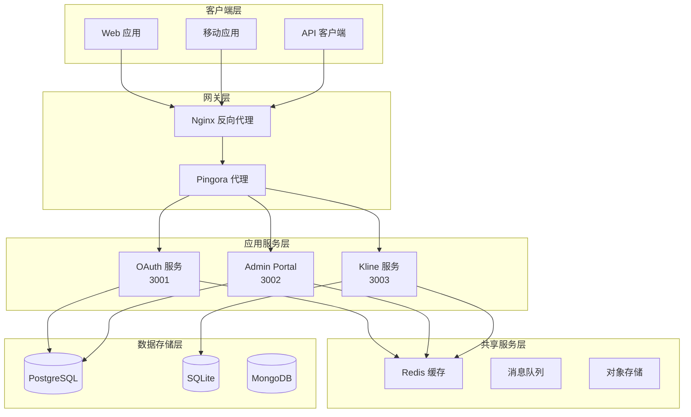

# 微服务架构设计文档

本文档详细阐述了 TS Next Template 项目的微服务架构设计，包括服务边界、通信模式、数据流和部署架构。

## 🏗️ 架构概览

### 系统架构图



## 🎯 服务边界定义

### 1. OAuth 服务 (端口 3001)

**职责范围:**
- OAuth 2.1 授权码流程实现
- JWT 令牌生成与验证
- 用户认证与授权
- 客户端注册与管理
- 令牌撤销与刷新

**服务边界:**
```
┌─────────────────────────────────────┐
│ OAuth 服务边界                       │
├─────────────────────────────────────┤
│ ✅ 用户认证/授权                     │
│ ✅ JWT 令牌管理                      │
│ ✅ OAuth 客户端管理                  │
│ ✅ 权限验证                         │
│ ❌ 用户资料管理                      │
│ ❌ 业务数据处理                      │
│ ❌ 前端界面渲染                      │
└─────────────────────────────────────┘
```

**API 边界:**
- `/api/v2/oauth/*` - OAuth 2.1 标准端点
- `/.well-known/*` - 发现端点
- 绝不包含业务逻辑 API

### 2. Admin Portal (端口 3002)

**职责范围:**
- 管理后台用户界面
- 用户管理界面
- OAuth 客户端管理界面
- 系统配置界面
- 审计日志查看

**服务边界:**
```
┌─────────────────────────────────────┐
│ Admin Portal 边界                    │
├─────────────────────────────────────┤
│ ✅ 管理界面渲染                      │
│ ✅ 用户界面交互                      │
│ ✅ 管理操作执行                      │
│ ✅ 数据可视化                        │
│ ❌ 认证逻辑实现                      │
│ ❌ 数据持久化                        │
│ ❌ 核心业务逻辑                      │
└─────────────────────────────────────┘
```

### 3. Kline Service (端口 3003)

**职责范围:**
- 金融数据计算
- WASM 高性能计算
- K-line 图表数据生成
- 技术指标计算
- 数据缓存与优化

**服务边界:**
```
┌─────────────────────────────────────┐
│ Kline Service 边界                   │
├─────────────────────────────────────┤
│ ✅ 金融数据计算                      │
│ ✅ WASM 模块执行                     │
│ ✅ 技术指标计算                      │
│ ✅ 数据缓存优化                      │
│ ❌ 用户认证                          │
│ ❌ 数据存储管理                      │
│ ❌ 界面渲染                          │
└─────────────────────────────────────┘
```

### 4. Pingora Proxy (端口 6188)

**职责范围:**
- 反向代理与负载均衡
- SSL 终端处理
- 请求路由与分发
- 缓存与压缩
- 安全头部添加

## 🔄 服务通信模式

### 1. 同步通信

#### HTTP/REST 通信
```typescript
// OAuth 服务调用示例
const response = await fetch(`${OAUTH_SERVICE_URL}/api/v2/oauth/token`, {
  method: 'POST',
  headers: {
    'Content-Type': 'application/json',
    'Authorization': `Bearer ${accessToken}`
  },
  body: JSON.stringify({
    grant_type: 'authorization_code',
    code: authorizationCode
  })
});
```

#### gRPC 通信 (可选)
```protobuf
// service.proto
service UserService {
  rpc GetUser(GetUserRequest) returns (GetUserResponse);
  rpc UpdateUser(UpdateUserRequest) returns (UpdateUserResponse);
}
```

### 2. 异步通信

#### 消息队列模式
```typescript
// 事件发布
await eventBus.publish('user.created', {
  userId: user.id,
  email: user.email,
  timestamp: new Date()
});

// 事件订阅
eventBus.subscribe('user.created', async (event) => {
  await emailService.sendWelcomeEmail(event.email);
});
```

### 3. 数据一致性策略

#### Saga 模式
```typescript
// 用户注册 Saga
class UserRegistrationSaga {
  async execute(userData: UserRegistrationData) {
    const transaction = new SagaTransaction();
    
    try {
      // 步骤1: 创建用户
      const user = await transaction.step(
        () => this.userService.createUser(userData),
        () => this.userService.deleteUser(user.id)
      );
      
      // 步骤2: 发送验证邮件
      await transaction.step(
        () => this.emailService.sendVerificationEmail(user.email),
        () => this.emailService.cancelVerificationEmail(user.email)
      );
      
      await transaction.commit();
    } catch (error) {
      await transaction.rollback();
      throw error;
    }
  }
}
```

#### 事件溯源
```typescript
// 事件存储
interface EventStore {
  append(event: DomainEvent): Promise<void>;
  getEvents(aggregateId: string): Promise<DomainEvent[]>;
  getSnapshot(aggregateId: string): Promise<Snapshot | null>;
}

// 事件应用
class UserAggregate {
  applyUserCreated(event: UserCreatedEvent) {
    this.id = event.userId;
    this.email = event.email;
    this.status = 'active';
  }
}
```

## 📊 数据架构

### 1. 数据分片策略

#### 用户数据分片
```sql
-- 按用户ID分片
CREATE TABLE users_shard_1 (
    id UUID PRIMARY KEY,
    email VARCHAR(255) UNIQUE,
    created_at TIMESTAMP DEFAULT NOW()
) PARTITION BY HASH (id);

CREATE TABLE users_shard_2 (
    id UUID PRIMARY KEY,
    email VARCHAR(255) UNIQUE,
    created_at TIMESTAMP DEFAULT NOW()
) PARTITION BY HASH (id);
```

#### 时间序列数据分片
```sql
-- 按时间分片的K线数据
CREATE TABLE kline_data_2024_01 (
    symbol VARCHAR(10),
    timestamp TIMESTAMP,
    open DECIMAL(10,4),
    high DECIMAL(10,4),
    low DECIMAL(10,4),
    close DECIMAL(10,4),
    volume BIGINT,
    PRIMARY KEY (symbol, timestamp)
) PARTITION BY RANGE (timestamp);
```

### 2. 缓存策略

#### Redis 缓存分层
```typescript
// 多级缓存策略
class CacheManager {
  private l1Cache: Map<string, any> = new Map();    // 内存缓存
  private l2Cache: Redis;                         // Redis缓存
  private l3Cache: Database;                      // 数据库缓存

  async get(key: string): Promise<any> {
    // L1: 内存缓存
    if (this.l1Cache.has(key)) {
      return this.l1Cache.get(key);
    }

    // L2: Redis缓存
    const redisData = await this.l2Cache.get(key);
    if (redisData) {
      this.l1Cache.set(key, redisData);
      return redisData;
    }

    // L3: 数据库
    const dbData = await this.l3Cache.query(key);
    if (dbData) {
      await this.l2Cache.set(key, dbData, 300); // 5分钟
      this.l1Cache.set(key, dbData);
      return dbData;
    }

    return null;
  }
}
```

### 3. 数据库读写分离

```typescript
// 读写分离配置
class DatabaseManager {
  private readReplicas: Database[];
  private writeMaster: Database;

  async read(query: string, params: any[]): Promise<any> {
    const replica = this.selectReadReplica();
    return replica.query(query, params);
  }

  async write(query: string, params: any[]): Promise<any> {
    return this.writeMaster.query(query, params);
  }

  private selectReadReplica(): Database {
    // 负载均衡算法选择读副本
    return this.readReplicas[Math.floor(Math.random() * this.readReplicas.length)];
  }
}
```

## 🚀 部署架构

### 1. 容器化部署

#### Docker Compose 架构
```yaml
version: '3.8'
services:
  oauth-service:
    image: ts-next/oauth-service:latest
    deploy:
      replicas: 3
      resources:
        limits:
          cpus: '0.5'
          memory: 512M
        reservations:
          cpus: '0.25'
          memory: 256M
    healthcheck:
      test: ["CMD", "curl", "-f", "http://localhost:3001/health"]
      interval: 30s
      timeout: 10s
      retries: 3

  admin-portal:
    image: ts-next/admin-portal:latest
    deploy:
      replicas: 2
      resources:
        limits:
          cpus: '1.0'
          memory: 1G
        reservations:
          cpus: '0.5'
          memory: 512M
```

### 2. Kubernetes 部署

#### Pod 亲和性配置
```yaml
apiVersion: apps/v1
kind: Deployment
metadata:
  name: oauth-service
spec:
  replicas: 3
  template:
    spec:
      affinity:
        podAntiAffinity:
          requiredDuringSchedulingIgnoredDuringExecution:
          - labelSelector:
              matchExpressions:
              - key: app
                operator: In
                values:
                - oauth-service
            topologyKey: kubernetes.io/hostname
```

#### 资源限制
```yaml
resources:
  requests:
    memory: "256Mi"
    cpu: "250m"
  limits:
    memory: "512Mi"
    cpu: "500m"
```

### 3. 服务网格 (Istio)

#### 流量管理
```yaml
apiVersion: networking.istio.io/v1alpha3
kind: VirtualService
metadata:
  name: oauth-service
spec:
  hosts:
  - oauth-service
  http:
  - match:
    - uri:
        prefix: /api/v2/oauth
    route:
    - destination:
        host: oauth-service
        port:
          number: 3001
    timeout: 30s
    retries:
      attempts: 3
      perTryTimeout: 10s
```

## 🔍 监控与可观测性

### 1. 分布式追踪

#### OpenTelemetry 配置
```typescript
import { NodeSDK } from '@opentelemetry/sdk-node';
import { JaegerExporter } from '@opentelemetry/exporter-jaeger';

const sdk = new NodeSDK({
  traceExporter: new JaegerExporter({
    endpoint: 'http://jaeger:14268/api/traces',
  }),
  serviceName: 'oauth-service',
});

sdk.start();
```

### 2. 指标监控

#### Prometheus 指标
```typescript
import { register, Counter, Histogram } from 'prom-client';

const httpRequestsTotal = new Counter({
  name: 'http_requests_total',
  help: 'Total number of HTTP requests',
  labelNames: ['method', 'route', 'status_code']
});

const httpRequestDuration = new Histogram({
  name: 'http_request_duration_seconds',
  help: 'Duration of HTTP requests in seconds',
  labelNames: ['method', 'route']
});
```

### 3. 日志聚合

#### ELK Stack 配置
```yaml
# Filebeat 配置
filebeat.inputs:
- type: log
  enabled: true
  paths:
    - /var/log/ts-next/*.log
  fields:
    service: oauth-service
    environment: production

output.elasticsearch:
  hosts: ["elasticsearch:9200"]
  index: "ts-next-%{[fields.service]}-%{+yyyy.MM.dd}"
```

## 🛡️ 安全架构

### 1. 零信任架构

#### 服务间认证
```typescript
// 服务间 JWT 认证
class ServiceAuth {
  async authenticateService(serviceToken: string): Promise<boolean> {
    try {
      const decoded = jwt.verify(serviceToken, process.env.SERVICE_JWT_SECRET);
      return decoded.service === 'authorized-service';
    } catch {
      return false;
    }
  }
}
```

### 2. 网络分段

#### 网络策略
```yaml
apiVersion: networking.k8s.io/v1
kind: NetworkPolicy
metadata:
  name: oauth-service-network-policy
spec:
  podSelector:
    matchLabels:
      app: oauth-service
  policyTypes:
  - Ingress
  - Egress
  ingress:
  - from:
    - namespaceSelector:
        matchLabels:
          name: ingress-nginx
    ports:
    - protocol: TCP
      port: 3001
  egress:
  - to:
    - namespaceSelector:
        matchLabels:
          name: database
    ports:
    - protocol: TCP
      port: 5432
```

### 3. 密钥管理

#### Vault 集成
```typescript
import { Vault } from 'node-vault';

class SecretManager {
  private vault: Vault;

  async getDatabaseCredentials(): Promise<DatabaseCredentials> {
    const response = await this.vault.read('database/creds/myapp');
    return {
      username: response.data.username,
      password: response.data.password,
    };
  }
}
```

## 📈 伸缩策略

### 1. 水平 Pod 自动伸缩

#### HPA 配置
```yaml
apiVersion: autoscaling/v2
kind: HorizontalPodAutoscaler
metadata:
  name: oauth-service-hpa
spec:
  scaleTargetRef:
    apiVersion: apps/v1
    kind: Deployment
    name: oauth-service
  minReplicas: 2
  maxReplicas: 10
  metrics:
  - type: Resource
    resource:
      name: cpu
      target:
        type: Utilization
        averageUtilization: 70
  - type: Resource
    resource:
      name: memory
      target:
        type: Utilization
        averageUtilization: 80
```

### 2. 垂直 Pod 自动伸缩

#### VPA 配置
```yaml
apiVersion: autoscaling.k8s.io/v1
kind: VerticalPodAutoscaler
metadata:
  name: oauth-service-vpa
spec:
  targetRef:
    apiVersion: apps/v1
    kind: Deployment
    name: oauth-service
  updatePolicy:
    updateMode: "Auto"
  resourcePolicy:
    containerPolicies:
    - containerName: oauth-service
      maxAllowed:
        cpu: 2
        memory: 2Gi
      minAllowed:
        cpu: 100m
        memory: 128Mi
```

## 🔄 灾难恢复

### 1. 备份策略

#### 数据库备份
```bash
#!/bin/bash
# 自动备份脚本
BACKUP_DIR="/backups/$(date +%Y%m%d)"
mkdir -p $BACKUP_DIR

# PostgreSQL 备份
pg_dump -h postgres-service -U postgres main_db > $BACKUP_DIR/database.sql

# Redis 备份
redis-cli -h redis-service BGSAVE
cp /data/dump.rdb $BACKUP_DIR/redis.rdb
```

### 2. 故障转移

#### 主从切换
```yaml
apiVersion: v1
kind: ConfigMap
metadata:
  name: patroni-config
data:
  patroni.yml: |
    scope: postgres-cluster
    name: postgresql-0
    restapi:
      listen: 0.0.0.0:8008
      connect_address: postgresql-0:8008
    postgresql:
      listen: 0.0.0.0:5432
      connect_address: postgresql-0:5432
      data_dir: /data/postgres
```

## 📊 架构决策记录 (ADR)

### ADR-001: 微服务拆分策略

**状态**: 已接受  
**日期**: 2024-01-15  
**背景**: 单体应用难以维护和扩展

**决策**: 按业务领域拆分为4个独立微服务
- **优点**: 独立部署、技术栈灵活、故障隔离
- **缺点**: 分布式系统复杂性、网络延迟
- **后果**: 需要服务发现、API网关、分布式追踪

### ADR-002: 通信协议选择

**状态**: 已接受  
**日期**: 2024-01-20  
**背景**: 需要选择服务间通信协议

**决策**: 主要使用 REST API，异步场景使用消息队列
- **优点**: 简单、易于调试、广泛支持
- **缺点**: 同步调用可能产生级联故障
- **缓解**: 实现熔断器、超时重试、异步消息

### ADR-003: 数据存储策略

**状态**: 已接受  
**日期**: 2024-01-25  
**背景**: 需要为不同服务选择合适的数据存储

**决策**: 每个服务独立数据库，使用 PostgreSQL 作为主存储
- **优点**: 服务自治、数据隔离、独立扩展
- **缺点**: 数据一致性挑战、跨服务查询复杂
- **缓解**: 使用事件驱动架构、CQRS 模式