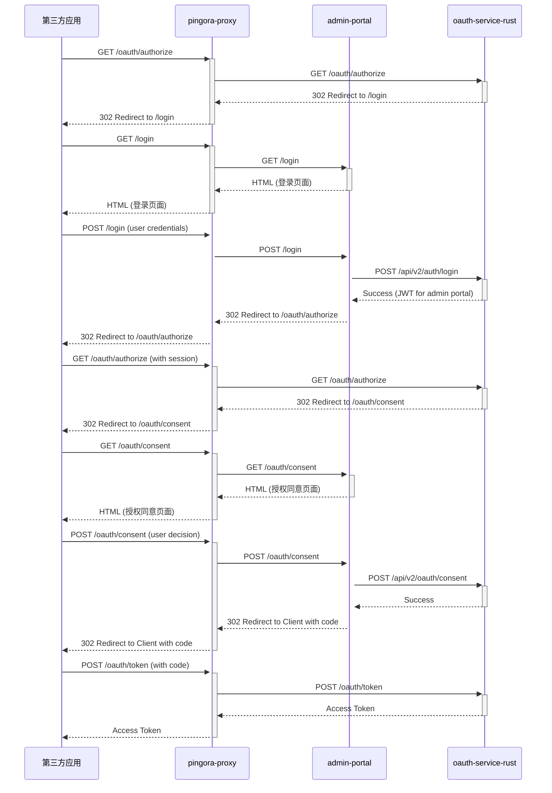

# 系统架构设计

## 架构总览

本系统采用基于微服务的架构，核心由三个主要服务构成：`oauth-service-rust`、`admin-portal` 和 `pingora-proxy`。

- **pingora-proxy**: 作为整个系统的入口，是一个高性能的异步反向代理，负责将外部请求路由到内部的各个服务。
- **oauth-service-rust**: 基于Rust语言构建的OAuth 2.1授权服务器，提供所有认证和授权相关的API。它是一个无状态的服务，不渲染任何UI。
- **admin-portal**: 认证中心的管理后台和用户交互界面，本身也是一个OAuth客户端。负责处理用户登录、授权同意、以及对用户、角色、客户端等的管理。

## 服务职责

### pingora-proxy (端口 6188)
- **职责**:
  - 统一的API网关
  - 请求路由
  - 负载均衡
  - SSL/TLS 终端
  - 健康检查

### oauth-service-rust (端口 3001)
- **职责**:
  - 实现OAuth 2.1和OIDC规范
  - JWT令牌的生成、验证和刷新
  - 基于RBAC的权限校验
  - 用户、角色、客户端等核心实体的管理API
  - 无任何UI渲染

### admin-portal (端口 3002)
- **职责**:
  - 提供用户认证页面（登录、授权、错误提示）
  - 提供管理后台界面（用户、角色、客户端管理）
  - 作为OAuth客户端与`oauth-service-rust`交互
  - 负责所有用户交互

## 核心流程

### 认证流程
1.  用户访问一个需要认证的第三方应用。
2.  第三方应用将用户重定向到 `pingora-proxy`，请求授权。
3.  `pingora-proxy` 将请求路由到 `oauth-service-rust` 的 `/oauth/authorize` 端点。
4.  `oauth-service-rust` 发现用户未认证，重定向到 `admin-portal` 的登录页面。
5.  用户在 `admin-portal` 上输入凭证完成登录。
6.  `admin-portal` 调用 `oauth-service-rust` 的API验证凭证。
7.  验证成功后，`oauth-service-rust` 根据需要可能会重定向到 `admin-portal` 的授权同意页面。
8.  用户同意授权后，`oauth-service-rust` 生成授权码并重定向回第三方应用。
9.  第三方应用使用授权码向 `oauth-service-rust` 的 `/oauth/token` 端点交换访问令牌。

### API授权流程
1.  客户端携带JWT访问受保护的API资源（通过`pingora-proxy`）。
2.  `pingora-proxy` 将请求转发给相应的后端服务（如`oauth-service-rust`）。
3.  后端服务中的认证中间件验证JWT的有效性（签名、过期时间等）。
4.  从JWT中提取用户的角色和权限。
5.  将用户权限与API端点所需的权限进行比对（RBAC校验）。
6.  如果权限满足，则处理API请求；否则返回403 Forbidden。

## 技术栈

### 后端技术
- **语言**: Rust
- **框架**: Actix-web
- **数据库**: PostgreSQL (生产), SQLite (开发)
- **ORM**: SQLx
- **认证**: OAuth 2.1, OpenID Connect, JWT (RS256)

### 前端技术
- **框架**: Next.js 15 (App Router)
- **语言**: TypeScript
- **UI**: React 19, TailwindCSS, shadcn/ui

### 代理
- **框架**: Pingora

### 共享包
- **@repo/database**: 数据库模型和迁移
- **@repo/lib**: 共享的工具函数和类型定义
- **@repo/ui**: 可重用的UI组件

## 数据流

### 认证数据流

