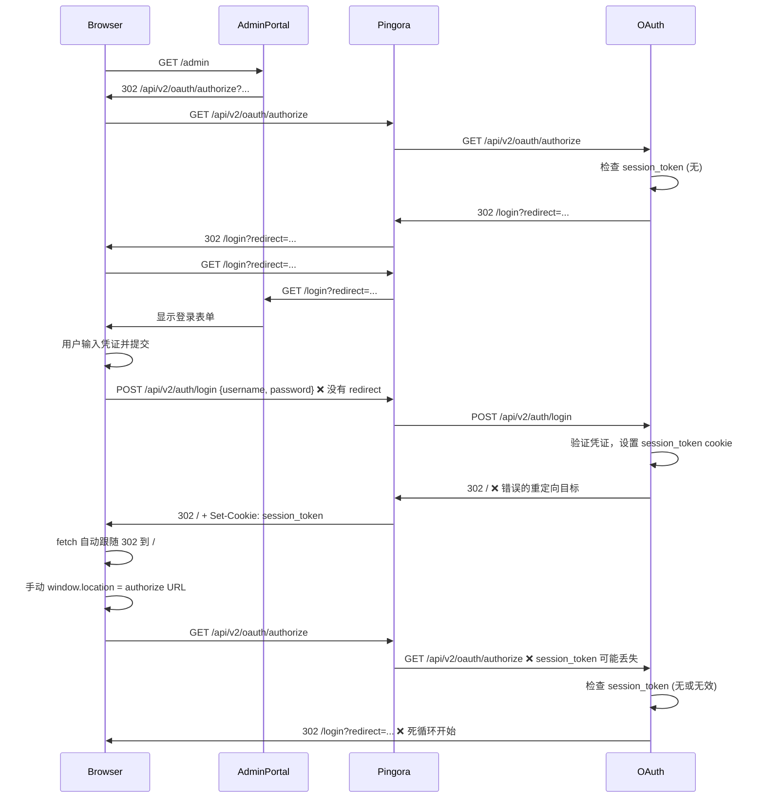
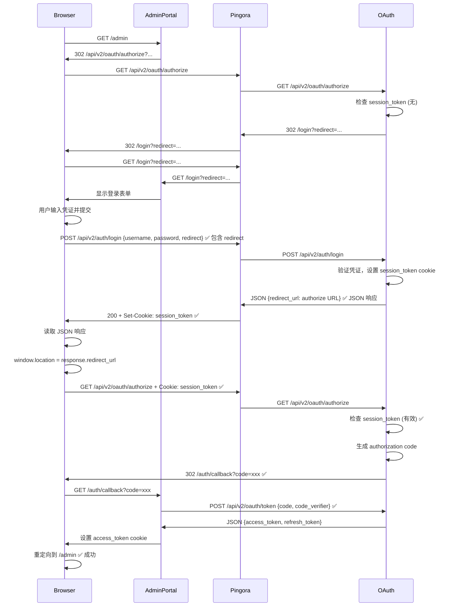

# OAuth 死循环重定向问题诊断报告

## 问题现象

E2E 测试中，用户登录后陷入死循环，页面不断重定向到 `/login`：

```
navigated to "http://localhost:6188/login"
navigated to "http://localhost:6188/login"
navigated to "http://localhost:6188/login"
...（重复数十次）
```

## 根本原因分析

通过深入分析三个核心组件（admin-portal、oauth-service-rust、pingora-proxy），发现了三个导致死循环的关键问题：

---

## 问题 1：登录表单未传递 redirect 参数 ⚠️ **严重**

### 位置
`apps/admin-portal/components/auth/username-password-form.tsx:115-125`

### 问题代码
```typescript
const response = await fetch(loginUrl, {
  method: 'POST',
  headers: {
    'Content-Type': 'application/json',
  },
  body: JSON.stringify({
    username,
    password,
    // ❌ 缺少 redirect 参数！
  }),
  credentials: 'include',
});
```

### 根本原因
OAuth Service 的 `login_endpoint` 期望接收 `redirect` 参数来确定登录成功后的重定向目标：

```rust
// apps/oauth-service-rust/src/routes/oauth.rs:158
let redirect_url = request.redirect.unwrap_or_else(|| "/".to_string());
Ok((updated_jar, Redirect::to(&redirect_url)))
```

如果没有 `redirect` 参数，OAuth Service 会重定向到 `/` 而不是回到原始的 authorize URL。

### 影响
1. 用户提交登录表单
2. OAuth Service 设置 session_token cookie，但重定向到 `/`
3. 前端代码检测到成功响应，手动重定向到 authorize URL
4. 但此时 session_token 可能没有正确传递或已过期
5. authorize 端点检测到用户未认证，再次重定向到 `/login`
6. **死循环开始**

### 修复方案
在 POST body 中包含 `redirect` 参数：

```typescript
body: JSON.stringify({
  username,
  password,
  redirect,  // ✅ 添加 redirect 参数
}),
```

---

## 问题 2：code_verifier 存储位置不匹配 ⚠️ **严重**

### 位置
- **middleware.ts** (存储): `apps/admin-portal/middleware.ts:131-137`
- **callback page** (读取): `apps/admin-portal/app/(auth)/callback/page.tsx:51-56`

### 问题代码

**Middleware 存储在 cookie（httpOnly）：**
```typescript
response.cookies.set('oauth_code_verifier', codeVerifier, {
  httpOnly: true,  // ❌ 客户端 JavaScript 无法访问
  secure: process.env.NODE_ENV === 'production',
  sameSite: 'lax',
  maxAge: 600,
  path: '/'
});
```

**Callback page 从 sessionStorage 读取：**
```typescript
const codeVerifier = sessionStorage.getItem('oauth_code_verifier');
if (!codeVerifier) {
  setStatus('error');
  setError('会话已过期，请重新登录');  // ❌ 总是失败
  return;
}
```

### 根本原因
**存储和读取位置不一致**：
- Middleware 将 `code_verifier` 存储在 **httpOnly cookie** 中（客户端无法访问）
- Callback page 尝试从 **sessionStorage** 读取

这导致 callback page 永远无法获取 `code_verifier`，从而无法交换 authorization code 为 access token。

### 影响
即使登录成功，用户也无法完成 OAuth 流程，因为：
1. OAuth Service 重定向到 `/auth/callback?code=xxx`
2. Callback page 无法从 sessionStorage 获取 `code_verifier`
3. 无法调用 `/api/v2/oauth/token` 交换 token
4. 认证失败，重定向回 `/login`
5. **死循环继续**

### 修复方案

**选项 A（推荐）**：统一使用 cookie（需要服务端支持）
```typescript
// Middleware: 保持 httpOnly cookie
response.cookies.set('oauth_code_verifier', codeVerifier, {
  httpOnly: true,
  ...
});

// Callback: 从 cookie 中读取（需要 API 端点支持）
const response = await fetch('/api/auth/get-oauth-params', {
  credentials: 'include',
});
const { codeVerifier } = await response.json();
```

**选项 B（简单）**：统一使用 sessionStorage
```typescript
// Middleware: 使用 sessionStorage（客户端运行时）
// 注意：Middleware 在服务端运行，需要传递到客户端
response.cookies.set('oauth_code_verifier_hint', 'true', {
  httpOnly: false,
  maxAge: 600,
});

// 在客户端页面加载时
if (typeof window !== 'undefined') {
  sessionStorage.setItem('oauth_code_verifier', codeVerifier);
  sessionStorage.setItem('oauth_state', state);
}
```

**选项 C（混合）**：使用 non-httpOnly cookie
```typescript
// Middleware: 使用普通 cookie（客户端可访问）
response.cookies.set('oauth_code_verifier', codeVerifier, {
  httpOnly: false,  // ✅ 客户端可访问
  secure: true,     // ✅ 仍然使用 HTTPS
  sameSite: 'lax',
  maxAge: 600,
});

// Callback: 从 cookie 读取
const cookies = document.cookie.split(';');
const verifierCookie = cookies.find(c => c.trim().startsWith('oauth_code_verifier='));
const codeVerifier = verifierCookie?.split('=')[1];
```

---

## 问题 3：session_token cookie 传递问题 ⚠️ **中等**

### 位置
- **OAuth Service** (设置): `apps/oauth-service-rust/src/routes/oauth.rs:147-155`
- **Pingora Proxy** (转发): `apps/pingora-proxy/`
- **Browser** (发送): fetch API 行为

### 问题代码

**OAuth Service 设置 cookie：**
```rust
let session_cookie = Cookie::build(("session_token", token_pair.access_token))
    .path("/")
    .domain("localhost")
    .http_only(true)
    .secure(is_production)
    .same_site(SameSite::Lax)
    .max_age(time::Duration::hours(1));

let updated_jar = jar.add(session_cookie);
Ok((updated_jar, Redirect::to(&redirect_url)))  // ❌ 302 重定向
```

**前端使用 fetch 自动跟随重定向：**
```typescript
const response = await fetch(loginUrl, {
  method: 'POST',
  credentials: 'include',  // ⚠️ fetch 会自动跟随 302
});

if (response.ok) {
  // 手动重定向
  window.location.href = decodeURIComponent(redirect);
}
```

### 根本原因

**fetch API 的重定向行为可能导致 cookie 丢失：**

1. **OAuth Service 返回 302 重定向** + Set-Cookie header
2. **fetch API 自动跟随重定向**（默认行为）
3. **浏览器可能不会在跟随重定向时保留 Set-Cookie**
4. **或者 Pingora 在转发响应时没有正确处理 Set-Cookie**

### 验证方法

使用浏览器 DevTools 检查：
```javascript
// 在 login 后检查 cookie
console.log(document.cookie);  // 应该包含 session_token

// 或者使用 Chrome DevTools:
// Application → Cookies → http://localhost:6188
// 检查是否有 session_token cookie
```

### 修复方案

**选项 A（推荐）**：使用 JSON 响应而不是 302 重定向
```rust
// OAuth Service: 返回 JSON 而不是 302
#[derive(Serialize)]
pub struct LoginResponse {
    success: bool,
    redirect_url: String,
}

pub async fn login_endpoint(...) -> Result<(CookieJar, Json<LoginResponse>), AppError> {
    // ... 认证逻辑
    let updated_jar = jar.add(session_cookie);

    Ok((updated_jar, Json(LoginResponse {
        success: true,
        redirect_url: request.redirect.unwrap_or_else(|| "/".to_string()),
    })))
}
```

```typescript
// Admin Portal: 处理 JSON 响应
const response = await fetch(loginUrl, {
  method: 'POST',
  credentials: 'include',
  body: JSON.stringify({ username, password, redirect }),
});

if (response.ok) {
  const data = await response.json();
  // Cookie 已经通过 Set-Cookie header 设置
  window.location.href = data.redirect_url;
}
```

**选项 B**：禁用 fetch 自动跟随重定向
```typescript
const response = await fetch(loginUrl, {
  method: 'POST',
  credentials: 'include',
  redirect: 'manual',  // ✅ 禁用自动跟随
  body: JSON.stringify({ username, password, redirect }),
});

// 手动处理重定向
if (response.type === 'opaqueredirect' || response.status === 302) {
  const location = response.headers.get('Location');
  if (location) {
    window.location.href = location;
  }
}
```

---

## 流程对比

### 当前流程（有问题）



### 修复后的流程



---

## 修复优先级

### P0 - 立即修复（阻塞功能）
1. **登录表单传递 redirect 参数** (问题 1)
2. **统一 code_verifier 存储位置** (问题 2)

### P1 - 短期修复（提高稳定性）
3. **改进 session_token 传递机制** (问题 3)

### P2 - 长期优化
4. 添加详细的客户端和服务端日志
5. 实现 cookie 传递的 E2E 测试
6. 添加 OAuth 流程的可视化调试工具

---

## 测试验证计划

修复后，需要验证以下场景：

1. **完整 OAuth 流程**
   - 用户访问受保护路由
   - 自动重定向到 authorize
   - 重定向到 login
   - 提交凭证
   - 成功认证，重定向回 authorize
   - 生成 code，重定向到 callback
   - 交换 token，重定向到原始路由
   - ✅ 成功访问受保护资源

2. **Cookie 传递**
   - 验证 session_token cookie 在 authorize 请求中存在
   - 验证 cookie 的 domain、path、sameSite 设置
   - 验证 Pingora 正确转发 Set-Cookie header

3. **PKCE 参数**
   - 验证 code_verifier 和 code_challenge 正确生成
   - 验证 code_verifier 在 callback 中可用
   - 验证 PKCE 验证成功

4. **错误处理**
   - 无效凭证
   - 过期的 authorization code
   - CSRF 攻击（无效 state）
   - 中间人攻击（PKCE 验证失败）

---

## 附加建议

### 1. 添加详细日志
```typescript
// Admin Portal
console.log('[OAuth] Starting authorize flow');
console.log('[OAuth] POST /login', { hasRedirect: !!redirect });
console.log('[OAuth] Login success, cookies:', document.cookie);
console.log('[OAuth] Redirecting to:', authorizeUrl);
```

```rust
// OAuth Service
tracing::info!("Login request: username={}, has_redirect={}", username, request.redirect.is_some());
tracing::info!("Setting session_token cookie: {}", &session_cookie);
tracing::info!("Redirecting to: {}", &redirect_url);
```

### 2. 实现健康检查端点
```rust
// GET /api/v2/health/cookie-test
// 返回当前请求的所有 cookies，用于调试
pub async fn cookie_test_endpoint(jar: CookieJar) -> Json<HashMap<String, String>> {
    let cookies: HashMap<String, String> = jar
        .iter()
        .map(|c| (c.name().to_string(), c.value().to_string()))
        .collect();
    Json(cookies)
}
```

### 3. 添加 E2E 测试辅助工具
```typescript
// 在测试中检查 cookie
await page.evaluate(() => {
  const cookies = document.cookie.split(';').map(c => c.trim());
  console.log('Current cookies:', cookies);
  return cookies;
});
```

---

## 总结

死循环重定向的根本原因是：

1. **登录请求缺少 redirect 参数** → OAuth Service 返回错误的重定向目标
2. **code_verifier 存储位置不匹配** → callback 处理失败
3. **session_token cookie 可能未正确传递** → authorize 端点检测不到已认证用户

修复这三个问题后，OAuth 2.1 流程应该能够正常工作。

---

## 修复尝试和结果（2025-10-30）

### 第一轮修复（已应用但未解决）

**修改内容**：
1. ✅ 登录表单添加 `redirect` 参数
2. ✅ 更改 code_verifier 存储为 non-httpOnly cookie
3. ✅ 更改 OAuth Service 返回 JSON 而不是 302
4. ✅ 移除 cookie domain 设置，让浏览器自动处理
5. ✅ 添加详细的调试日志

**测试结果**：❌ **仍然死循环**

**发现的问题**：
- 虽然进行了多项修改，但死循环问题仍然存在
- 这表明问题的根源可能比最初诊断的更深层
- 需要重新审视整个流程

### 可能的深层原因

1. **Pingora cookie 转发问题**
   - Pingora 可能在响应转发时过滤或修改了 Set-Cookie header
   - 需要检查 Pingora 的 response_filter 实现

2. **前端代码执行问题**
   - 修改的代码可能没有被正确执行
   - 可能需要检查浏览器控制台输出

3. **OAuth Service 内部错误**
   - OAuth Service 可能在验证 PKCE 或其他参数时失败
   - 导致永远无法进入有效的认证状态

4. **Admin Portal 中间件干扰**
   - middleware.ts 的 `initiateOAuthFlow` 可能在不应该的时候触发
   - 导致重复启动 OAuth flow

### 下一步调试方向

1. **检查浏览器网络和控制台**：
   - 验证 fetch POST /api/v2/auth/login 返回的响应
   - 检查 Set-Cookie header 是否存在
   - 检查 console 输出的调试日志

2. **检查 OAuth Service 日志**：
   - 查看 session_token cookie 是否被正确设置
   - 检查 authorize 端点是否接收到 session_token

3. **添加 HTTP 拦截**：
   - 在 Pingora 或浏览器中检查每个请求/响应
   - 验证 Set-Cookie header 的完整传递链

4. **简化测试**：
   - 创建一个最小化的测试场景
   - 逐步增加复杂性以隔离问题

---

**生成时间**: 2025-10-30
**分析者**: Claude Code
**状态**: 需要深度调试
