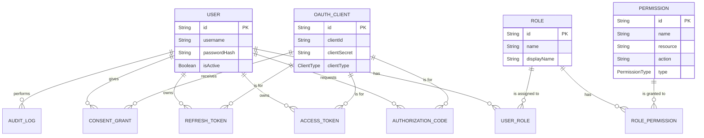

# 数据库设计文档

> **文档版本**: v1.0.0  
> **创建日期**: 2025-07-08
> **最后更新**: 2025-07-08  
> **文档状态**: 正式版  
> **维护团队**: 架构团队

## 1. 概述

本文档详细描述了 OAuth2.1 认证授权中心项目的数据库结构设计。该设计旨在支持一个安全、可扩展且符合标准的企业级身份认证和授权系统。所有数据模型均通过 Prisma Schema (`schema.prisma`) 进行定义和管理。

## 2. 实体关系图 (ERD)

下图展示了核心实体之间的关系：

## 3. 核心数据模型详述

### 3.1 用户 (User)

-   **描述**: 存储系统的用户账户信息。在内网环境中，用户通常由管理员创建。
-   **表名**: `users`

| 字段名 | 数据类型 | 约束 | 描述 |
| :--- | :--- | :--- | :--- |
| `id` | `String` | PK, CUID | 用户的唯一标识符。 |
| `username` | `String` | Unique | 用户名，用于登录，全局唯一。 |
| `passwordHash` | `String` | | 使用 bcrypt 哈希后的密码。 |
| `isActive` | `Boolean` | Default: `true` | 账户是否激活。 |
| `displayName` | `String?` | | 用于UI展示的名称。 |
| `organization` | `String?` | | 用户所属的组织。 |
| `department` | `String?` | | 用户所属的部门。 |
| `mustChangePassword` | `Boolean` | Default: `true` | 用户下次登录是否需要强制修改密码。 |
| `failedLoginAttempts` | `Int` | Default: `0` | ���续登录失败次数。 |
| `lockedUntil` | `DateTime?` | | 账户因登录失败被锁定的截止时间。 |

### 3.2 角色 (Role)

-   **描述**: 定义了一组权限的集合。用户通过被分配角色来获得相应的权限。
-   **表名**: `roles`

| 字段名 | 数据类型 | 约束 | 描述 |
| :--- | :--- | :--- | :--- |
| `id` | `String` | PK, CUID | 角色的唯一标识符。 |
| `name` | `String` | Unique | 角色的唯一编程名称 (e.g., `SYSTEM_ADMIN`)。 |
| `displayName` | `String` | | 用于UI展示的角色名称 (e.g., "系统管理员")。 |
| `isSystemRole` | `Boolean` | Default: `false` | 是否为系统内置角色，通常不可删除。 |
| `isActive` | `Boolean` | Default: `true` | 角色是否激活。 |

### 3.3 权限 (Permission)

-   **描述**: 定义了系统中最小粒度的操作权限。
-   **表名**: `permissions`

| 字段名 | 数据类型 | 约束 | 描述 |
| :--- | :--- | :--- | :--- |
| `id` | `String` | PK, CUID | 权限的唯一标识符。 |
| `name` | `String` | Unique | 权限的唯一编程名称 (e.g., `users:create`)。 |
| `resource` | `String` | | 权限作用的资源 (e.g., `User`, `Client`)。 |
| `action` | `String` | | 权限允许的操作 (e.g., `create`, `read`)。 |
| `type` | `PermissionType` | | 权限类型 (API, MENU, DATA)。 |

### 3.4 OAuth客户端 (OAuthClient)

-   **描述**: 代表一个可以请求访问受保护资源的第三方应用或服务。
-   **表名**: `oauth_clients`

| 字段名 | 数据类型 | 约束 | 描述 |
| :--- | :--- | :--- | :--- |
| `id` | `String` | PK, CUID | 客户端的数据库唯一ID。 |
| `clientId` | `String` | Unique | 对外暴露的客户端ID。 |
| `clientSecret` | `String?` | | 机密客户端的密钥，BCrypt哈希存储。 |
| `clientType` | `ClientType` | | 客户端类型 (PUBLIC 或 CONFIDENTIAL)。 |
| `redirectUris` | `String` | | JSON数组，允许重定向的URI列表。 |
| `allowedScopes` | `String` | | JSON数组，允许请求的权限范围。 |
| `grantTypes` | `String` | | JSON数组，允许的授权类型。 |
| `requirePkce` | `Boolean` | Default: `true` | 是否强制要求使用PKCE。 |

### 3.5 令牌与授权码

#### 3.5.1 授权码 (AuthorizationCode)
-   **描述**: 在OAuth授权码流程中，作为用户授权的临时凭证，用于交换访问令牌。
-   **表名**: `authorization_codes`
-   **核心字段**: `code` (授权码), `userId`, `clientId`, `expiresAt`, `isUsed`, `codeChallenge`。

#### 3.5.2 访问令牌 (AccessToken)
-   **描述**: 客户端用于访问受保护资源的凭证。
-   **表名**: `access_tokens`
-   **核心字段**: `tokenHash` (令牌哈希), `userId`, `clientId`, `scope`, `expiresAt`。

#### 3.5.3 刷新令牌 (RefreshToken)
-   **描述**: 用于获取新的访问令牌，生命周期较长。
-   **表名**: `refresh_tokens`
-   **核心字段**: `tokenHash` (令牌哈希), `userId`, `clientId`, `expiresAt`, `isRevoked`。

## 4. 关联关系表

-   **UserRole**: 用户与角色的多对多关联。
-   **RolePermission**: 角色与权限的多对多关联。
-   **ConsentGrant**: 记录用户对特定客户端的授权同意情况。
-   **PasswordHistory**: 记录用户的历史密码，防止重用。
-   **TokenBlacklist**: JWT ID (JTI) 黑名单，用于精确撤销令牌。

## 5. 索引与性能

为了保证查询性能，在多个关键字段和外键上建立了索引。

-   **用户表**: 在 `username`, `isActive`, `organization`, `department` 上建立了索引。
-   **令牌相关表**: 在 `tokenHash`, `jti`, `userId`, `clientId`, `expiresAt` 上建立了索引，以加速令牌验证、查找和清理。
-   **权限相关表**: 在 `name`, `resource`, `action` 上建立了索引，以加速权限检查。

此数据库设计为系统提供了坚实的数据基础，兼顾了功能完整性、安全性和性能。
