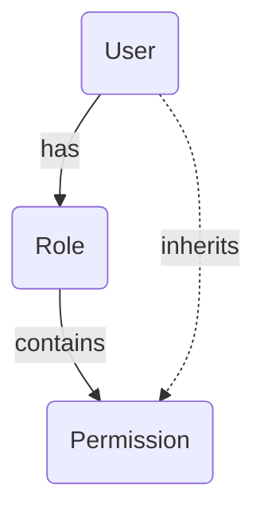

# 权限设计文档 (RBAC)

> **文档版本**: v1.0.0  
> **创建日期**: 2025-07-08
> **最后更新**: 2025-07-08  
> **文档状态**: 正式版  
> **维护团队**: 架构团队

## 1. 概述

本文档详细描述了平台的权限体系结构。系统采用基于角色的访问控制（RBAC）模型，结合了菜单、API、操作和数据四个层级的细粒度权限控制，以确保系统的安全性和灵活性。

## 2. 权限模型 (RBAC)

系统权限模型的核心是 **用户 (User)**、**角色 (Role)** 和 **权限 (Permission)** 之间的关系：

-   **用户 (User)**: 系统中的操作实体。
-   **角色 (Role)**: 一组权限的集合。一个角色可以包含多个权限点。
-   **权限 (Permission)**: 定义了一个具体的操作许可，是系统中最细粒度的控制单元。

**关系**:
-   一个用户可以拥有一个或多个角色。
-   一个角色可以包含一个或多个权限。
-   用户通过其拥有的所有角色，间接获得这些角色所包含的所有权限。



## 3. 权限点 (Permissions) 规范

### 3.1 命名规范

所有权限点均遵循 `resource:action` 的命名规范，以确保清晰和一致。

-   **resource**: 权限作用的资源，如 `users`, `roles`, `clients`。对于UI菜单，使用 `menu:system:user` 这样的层级结构。
-   **action**: 允许执行的操作，如 `list`, `create`, `read`, `update`, `delete`。

### 3.2 权限点清单

以下是系统中定义的所有权限点，按资源进行分类：

#### 系统与仪表盘
| 权限点 | 描述 | 类型 |
| :--- | :--- | :--- |
| `dashboard:view` | 查看管理后台仪表盘 | `MENU` |
| `profile:view` | 查看个人资料页面 | `MENU` |
| `profile:update` | 更新个人资料 | `API` |

#### 用户管理 (User Management)
| 权限点 | 描述 | 类型 |
| :--- | :--- | :--- |
| `menu:system:user:view` | 查看“用户管理”菜单 | `MENU` |
| `user:list` | 获取用户列表 | `API` |
| `user:create` | 创建新用户 | `API` |
| `user:read` | 查看单个用户详情 | `API` |
| `user:update` | 更新用户信息 | `API` |
| `user:delete` | 删除用户 | `API` |

#### 角色管理 (Role Management)
| 权限点 | 描述 | 类型 |
| :--- | :--- | :--- |
| `menu:system:role:view` | 查看“角色管理”菜单 | `MENU` |
| `role:list` | 获取角色列表 | `API` |
| `role:create` | 创建新角色 | `API` |
| `role:read` | 查看单个角色详情 | `API` |
| `role:update` | 更新角色信息 | `API` |
| `role:delete` | 删除角色 | `API` |
| `roles:permissions:read` | 查看角色拥有的权限 | `API` |
| `roles:permissions:assign` | 为角色分配权限 | `API` |
| `roles:permissions:remove` | 从角色移除权限 | `API` |

#### 权限管理 (Permission Management)
| 权限点 | 描述 | 类型 |
| :--- | :--- | :--- |
| `menu:system:permission:view` | 查看“权限管理”菜单 | `MENU` |
| `permission:list` | 获取权限列表 | `API` |
| `permission:create` | 创建新权限 | `API` |
| `permission:read` | 查看单个权限详情 | `API` |
| `permission:update` | 更新权限信息 | `API` |
| `permission:delete` | 删除权限 | `API` |

#### 客户端管理 (Client Management)
| 权限点 | 描述 | 类型 |
| :--- | :--- | :--- |
| `menu:system:client:view` | 查看“客户端管理”菜单 | `MENU` |
| `client:list` | 获取客户端列表 | `API` |
| `client:create` | 创建新客户端 | `API` |
| `client:read` | 查看单个客户端详情 | `API` |
| `client:update` | 更新客户端信息 | `API` |
| `client:delete` | 删除客户端 | `API` |
| `oauth:clients:manage` | 管理客户端密钥等敏感操作 | `API` |

#### 范围管理 (Scope Management)
| 权限点 | 描述 | 类型 |
| :--- | :--- | :--- |
| `menu:system:scope:view` | 查看“范围管理”菜单 | `MENU` |
| `scope:list` | 获取范围列表 | `API` |
| `scope:create` | 创建新范围 | `API` |
| `scope:read` | 查看单个范围详情 | `API` |
| `scope:update` | 更新范围信息 | `API` |
| `scope:delete` | 删除范围 | `API` |

#### 审计管理 (Audit Management)
| 权限点 | 描述 | 类型 |
| :--- | :--- | :--- |
| `menu:system:audit:view` | 查看“审计日志”菜单 | `MENU` |
| `audit:list` | 获取审计日志列表 | `API` |

## 4. 核心角色定义

系统预设了四个核心角色，以满足常见的管理需求。

### 4.1 系统管理员 (SYSTEM_ADMIN)
-   **描述**: 拥有系统的所有权限，是最高权限管理员。
-   **权限**: 包含系统中定义的所有权限点 (`*.*`)。

### 4.2 用户管理员 (USER_ADMIN)
-   **描述**: 负责管理用户和分配角色，但不能修改角色本身的权限。
-   **权限**:
    -   `menu:system:user:view`
    -   `user:list`, `user:create`, `user:read`, `user:update`, `user:delete`
    -   `role:list` (查看角色列表以便为用户分配)
    -   `dashboard:view`
    -   `profile:view`, `profile:update`

### 4.3 安全管理员 (SECURITY_ADMIN)
-   **描述**: 负责管理系统的安全配置，包括角色、权限、客户端和审计。
-   **权限**:
    -   `menu:system:role:view`, `menu:system:permission:view`, `menu:system:client:view`, `menu:system:scope:view`, `menu:system:audit:view`
    -   `role:*`, `permission:*`, `client:*`, `scope:*`, `audit:*`
    -   `roles:permissions:*`
    -   `oauth:clients:manage`
    -   `dashboard:view`
    -   `profile:view`, `profile:update`

### 4.4 普通用户 (USER)
-   **描述**: 基础用户角色，只能登录管理后台并查看自己的信息。
-   **权限**:
    -   `dashboard:view`
    -   `profile:view`, `profile:update`

## 5. 数据库初始化数据 (Seed Data)

以下是用于数据库初始化的核心角色和权限数据。

### 5.1 权限 (Permissions)
```typescript
// packages/database/prisma/seed.ts

const permissions = [
  // Dashboard & Profile
  { name: 'dashboard:view', displayName: '查看仪表盘', resource: 'Dashboard', action: 'view', type: 'MENU' },
  { name: 'profile:view', displayName: '查看个人资料', resource: 'Profile', action: 'view', type: 'MENU' },
  { name: 'profile:update', displayName: '更新个人资料', resource: 'Profile', action: 'update', type: 'API' },

  // User Management
  { name: 'menu:system:user:view', displayName: '查看用户管理菜单', resource: 'Menu', action: 'view', type: 'MENU' },
  { name: 'user:list', displayName: '获取用户列表', resource: 'User', action: 'list', type: 'API' },
  // ... 其他所有权限点
];
```

### 5.2 角色 (Roles)
```typescript
// packages/database/prisma/seed.ts

const roles = [
  { name: 'SYSTEM_ADMIN', displayName: '系统管理员', isSystemRole: true },
  { name: 'USER_ADMIN', displayName: '用户管理员', isSystemRole: true },
  { name: 'SECURITY_ADMIN', displayName: '安全管理员', isSystemRole: true },
  { name: 'USER', displayName: '普通用户', isSystemRole: true },
];
```

### 5.3 角色与权限关联 (Role-Permission Assignments)
```typescript
// packages/database/prisma/seed.ts

const rolePermissions = {
  SYSTEM_ADMIN: permissions.map(p => p.name), // 系统管理员拥有所有权限
  USER_ADMIN: [
    'dashboard:view', 'profile:view', 'profile:update',
    'menu:system:user:view', 'user:list', 'user:create', 'user:read', 'user:update', 'user:delete',
    'role:list',
  ],
  SECURITY_ADMIN: [
    'dashboard:view', 'profile:view', 'profile:update',
    'menu:system:role:view', 'role:list', 'role:create', 'role:read', 'role:update', 'role:delete',
    'menu:system:permission:view', 'permission:list', 'permission:create', 'permission:read', 'permission:update', 'permission:delete',
    'menu:system:client:view', 'client:list', 'client:create', 'client:read', 'client:update', 'client:delete', 'oauth:clients:manage',
    'menu:system:scope:view', 'scope:list', 'scope:create', 'scope:read', 'scope:update', 'scope:delete',
    'menu:system:audit:view', 'audit:list',
    'roles:permissions:read', 'roles:permissions:assign', 'roles:permissions:remove',
  ],
  USER: ['dashboard:view', 'profile:view', 'profile:update'],
};
```

## 6. 权限实施

-   **后端**: 使用 `withAuth` 中间件在 API 路由层面对每个请求进行权限验证。中间件会解析 JWT，获取用户的权限列表，并与该端点所需的权限进行比对。
-   **前端**:
    -   **菜单**: 侧边栏组件根据用户权限动态渲染菜单项。
    -   **页面**: 页面级组件使用 `PermissionGuard` 或类似的逻辑进行包裹，无权访问则重定向或显示未授权提示。
    -   **操作**: 页面内的创建、编辑、删除等按钮，根据用户是否拥有对应的操作权限（如 `user:create`）来决定是否渲染或禁用。
