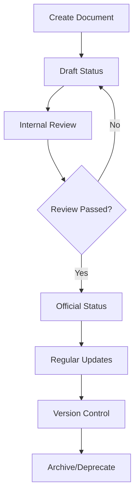

# Documentation Standards

> **Document Version**: v2.0.0  
> **Created**: 2024-01-20  
> **Last Updated**: 2024-12-19  
> **Status**: Official  
> **Maintenance Team**: Development Team

## Document Summary

This document establishes comprehensive documentation standards for the OAuth2.1 Authentication Authorization Center project, including formatting guidelines, content organization, maintenance processes, and best practices to ensure consistency, readability, and maintainability across all project documentation.

## Table of Contents

- [1. Documentation Overview](#1-documentation-overview)
- [2. Naming Conventions](#2-naming-conventions)
- [3. Document Structure Templates](#3-document-structure-templates)
- [4. Content Standards](#4-content-standards)
- [5. Maintenance Processes](#5-maintenance-processes)
- [6. Quality Control](#6-quality-control)
- [7. Team Collaboration](#7-team-collaboration)
- [8. Project Rules](#8-project-rules)
- [9. Best Practices](#9-best-practices)

## 1. Documentation Overview

### 1.1 Purpose and Scope

This standard applies to all documentation types within the OAuth2.1 Authentication Authorization Center project:

- **Product Requirements Documents**
- **Technical Design Documents** 
- **API Documentation**
- **Testing Documentation**
- **Deployment and Operations Documentation**
- **User Manuals**
- **Development Guides**

### 1.2 Documentation Principles

- **Consistency**: All documents follow unified format and structure
- **Completeness**: Documents contain all necessary information
- **Accuracy**: Content remains synchronized with actual implementation
- **Readability**: Clear structure with concise, understandable language
- **Maintainability**: Easy to update and extend
- **Accessibility**: Available to all relevant team members

### 1.3 Quality Objectives

| Metric | Target | Measurement |
|--------|--------|-------------|
| Content Accuracy | > 95% | Regular audits |
| Update Timeliness | < 48 hours | Change tracking |
| Format Compliance | 100% | Automated checks |
| User Satisfaction | > 90% | Team feedback |

## 2. Naming Conventions

### 2.1 File Naming Standard

**Format**: `[category]-[subject].md`

**Examples**:
- `product-requirements.md`
- `architecture-design.md`
- `api-documentation.md`
- `testing-strategy.md`
- `deployment-guide.md`

**Rules**:
- Use lowercase letters only
- Separate words with hyphens (kebab-case)
- Use descriptive, concise names
- Avoid special characters and spaces
- Include version in content, not filename

### 2.2 Document Title Hierarchy

```markdown
# Level 1 Title (Document Title)
## Level 2 Title (Main Sections)
### Level 3 Title (Subsections)
#### Level 4 Title (Detailed Content)
##### Level 5 Title (Minimum Granularity)
```

**Note**: Avoid using level 6 headings to maintain document structure clarity.

### 2.3 Section Numbering

Use consistent numbering for main sections:
```markdown
## 1. Introduction
### 1.1 Purpose
### 1.2 Scope
## 2. Requirements
### 2.1 Functional Requirements
### 2.2 Non-functional Requirements
```

## 3. Document Structure Templates

### 3.1 Requirements Document Template

```markdown
# [Product Name] Requirements

> **Document Version**: vX.Y.Z  
> **Created**: YYYY-MM-DD  
> **Last Updated**: YYYY-MM-DD  
> **Status**: [Draft|Review|Official]  
> **Owner**: [Team/Person]

## Document Summary
[Brief description of the document purpose and scope]

## Table of Contents
[Auto-generated or manual TOC]

## 1. Product Overview
### 1.1 Product Positioning
### 1.2 Product Vision
### 1.3 Target Users
### 1.4 Use Cases

## 2. Functional Requirements
### 2.1 Core Features
### 2.2 User Stories
### 2.3 Acceptance Criteria

## 3. Non-functional Requirements
### 3.1 Performance Requirements
### 3.2 Security Requirements
### 3.3 Usability Requirements
### 3.4 Compatibility Requirements

## 4. Constraints
### 4.1 Technical Constraints
### 4.2 Business Constraints
### 4.3 Timeline Constraints

## 5. Risk Assessment
### 5.1 Technical Risks
### 5.2 Business Risks
### 5.3 Risk Mitigation

## 6. Appendix
### 6.1 Glossary
### 6.2 References
### 6.3 Change Log
```

### 3.2 Technical Design Document Template

```markdown
# [System Name] Technical Design

> **Document Version**: vX.Y.Z  
> **Created**: YYYY-MM-DD  
> **Last Updated**: YYYY-MM-DD  
> **Status**: [Draft|Review|Official]  
> **Owner**: [Team/Person]

## Document Summary
[Brief description of the technical design scope and objectives]

## Table of Contents
[Auto-generated or manual TOC]

## 1. System Overview
### 1.1 System Purpose
### 1.2 Core Features
### 1.3 Technology Stack

## 2. System Architecture
### 2.1 High-level Architecture
### 2.2 Component Design
### 2.3 Data Flow
### 2.4 Integration Points

## 3. Detailed Design
### 3.1 Database Design
### 3.2 API Design
### 3.3 Security Design
### 3.4 Performance Considerations

## 4. Implementation Guidelines
### 4.1 Development Standards
### 4.2 Testing Strategy
### 4.3 Deployment Strategy

## 5. Appendix
### 5.1 Technical Specifications
### 5.2 Dependencies
### 5.3 Change Log
```

### 3.3 API Documentation Template

```markdown
# [API Name] Documentation

> **API Version**: vX.Y.Z  
> **Created**: YYYY-MM-DD  
> **Last Updated**: YYYY-MM-DD  
> **Status**: [Draft|Review|Official]  
> **Owner**: [Team/Person]

## Document Summary
[Brief description of the API purpose and capabilities]

## Table of Contents
[Auto-generated or manual TOC]

## 1. API Overview
### 1.1 Base URL
### 1.2 Authentication
### 1.3 Rate Limiting
### 1.4 Response Formats

## 2. Endpoints
### 2.1 Authentication Endpoints
### 2.2 User Management Endpoints
### 2.3 Resource Endpoints

## 3. Data Models
### 3.1 Request Models
### 3.2 Response Models
### 3.3 Error Models

## 4. Examples
### 4.1 Authentication Flow
### 4.2 Common Use Cases
### 4.3 Error Handling

## 5. Appendix
### 5.1 Status Codes
### 5.2 Error Codes
### 5.3 Change Log
```

## 4. Content Standards

### 4.1 Writing Style Guidelines

**Language**:
- Use clear, concise language
- Avoid jargon unless necessary (provide definitions)
- Use active voice when possible
- Be consistent with terminology

**Formatting**:
- Use bullet points for lists
- Use numbered lists for sequential steps
- Use code blocks for technical examples
- Use tables for structured data

**Code Examples**:
```typescript
// Always include language specification
// Provide complete, runnable examples
// Include comments for clarity
const example = {
  property: 'value',
  method: () => {
    // Implementation details
  }
};
```

### 4.2 Visual Elements

**Diagrams**:
- Use consistent diagramming tools (Mermaid preferred)
- Include alt text for accessibility
- Keep diagrams simple and focused

**Screenshots**:
- Use high-quality images
- Highlight relevant areas
- Include captions

**Tables**:
- Use headers for all columns
- Keep content concise
- Align content appropriately

### 4.3 Cross-references

**Internal Links**:
```markdown
See [Section 2.1](#21-authentication) for details.
Refer to the [API Documentation](./api-documentation.md).
```

**External Links**:
```markdown
For more information, see the [OAuth 2.1 Specification](https://tools.ietf.org/html/draft-ietf-oauth-v2-1-01).
```

## 5. Maintenance Processes

### 5.1 Document Lifecycle



### 5.2 Update Triggers

**Mandatory Updates**:
- Code changes affecting documented functionality
- API changes or new endpoints
- Security updates
- Process changes

**Scheduled Updates**:
- Quarterly review of all documentation
- Annual comprehensive audit
- Version release documentation

### 5.3 Update Process

1. **Identify Changes**: Monitor code commits, feature requests, bug reports
2. **Assess Impact**: Determine which documents need updates
3. **Update Content**: Make necessary changes following standards
4. **Review Changes**: Peer review for accuracy and clarity
5. **Publish Updates**: Update version and publish changes
6. **Notify Stakeholders**: Inform relevant team members

### 5.4 Version Control

**Version Format**: `vMAJOR.MINOR.PATCH`

- **MAJOR**: Significant restructuring or complete rewrites
- **MINOR**: New sections, substantial content additions
- **PATCH**: Minor corrections, clarifications, formatting fixes

**Change Log Format**:
```markdown
## Change Log

### v2.1.0 - 2024-12-19
- Added new authentication flow documentation
- Updated API endpoint examples
- Fixed formatting issues in code blocks

### v2.0.0 - 2024-12-01
- Complete restructure of document organization
- Migrated to new template format
- Added comprehensive examples
```

## 6. Quality Control

### 6.1 Review Process

**Review Types**:
- **Peer Review**: Technical accuracy and completeness
- **Editorial Review**: Language, formatting, and style
- **Stakeholder Review**: Business requirements alignment

**Review Checklist**:
- [ ] Content accuracy verified
- [ ] Format standards followed
- [ ] Links and references working
- [ ] Code examples tested
- [ ] Grammar and spelling checked
- [ ] Version information updated

### 6.2 Quality Metrics

**Automated Checks**:
- Link validation
- Spelling and grammar
- Format compliance
- Code syntax validation

**Manual Assessments**:
- Content accuracy audits
- User feedback collection
- Accessibility reviews
- Completeness evaluations

### 6.3 Feedback Mechanisms

**Internal Feedback**:
- Regular team reviews
- Documentation surveys
- Issue tracking for documentation bugs

**External Feedback**:
- User feedback forms
- Community contributions
- Support ticket analysis

## 7. Team Collaboration

### 7.1 Responsibility Matrix

| Document Type | Primary Owner | Contributors | Reviewers | Update Frequency |
|---------------|---------------|--------------|-----------|------------------|
| Requirements | Product Manager | Dev Team | Tech Lead | On requirement changes |
| Architecture | Tech Lead | Dev Team | Architect | On design changes |
| API Docs | API Developer | Dev Team | Tech Lead | On API changes |
| Testing | QA Engineer | Dev Team | QA Lead | On test plan changes |
| Deployment | DevOps Engineer | Dev Team | Tech Lead | On process changes |
| User Guides | Technical Writer | Product Team | Product Manager | On feature changes |

### 7.2 Collaboration Tools

**Primary Tools**:
- **Git**: Version control for all documentation
- **Markdown**: Standard format for all documents
- **Pull Requests**: Review and approval process
- **Issues**: Track documentation tasks and bugs

**Supporting Tools**:
- **Mermaid**: Diagram creation
- **Prettier**: Automatic formatting
- **Vale**: Style and grammar checking
- **Link Checker**: Automated link validation

### 7.3 Communication Protocols

**Documentation Updates**:
- Announce major updates in team channels
- Use descriptive commit messages
- Tag relevant team members in reviews
- Maintain update logs

**Issue Resolution**:
- Report documentation issues via GitHub Issues
- Use appropriate labels and priorities
- Assign to relevant document owners
- Track resolution progress

## 8. Project Rules

### 8.1 Technical Requirements

**Development Environment**:
- This project may require **Rust** and **wasm-pack** for WebAssembly compilation
- Testing framework: **Vitest**
- Database: **Prisma** with **SQLite**

**Code Quality Standards**:
- All API code must have corresponding unit tests
- Test coverage should be maintained above 85%
- Follow TypeScript/JavaScript best practices

### 8.2 Documentation Requirements

**Central Documentation**:
- The `docs/` directory serves as the central documentation repository
- All code implementation must align with documented designs
- If documentation is inadequate, update documentation before implementation

**Documentation-Driven Development**:
- Design documents should be created before implementation
- API documentation should be written before API development
- Test documentation should define test strategies before test implementation

### 8.3 Compliance Standards

**Security Requirements**:
- Follow OAuth 2.1 specification strictly
- Implement PKCE for all authorization flows
- Maintain security documentation current

**Quality Assurance**:
- All features must have corresponding test documentation
- Performance requirements must be documented
- Security considerations must be explicitly documented

## 9. Best Practices

### 9.1 Writing Effective Documentation

**Structure**:
- Start with a clear summary
- Use logical organization
- Provide table of contents for long documents
- Include examples and use cases

**Content**:
- Write for your audience
- Use consistent terminology
- Provide context and background
- Include troubleshooting information

**Maintenance**:
- Review regularly for accuracy
- Update promptly when changes occur
- Archive outdated information
- Gather and act on feedback

### 9.2 Common Pitfalls to Avoid

**Content Issues**:
- Outdated information
- Missing context or assumptions
- Overly technical language for general audience
- Incomplete examples

**Structure Issues**:
- Inconsistent formatting
- Poor organization
- Missing cross-references
- Unclear headings

**Maintenance Issues**:
- Infrequent updates
- No version control
- Missing change logs
- No review process

### 9.3 Continuous Improvement

**Regular Assessment**:
- Quarterly documentation reviews
- Annual process improvements
- User feedback integration
- Tool and process updates

**Innovation**:
- Explore new documentation tools
- Implement automation where possible
- Adopt industry best practices
- Share knowledge across teams

## Summary

This documentation standard provides a comprehensive framework for creating, maintaining, and improving project documentation. By following these guidelines, the team ensures:

1. **Consistency** across all documentation types
2. **Quality** through structured review processes
3. **Maintainability** via clear ownership and update procedures
4. **Accessibility** through standardized formats and organization
5. **Compliance** with project technical requirements

Regular adherence to these standards will result in documentation that effectively supports development, deployment, and maintenance of the OAuth2.1 Authentication Authorization Center.