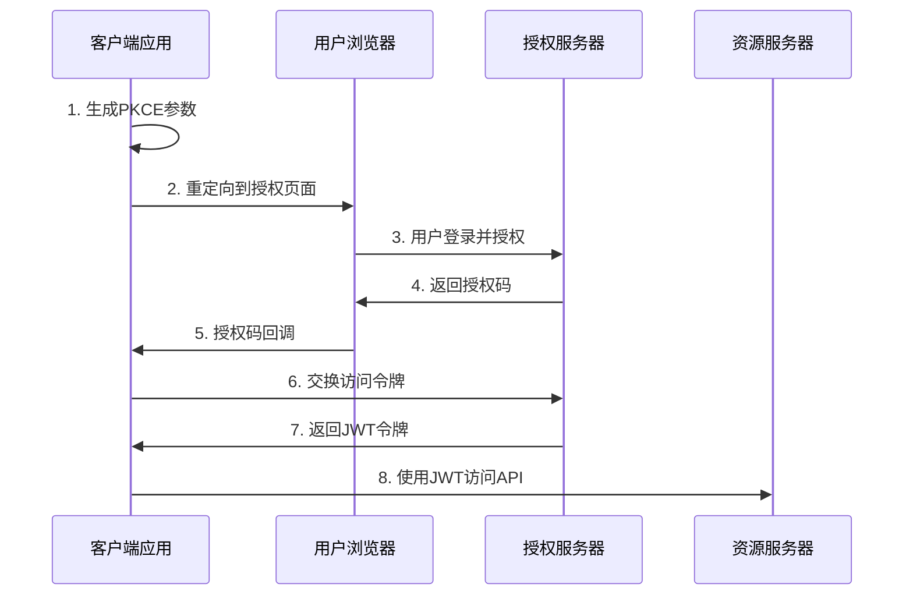

# JWT认证授权使用说明文档

**文档版本**: v1.0  
**创建日期**: 2024-01-15  
**最后更新**: 2024-01-15  
**文档状态**: 正式版  
**维护团队**: 认证授权团队  

**文档摘要**: 本文档详细说明了在OAuth2.1认证授权中心中如何获取、验证和使用JWT令牌，包括授权码模式、客户端认证模式、PKCE流程和OIDC公钥获取。

## 目录

1. [JWT概述](#1-jwt概述)
2. [OAuth2.1授权码模式获取JWT](#2-oauth21授权码模式获取jwt)
3. [客户端认证模式获取JWT](#3-客户端认证模式获取jwt)
4. [OIDC公钥获取和验证](#4-oidc公钥获取和验证)
5. [JWT令牌验证](#5-jwt令牌验证)
6. [API调用示例](#6-api调用示例)
7. [错误处理](#7-错误处理)
8. [最佳实践](#8-最佳实践)

## 1. JWT概述

### 1.1 JWT结构

JWT (JSON Web Token) 由三部分组成，用点号分隔：
```
header.payload.signature
```

- **Header**: 包含令牌类型和签名算法
- **Payload**: 包含声明信息（用户信息、权限等）
- **Signature**: 用于验证令牌完整性的签名

### 1.2 JWT类型

本系统支持两种JWT令牌：

- **Access Token**: 用于API访问的短期令牌（默认1小时）
- **Refresh Token**: 用于刷新访问令牌的长期令牌（默认30天）

## 2. OAuth2.1授权码模式获取JWT

### 2.1 流程概述

授权码模式是最安全的OAuth2.1流程，适用于Web应用和移动应用。



### 2.2 步骤详解

#### 步骤1: 生成PKCE参数

```javascript
// 生成code_verifier (43-128个字符的随机字符串)
const codeVerifier = generateRandomString(128);

// 生成code_challenge (SHA256哈希后Base64URL编码)
const codeChallenge = base64URLEncode(sha256(codeVerifier));
const codeChallengeMethod = 'S256';
```

#### 步骤2: 构建授权URL

```javascript
const authUrl = new URL('/api/oauth/authorize', 'https://auth.company.com');
authUrl.searchParams.set('response_type', 'code');
authUrl.searchParams.set('client_id', 'your_client_id');
authUrl.searchParams.set('redirect_uri', 'https://yourapp.com/callback');
authUrl.searchParams.set('scope', 'openid profile api:read');
authUrl.searchParams.set('state', generateRandomString(32));
authUrl.searchParams.set('code_challenge', codeChallenge);
authUrl.searchParams.set('code_challenge_method', codeChallengeMethod);

// 重定向用户到授权页面
window.location.href = authUrl.toString();
```

#### 步骤3: 处理授权回调

```javascript
// 在回调页面处理授权码
const urlParams = new URLSearchParams(window.location.search);
const code = urlParams.get('code');
const state = urlParams.get('state');

// 验证state参数防止CSRF攻击
if (state !== storedState) {
    throw new Error('Invalid state parameter');
}
```

#### 步骤4: 交换访问令牌

```javascript
const tokenResponse = await fetch('/api/oauth/token', {
    method: 'POST',
    headers: {
        'Content-Type': 'application/x-www-form-urlencoded',
    },
    body: new URLSearchParams({
        grant_type: 'authorization_code',
        code: code,
        redirect_uri: 'https://yourapp.com/callback',
        client_id: 'your_client_id',
        code_verifier: codeVerifier
    })
});

const tokens = await tokenResponse.json();
// tokens包含: access_token, refresh_token, id_token, token_type, expires_in
```

## 3. 客户端认证模式获取JWT

### 3.1 适用场景

客户端认证模式适用于：
- 服务器到服务器的通信
- 后台任务和定时任务
- 微服务间的认证

### 3.2 获取令牌

```javascript
const tokenResponse = await fetch('/api/oauth/token', {
    method: 'POST',
    headers: {
        'Content-Type': 'application/x-www-form-urlencoded',
        'Authorization': `Basic ${btoa(`${clientId}:${clientSecret}`)}`
    },
    body: new URLSearchParams({
        grant_type: 'client_credentials',
        scope: 'api:read api:write'
    })
});

const tokens = await tokenResponse.json();
```

## 4. OIDC公钥获取和验证

### 4.1 获取公钥

```javascript
// 获取JWKS (JSON Web Key Set)
const jwksResponse = await fetch('/.well-known/jwks.json');
const jwks = await jwksResponse.json();

// 或者获取OpenID配置
const configResponse = await fetch('/.well-known/openid-configuration');
const config = await configResponse.json();
const jwksUri = config.jwks_uri;
```

### 4.2 验证JWT签名

```javascript
import { jwtVerify, importJWK } from 'jose';

// 解析JWT头部获取kid
const header = JSON.parse(atob(jwt.split('.')[0]));
const kid = header.kid;

// 从JWKS中找到对应的公钥
const jwk = jwks.keys.find(key => key.kid === kid);
if (!jwk) {
    throw new Error('Public key not found');
}

// 导入公钥并验证JWT
const publicKey = await importJWK(jwk);
const { payload } = await jwtVerify(jwt, publicKey, {
    issuer: 'https://auth.company.com',
    audience: 'your_client_id'
});
```

## 5. JWT令牌验证

### 5.1 验证步骤

1. **格式验证**: 确保JWT格式正确
2. **签名验证**: 使用公钥验证签名
3. **时间验证**: 检查exp和iat声明
4. **发行者验证**: 验证iss声明
5. **受众验证**: 验证aud声明
6. **权限验证**: 检查scope和权限

### 5.2 验证示例

```javascript
function validateJWT(token) {
    try {
        // 1. 解析JWT
        const [header, payload, signature] = token.split('.');
        const decodedPayload = JSON.parse(atob(payload));
        
        // 2. 检查过期时间
        if (decodedPayload.exp < Date.now() / 1000) {
            throw new Error('Token expired');
        }
        
        // 3. 检查发行者
        if (decodedPayload.iss !== 'https://auth.company.com') {
            throw new Error('Invalid issuer');
        }
        
        // 4. 检查受众
        if (!decodedPayload.aud.includes('your_client_id')) {
            throw new Error('Invalid audience');
        }
        
        return decodedPayload;
    } catch (error) {
        throw new Error(`JWT validation failed: ${error.message}`);
    }
}
```

## 6. API调用示例

### 6.1 使用Access Token调用API

```javascript
// 在请求头中包含JWT
const apiResponse = await fetch('/api/v2/users', {
    headers: {
        'Authorization': `Bearer ${accessToken}`,
        'Content-Type': 'application/json'
    }
});

if (apiResponse.status === 401) {
    // 令牌过期，使用refresh token刷新
    await refreshAccessToken();
    // 重试请求
}
```

### 6.2 刷新访问令牌

```javascript
async function refreshAccessToken() {
    const response = await fetch('/api/oauth/token', {
        method: 'POST',
        headers: {
            'Content-Type': 'application/x-www-form-urlencoded'
        },
        body: new URLSearchParams({
            grant_type: 'refresh_token',
            refresh_token: storedRefreshToken,
            client_id: 'your_client_id'
        })
    });
    
    const tokens = await response.json();
    // 更新存储的令牌
    updateStoredTokens(tokens);
}
```

## 7. 错误处理

### 7.1 常见错误码

| 错误码 | 描述 | 处理方式 |
|--------|------|----------|
| `invalid_request` | 请求参数错误 | 检查请求参数 |
| `invalid_client` | 客户端认证失败 | 检查client_id和client_secret |
| `invalid_grant` | 授权码无效或过期 | 重新获取授权码 |
| `unauthorized_client` | 客户端无权限 | 联系管理员配置权限 |
| `unsupported_grant_type` | 不支持的授权类型 | 使用支持的授权类型 |
| `invalid_scope` | 无效的权限范围 | 检查请求的scope |

### 7.2 错误处理示例

```javascript
try {
    const response = await fetch('/api/oauth/token', options);
    
    if (!response.ok) {
        const error = await response.json();
        
        switch (error.error) {
            case 'invalid_grant':
                // 重新进行授权流程
                redirectToAuth();
                break;
            case 'invalid_client':
                // 客户端配置错误
                console.error('Client configuration error');
                break;
            default:
                console.error('OAuth error:', error);
        }
        return;
    }
    
    const tokens = await response.json();
    // 处理成功响应
} catch (error) {
    console.error('Network error:', error);
}
```

## 8. 最佳实践

### 8.1 安全最佳实践

1. **安全存储**: 使用安全的存储方式保存令牌
   ```javascript
   // 推荐：使用httpOnly cookie存储refresh token
   // 使用内存或sessionStorage存储access token
   ```

2. **内网环境特点**: 本系统专为内网环境设计
   - 用户由管理员创建和管理
   - 客户端由管理员注册和配置
   - 权限由管理员分配
   - 无需邮箱和手机号验证

2. **令牌刷新**: 实现自动令牌刷新机制
   ```javascript
   // 在令牌过期前5分钟自动刷新
   const refreshThreshold = 5 * 60 * 1000; // 5分钟
   if (tokenExpiresAt - Date.now() < refreshThreshold) {
       await refreshAccessToken();
   }
   ```

3. **PKCE使用**: 始终使用PKCE增强安全性
4. **State参数**: 使用state参数防止CSRF攻击
5. **HTTPS**: 所有通信必须使用HTTPS

### 8.2 性能最佳实践

1. **令牌缓存**: 合理缓存公钥和配置信息
2. **批量验证**: 对于高频API，考虑批量验证令牌
3. **连接复用**: 复用HTTP连接减少延迟

### 8.3 开发最佳实践

1. **错误日志**: 记录详细的错误信息用于调试
2. **监控告警**: 监控令牌获取和验证的成功率
3. **测试覆盖**: 编写完整的单元测试和集成测试

---

**注意**: 本文档基于OAuth2.1和OpenID Connect标准，请确保客户端实现符合相关规范要求。如有疑问，请联系认证授权团队。