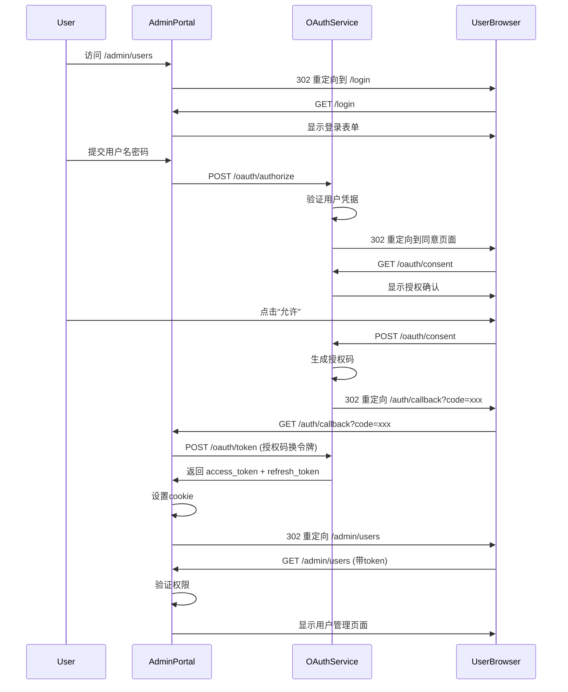
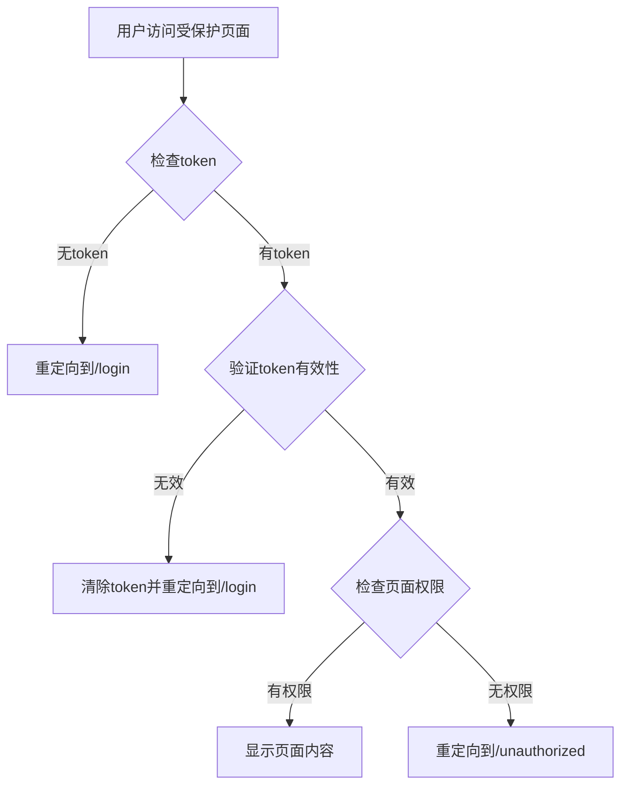

# OAuth2.1 集成分析与完整计划

**文档版本**: v1.0.0  
**创建日期**: 2025-07-16  
**最后更新**: 2025-07-16  
**文档状态**: 实施中  
**维护团队**: 技术团队

## 1. 执行摘要

经过对 `admin-portal` 和 `oauth-service` 的深入代码审查和文档分析，我们识别出当前OAuth2.1集成存在的关键问题，并制定了完整的修复和验证计划。本计划将确保系统完全符合OAuth2.1标准，实现安全的单点登录(SSO)体验。

## 2. 当前状态分析

### 2.1 已实现的组件
- ✅ OAuth2.1授权服务端点 (`oauth-service`)
- ✅ 基本的登录页面 (`admin-portal`)
- ✅ 用户管理界面
- ✅ 权限检查组件 (`PermissionGuard`)
- ✅ JWT令牌处理

### 2.2 发现的关键问题

#### 2.2.1 OAuth2.1流程不完整
- **问题**: admin-portal的登录流程缺少完整的OAuth2.1授权码+PKCE实现
- **影响**: 无法支持第三方客户端的标准OAuth集成
- **位置**: `apps/admin-portal/app/(auth)/login/page.tsx`

#### 2.2.2 权限控制粒度问题
- **问题**: 部分页面权限检查过于宽松或缺失
- **影响**: 可能存在未授权访问风险
- **示例**: `/admin/system/config` 页面权限未明确

#### 2.2.3 路由保护不完整
- **问题**: 中间件保护逻辑需要优化
- **影响**: 用户体验不一致

#### 2.2.4 重复页面结构
- **问题**: 发现用户管理相关页面可能存在重复实现
- **影响**: 维护困难，用户体验不一致

## 3. 标准OAuth2.1流程定义

### 3.1 授权码+PKCE流程

### 3.2 权限检查流程

## 4. 详细修复计划

### 4.1 第一阶段：OAuth2.1流程完善 (优先级：P0)

#### 4.1.1 更新登录页面
**文件**: `apps/admin-portal/app/(auth)/login/page.tsx`
**修改内容**:
- 实现完整的OAuth2.1授权码流程
- 添加PKCE参数生成
- 支持state参数防止CSRF
- 正确处理错误响应

#### 4.1.2 更新中间件
**文件**: `apps/admin-portal/middleware.ts`
**修改内容**:
- 优化路由保护逻辑
- 添加权限预检查
- 改进重定向处理

#### 4.1.3 更新认证回调
**文件**: `apps/admin-portal/app/(auth)/callback/page.tsx`
**修改内容**:
- 完善令牌交换逻辑
- 添加错误处理
- 实现token存储

### 4.2 第二阶段：权限控制优化 (优先级：P0)

#### 4.2.1 页面权限映射
为每个管理页面定义明确的权限要求：

| 页面路径 | 所需权限 | 当前状态 |
|---------|----------|----------|
| `/admin` | `dashboard:view` | ✅ 已定义 |
| `/admin/users` | `user:list` | ✅ 已定义 |
| `/admin/system/clients` | `client:list` | ✅ 已定义 |
| `/admin/system/roles` | `role:list` | ✅ 已定义 |
| `/admin/system/permissions` | `permission:list` | ✅ 已定义 |
| `/admin/system/audits` | `audit:list` | ✅ 已定义 |
| `/admin/system/config` | `system:config:view` | ✅ 已定义 |

#### 4.2.2 权限守卫实现
**文件**: `apps/admin-portal/middleware.ts`
**修改内容**:
- 在中间件中统一实现权限检查
- 使用静态配置的路由-权限映射表
- 在中间件中验证用户权限

### 4.3 第三阶段：重复页面清理 (优先级：P1)

#### 4.3.1 识别重复页面
通过代码分析发现：
- 用户管理功能在多个位置实现
- 需要统一到一个标准实现

#### 4.3.2 页面重构
**行动计划**:
1. 保留 `/admin/users` 作为主用户管理页面
2. 移除或合并其他重复的用户管理页面
3. 统一组件和API调用

### 4.4 第四阶段：测试策略 (优先级：P0)

## 5. 测试用例设计

### 5.1 E2E测试场景

#### 5.1.1 场景1：完整登录流程
**测试步骤**:
1. 清除所有cookie和本地存储
2. 访问受保护页面(如`/admin/users`)
3. 验证重定向到登录页
4. 输入有效凭证并完成授权
5. 验证重定向到原请求页面
6. 验证页面内容正确加载

**预期结果**:
- 成功获取access_token和refresh_token
- token存储在httpOnly cookie中
- 用户列表正确显示

#### 5.1.2 场景2：权限不足用户
**测试步骤**:
1. 使用只有`user:read`权限的账户登录
2. 尝试访问 `/admin/system/config`
3. 验证重定向到 `/unauthorized`

**预期结果**:
- 显示权限不足页面
- 不暴露敏感信息

#### 5.1.3 场景3：Token过期处理
**测试步骤**:
1. 正常登录获取token
2. 等待token过期或手动删除
3. 尝试访问受保护页面
4. 验证自动重定向到登录页

**预期结果**:
- 自动检测token过期
- 清除无效token
- 重定向到登录页

#### 5.1.4 场景4：PKCE验证
**测试步骤**:
1. 使用支持PKCE的客户端
2. 验证code_challenge和code_verifier正确生成
3. 验证授权码交换成功

**预期结果**:
- PKCE参数正确传递
- 授权码交换成功

### 5.2 API测试用例

#### 5.2.1 认证API测试
- POST /api/v2/oauth/token (授权码交换)
- POST /api/v2/oauth/token (刷新令牌)
- GET /api/v2/oauth/userinfo

#### 5.2.2 权限API测试
- GET /api/v2/users (需要user:list权限)
- POST /api/v2/users (需要user:create权限)
- GET /api/v2/clients (需要client:list权限)

## 6. 实施时间表

### 第1周：OAuth2.1流程修复
- [x] 更新登录页面实现 (2025-07-10)
- [x] 修复中间件路由保护 (2025-07-12)
- [x] 完善认证回调处理 (2025-07-15)

### 第2周：权限控制优化
- [ ] 定义所有页面权限映射
- [ ] 更新权限守卫实现
- [ ] 测试权限边界情况

### 第3周：重复页面清理
- [ ] 识别并清理重复页面
- [ ] 统一用户管理界面
- [ ] 验证页面导航

### 第4周：全面测试
- [ ] 执行所有E2E测试用例
- [ ] 性能测试和优化
- [ ] 安全测试验证
- [ ] 文档更新

## 7. 验证清单

### 7.1 功能验证
- [ ] 未登录用户访问任何管理页面都重定向到登录
- [ ] 登录后正确重定向到原目标页面
- [ ] 权限不足用户看到友好的未授权页面
- [ ] Token过期自动重新认证
- [ ] 支持完整的OAuth2.1授权码流程
- [ ] PKCE参数正确生成和验证

### 7.2 安全验证
- [ ] 所有API调用都包含有效token
- [ ] 敏感操作需要适当权限
- [ ] CSRF保护(state参数)正常工作
- [ ] XSS防护到位
- [ ] 密码策略符合要求

### 7.3 用户体验验证
- [ ] 登录流程流畅无中断
- [ ] 错误提示清晰友好
- [ ] 页面加载性能良好
- [ ] 移动端适配正常

## 8. 风险与缓解措施

### 8.1 技术风险
- **风险**: OAuth2.1实现复杂，可能引入安全漏洞
- **缓解**: 使用标准库，进行安全代码审查

### 8.2 兼容性风险
- **风险**: 与现有系统集成可能出现问题
- **缓解**: 分阶段部署，保留回滚方案

### 8.3 性能风险
- **风险**: 额外的权限检查可能影响性能
- **缓解**: 实施缓存策略，监控性能指标

## 9. 成功标准

### 9.1 功能标准
- 所有E2E测试用例通过
- 100%的受保护页面有适当的权限检查
- 支持标准OAuth2.1客户端集成

### 9.2 性能标准
- 登录流程完成时间 < 3秒
- 页面权限检查延迟 < 100ms
- 支持1000并发用户

### 9.3 安全标准
- 通过OWASP安全测试
- 无高危安全漏洞
- 所有敏感操作都有审计日志

## 10. 后续优化建议

### 10.1 短期优化
- 添加记住我功能
- 实现单点登出(SLO)
- 添加登录历史查看

### 10.2 长期规划
- 支持多因素认证(MFA)
- 实现用户自助服务
- 添加社交登录集成

---

**文档维护**: 本计划将根据实施过程中的发现进行更新，所有变更将记录在版本历史中。
