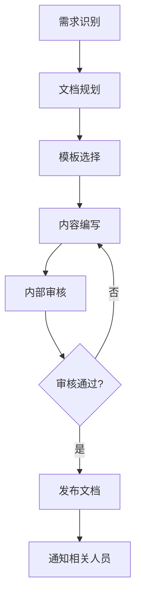
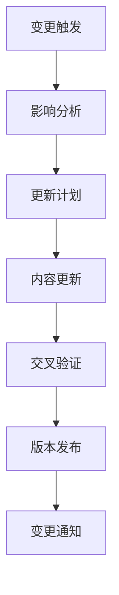

# OAuth2.1认证授权中心文档维护指南

> **文档版本**: v1.0.0  
> **创建日期**: 2024-01-20  
> **最后更新**: 2024-01-20  
> **文档状态**: 正式版  
> **维护团队**: 全体开发团队

## 文档摘要

本指南详细描述了OAuth2.1认证授权中心文档体系的维护流程、规范和最佳实践。确保文档的准确性、时效性和一致性，为项目的长期发展提供有力支撑。

## 目录

- [1. 文档维护概述](#1-文档维护概述)
- [2. 文档分类管理](#2-文档分类管理)
- [3. 维护流程](#3-维护流程)
- [4. 质量控制](#4-质量控制)
- [5. 版本管理](#5-版本管理)
- [6. 团队协作](#6-团队协作)
- [7. 工具和平台](#7-工具和平台)
- [8. 最佳实践](#8-最佳实践)

## 1. 文档维护概述

### 1.1 维护目标

**核心目标**:
- 确保文档内容的准确性和时效性
- 维护文档体系的完整性和一致性
- 提升文档的可读性和实用性
- 建立高效的文档协作机制

**质量标准**:
- 内容准确率 > 95%
- 文档更新及时性 < 48小时
- 格式规范遵循率 = 100%
- 用户满意度 > 90%

### 1.2 维护原则

1. **及时性原则**: 代码变更后48小时内更新相关文档
2. **准确性原则**: 确保文档内容与实际实现保持一致
3. **完整性原则**: 覆盖系统的所有重要方面
4. **一致性原则**: 遵循统一的格式和风格规范
5. **可维护性原则**: 文档结构清晰，易于更新和扩展

## 2. 文档分类管理

### 2.1 文档分类体系

```
docs/
├── 01-需求文档/
│   ├── 产品需求文档.md
│   ├── 功能需求规格说明.md
│   └── 用户故事.md
├── 02-设计文档/
│   ├── 系统架构设计.md
│   ├── 数据库设计.md
│   ├── API设计规范.md
│   ├── 权限体系设计文档.md
│   └── 认证授权中心页面设计文档.md
├── 03-技术文档/
│   ├── OAuth2.1认证授权中心完整技术设计文档.md
│   ├── OAuth2.1认证授权中心技术架构文档.md
│   ├── OAuth2.1认证授权模型完整技术文档.md
│   ├── jwt_auth_middleware_guidance.md
│   └── 系统监控数据上报设计.md
├── 04-测试文档/
│   ├── 测试设计方案.md
│   ├── 测试用例.md
│   └── 测试报告.md
├── 05-运维文档/
│   ├── 部署指南.md
│   ├── 运维手册.md
│   └── 故障排查指南.md
├── 06-开发文档/
│   ├── 开发环境搭建.md
│   ├── 代码规范.md
│   ├── 代码升级方案.md
│   └── 贡献指南.md
├── 07-管理文档/
│   ├── 文档标准化规范.md
│   ├── 文档维护指南.md
│   └── 项目管理.md
└── 08-报告文档/
    ├── API优化实施报告.md
    ├── 性能测试报告.md
    └── 安全评估报告.md
```

### 2.2 文档责任矩阵

| 文档类型 | 主要负责人 | 协作人员 | 审核人员 | 更新频率 |
|----------|------------|----------|----------|----------|
| 需求文档 | 产品经理 | 开发团队 | 技术负责人 | 需求变更时 |
| 设计文档 | 架构师 | 开发团队 | 技术负责人 | 设计变更时 |
| 技术文档 | 技术负责人 | 开发团队 | 架构师 | 技术变更时 |
| 测试文档 | 测试工程师 | 开发团队 | QA负责人 | 测试计划变更时 |
| 运维文档 | 运维工程师 | 开发团队 | 运维负责人 | 部署变更时 |
| 开发文档 | 开发工程师 | 全体开发 | 技术负责人 | 代码变更时 |

## 3. 维护流程

### 3.1 文档创建流程



**详细步骤**:

1. **需求识别**
   - 识别文档需求来源
   - 确定文档类型和优先级
   - 分配责任人

2. **文档规划**
   - 确定文档结构和内容范围
   - 制定编写计划和时间表
   - 识别相关利益方

3. **模板选择**
   - 根据文档类型选择合适模板
   - 确保遵循标准化规范
   - 自定义特殊需求部分

4. **内容编写**
   - 按照模板结构编写内容
   - 遵循写作规范和风格指南
   - 添加必要的图表和示例

5. **内部审核**
   - 技术准确性审核
   - 格式规范性检查
   - 内容完整性验证

6. **发布文档**
   - 更新文档版本信息
   - 发布到指定位置
   - 更新文档索引

### 3.2 文档更新流程



**触发条件**:
- 代码功能变更
- 系统架构调整
- 业务需求变化
- 错误修正
- 定期审查

**更新要求**:
- 变更后48小时内完成更新
- 保持版本历史记录
- 通知相关利益方
- 验证更新准确性

### 3.3 文档审核流程

**审核层级**:

1. **一级审核**（作者自审）
   - 内容完整性检查
   - 格式规范性验证
   - 链接有效性测试

2. **二级审核**（同行评审）
   - 技术准确性验证
   - 逻辑一致性检查
   - 可读性评估

3. **三级审核**（专家审核）
   - 架构合理性评估
   - 标准符合性检查
   - 最终质量把关

**审核清单**:

```markdown
## 文档审核清单

### 内容质量
- [ ] 内容准确无误
- [ ] 逻辑清晰连贯
- [ ] 信息完整充分
- [ ] 示例代码可运行
- [ ] 图表清晰易懂

### 格式规范
- [ ] 遵循文档模板
- [ ] 标题层级正确
- [ ] 代码块格式正确
- [ ] 链接有效可访问
- [ ] 图片显示正常

### 技术标准
- [ ] 符合技术规范
- [ ] API文档与实现一致
- [ ] 配置信息准确
- [ ] 版本信息正确
- [ ] 依赖关系明确
```

## 4. 质量控制

### 4.1 质量指标

**内容质量指标**:

| 指标 | 定义 | 目标值 | 测量方法 |
|------|------|--------|----------|
| 准确性 | 文档内容与实际实现的一致性 | >95% | 定期验证测试 |
| 完整性 | 文档覆盖功能的完整程度 | >90% | 功能覆盖率分析 |
| 时效性 | 文档更新的及时程度 | <48h | 更新时间统计 |
| 可读性 | 文档的易读易懂程度 | >4.0/5.0 | 用户反馈评分 |
| 一致性 | 文档格式和风格的统一性 | 100% | 自动化检查 |

### 4.2 质量检查机制

**自动化检查**:

```yaml
# .github/workflows/docs-quality.yml
name: Documentation Quality Check

on:
  pull_request:
    paths:
      - 'docs/**'

jobs:
  quality-check:
    runs-on: ubuntu-latest
    steps:
      - uses: actions/checkout@v3
      
      - name: Check Markdown Format
        uses: markdownlint/markdownlint-action@v1
        with:
          config: .markdownlint.json
          
      - name: Check Links
        uses: gaurav-nelson/github-action-markdown-link-check@v1
        
      - name: Spell Check
        uses: streetsidesoftware/cspell-action@v2
        
      - name: Check Document Structure
        run: |
          python scripts/check-doc-structure.py
```

**人工检查**:
- 每月进行文档质量审查
- 季度进行全面文档评估
- 年度进行文档体系优化

### 4.3 持续改进

**反馈收集**:
- 用户反馈表单
- 开发团队建议
- 文档使用统计
- 问题跟踪系统

**改进措施**:
- 定期更新文档模板
- 优化文档结构
- 改进写作指南
- 加强培训和指导

## 5. 版本管理

### 5.1 版本控制策略

**版本号规则**:
- 主版本号：重大架构变更或完全重写
- 次版本号：功能新增或重要更新
- 修订版本号：错误修正或小幅改进

**示例**:
- v1.0.0：初始版本
- v1.1.0：新增功能模块
- v1.1.1：修正错误或更新

### 5.2 变更记录

**CHANGELOG格式**:

```markdown
# 变更日志

## [v2.0.0] - 2024-01-20

### 新增
- 添加OAuth2.1完整技术设计文档
- 新增代码升级方案文档
- 完善权限体系设计文档

### 变更
- 重构产品需求文档结构
- 优化测试设计方案格式
- 统一文档标准化规范

### 修复
- 修正API文档中的错误示例
- 更新过期的配置信息
- 修复文档链接问题

### 移除
- 删除过时的技术文档
- 清理重复的内容
```

### 5.3 分支管理

**文档分支策略**:
- `main`：稳定版本文档
- `develop`：开发版本文档
- `feature/*`：功能特性文档
- `hotfix/*`：紧急修复文档

## 6. 团队协作

### 6.1 角色定义

**文档管理员**:
- 制定文档标准和规范
- 监督文档质量和一致性
- 协调文档维护工作
- 培训团队成员

**内容贡献者**:
- 编写和更新文档内容
- 遵循文档规范和标准
- 参与文档审核工作
- 提供改进建议

**技术审核员**:
- 验证技术内容准确性
- 确保文档与实现一致
- 提供专业技术指导
- 把控文档技术质量

### 6.2 协作工具

**文档编辑**:
- Markdown编辑器
- VS Code + 插件
- Typora
- 在线协作平台

**版本控制**:
- Git版本管理
- GitHub/GitLab
- 分支保护规则
- Pull Request流程

**沟通协调**:
- 项目管理工具
- 即时通讯工具
- 定期会议
- 邮件通知

### 6.3 培训机制

**新人培训**:
- 文档规范培训
- 工具使用培训
- 最佳实践分享
- 实践指导

**持续培训**:
- 定期技能提升
- 新工具介绍
- 经验分享会
- 外部培训

## 7. 工具和平台

### 7.1 编写工具

**推荐工具**:

1. **VS Code**
   - Markdown All in One插件
   - Markdown Preview Enhanced
   - Code Spell Checker
   - GitLens

2. **Typora**
   - 所见即所得编辑
   - 实时预览
   - 主题定制
   - 导出功能

3. **在线编辑器**
   - Notion
   - GitBook
   - Confluence
   - 语雀

### 7.2 质量检查工具

**自动化工具**:

```json
{
  "markdownlint": "格式检查",
  "cspell": "拼写检查",
  "markdown-link-check": "链接检查",
  "textlint": "文本校对",
  "alex": "包容性语言检查"
}
```

**配置示例**:

```json
// .markdownlint.json
{
  "MD013": {
    "line_length": 120,
    "code_blocks": false,
    "tables": false
  },
  "MD033": {
    "allowed_elements": ["br", "sub", "sup"]
  }
}
```

### 7.3 发布平台

**内部平台**:
- 企业Wiki系统
- 内部文档平台
- 项目管理系统
- 知识库系统

**外部平台**:
- GitHub Pages
- GitBook
- Read the Docs
- 静态网站生成器

## 8. 最佳实践

### 8.1 写作最佳实践

**内容组织**:
1. 使用清晰的标题层级
2. 提供目录和导航
3. 合理使用列表和表格
4. 添加代码示例和图表
5. 包含相关链接和参考

**语言风格**:
1. 使用简洁明了的语言
2. 避免技术术语滥用
3. 保持一致的术语使用
4. 提供必要的解释说明
5. 考虑读者的技术水平

**格式规范**:
1. 遵循Markdown语法标准
2. 使用一致的代码块格式
3. 保持图片大小适中
4. 使用有意义的文件名
5. 维护清晰的目录结构

### 8.2 维护最佳实践

**定期维护**:
1. 每月检查文档准确性
2. 季度更新过时内容
3. 年度评估文档架构
4. 及时处理用户反馈
5. 持续优化文档质量

**协作效率**:
1. 建立清晰的责任分工
2. 使用标准化的流程
3. 及时沟通和反馈
4. 共享最佳实践经验
5. 持续改进工作方式

### 8.3 质量保证最佳实践

**预防措施**:
1. 使用文档模板
2. 建立审核机制
3. 自动化质量检查
4. 定期培训团队
5. 收集用户反馈

**持续改进**:
1. 分析质量指标
2. 识别改进机会
3. 实施改进措施
4. 监控改进效果
5. 分享成功经验

## 总结

文档维护是一个持续的过程，需要全团队的共同努力。通过建立完善的维护机制、严格的质量控制和高效的协作流程，我们能够确保文档体系的高质量和可持续发展。

良好的文档维护不仅能提升项目的专业性和可维护性，还能显著提高团队的工作效率和协作质量。让我们共同努力，打造一个优秀的文档体系！