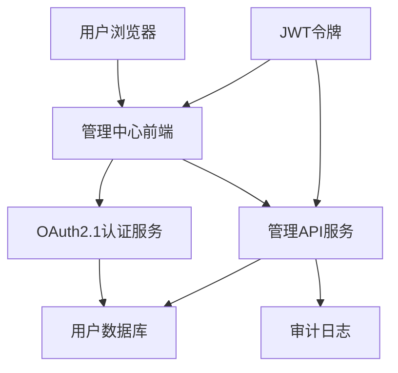

# 认证授权中心页面设计文档

## 1. 页面设计概述

### 1.1 设计原则

认证授权中心管理界面遵循以下设计原则：

- **OAuth客户端架构**: 管理中心本身作为OAuth客户端，通过标准OAuth2.1流程进行认证
- **无状态设计**: 不依赖传统session管理，完全基于JWT令牌
- **权限驱动**: 所有页面和功能基于RBAC权限控制
- **响应式设计**: 支持桌面端和移动端访问
- **安全优先**: 所有操作都有完整的审计日志

### 1.2 技术架构



### 1.3 认证流程

管理中心作为OAuth客户端的认证流程：

1. **初始访问**: 用户访问管理中心，检查JWT令牌
2. **OAuth重定向**: 无有效令牌时重定向到OAuth授权端点
3. **用户认证**: 用户在认证页面输入凭据
4. **授权确认**: 用户确认授权管理中心访问权限
5. **令牌获取**: 管理中心获取访问令牌和刷新令牌
6. **权限验证**: 基于令牌验证用户权限并显示相应界面

## 2. 页面结构设计

### 2.1 整体布局

```
┌─────────────────────────────────────────────────────────┐
│                    顶部导航栏                              │
├─────────────┬───────────────────────────────────────────┤
│             │                                           │
│             │                                           │
│   侧边栏     │              主内容区域                     │
│   菜单      │                                           │
│             │                                           │
│             │                                           │
├─────────────┴───────────────────────────────────────────┤
│                    底部信息栏                              │
└─────────────────────────────────────────────────────────┘
```

### 2.2 顶部导航栏

**组件**: `TopNavigation`

**功能**:
- 系统Logo和名称
- 用户信息显示（头像、姓名、角色）
- 通知中心
- 用户菜单（个人设置、退出登录）
- 系统状态指示器

**权限控制**:
- 所有登录用户可见
- 通知中心根据用户权限显示相关通知

### 2.3 侧边栏菜单

**组件**: `SidebarMenu`

**菜单结构**:
```typescript
interface MenuItem {
  id: string;
  name: string;
  icon: string;
  path: string;
  permission: string;
  children?: MenuItem[];
  badge?: {
    text: string;
    color: 'red' | 'blue' | 'green' | 'yellow';
  };
}
```

**权限控制**:
- 基于用户权限动态显示菜单项
- 无权限的菜单项不显示
- 支持菜单项的实时权限检查

## 3. 核心页面设计

### 3.1 登录页面

**页面路径**: `/login`
**组件**: `LoginPage`
**权限**: 公开访问

**设计要求**:
- 简洁的登录界面，突出企业品牌
- 支持OAuth2.1 + PKCE流程
- 响应式设计，适配移动端
- 错误提示友好

**功能特性**:
- 企业SSO登录
- 多因素认证支持
- 记住登录状态（可选）
- 登录安全验证

**UI组件**:
```tsx
interface LoginPageProps {
  redirectUri?: string;
  clientId: string;
  scope: string[];
}

const LoginPage: React.FC<LoginPageProps> = ({ redirectUri, clientId, scope }) => {
  const { initiateOAuth } = useOAuthFlow();
  
  return (
    <div className="min-h-screen flex items-center justify-center bg-gradient-to-br from-blue-50 to-indigo-100">
      <Card className="w-full max-w-md">
        <CardHeader className="text-center">
          <div className="mx-auto w-16 h-16 bg-blue-600 rounded-full flex items-center justify-center mb-4">
            <ShieldCheckIcon className="w-8 h-8 text-white" />
          </div>
          <CardTitle className="text-2xl">认证授权中心</CardTitle>
          <CardDescription>企业级身份认证管理平台</CardDescription>
        </CardHeader>
        <CardContent>
          <Button 
            className="w-full" 
            onClick={() => initiateOAuth({ clientId, redirectUri, scope })}
          >
            使用企业账号登录
          </Button>
          <div className="mt-4 text-center text-sm text-gray-600">
            <p>支持SSO单点登录和多因素认证</p>
          </div>
        </CardContent>
      </Card>
    </div>
  );
};
```

### 3.2 仪表板页面

**路径**: `/dashboard`  
**权限**: `menu:dashboard:view`  
**组件**: `DashboardPage`

#### 3.1.1 页面布局

```
┌─────────────────────────────────────────────────────────┐
│  系统概览卡片区域                                          │
├─────────────┬─────────────┬─────────────┬─────────────┤
│  用户统计    │  认证统计    │  权限统计    │  系统状态    │
├─────────────┴─────────────┴─────────────┴─────────────┤
│                    图表区域                              │
├─────────────────────┬───────────────────────────────┤
│    认证趋势图表      │        权限使用统计图表          │
├─────────────────────┴───────────────────────────────┤
│                  最近活动列表                           │
└─────────────────────────────────────────────────────────┘
```

#### 3.1.2 功能组件

**统计卡片**:
- 总用户数、活跃用户数、新增用户数
- 认证成功率、失败次数、令牌数量
- 角色数量、权限数量、客户端数量
- 系统健康状态、API响应时间

**图表组件**:
- 认证趋势图（折线图）
- 权限使用分布（饼图）
- API调用统计（柱状图）
- 用户活跃度热力图

**活动列表**:
- 最近登录记录
- 权限变更记录
- 系统配置变更
- 安全事件提醒

### 3.2 用户管理页面

**路径**: `/users`  
**权限**: `menu:users:view`  
**组件**: `UserManagementPage`

#### 3.2.1 用户列表页面

**路径**: `/users/list`  
**权限**: `menu:users:list`

**功能特性**:
- 用户列表展示（表格形式）
- 高级搜索和筛选
- 批量操作（启用/禁用/删除）
- 分页和排序
- 导出功能

**表格列**:
- 用户头像和基本信息
- 用户状态（活跃/锁定/禁用）
- 角色信息
- 最后登录时间
- 创建时间
- 操作按钮

#### 3.2.2 用户详情页面

**路径**: `/users/[userId]`  
**权限**: `users:read`

**页面结构**:
```
┌─────────────────────────────────────────────────────────┐
│                  用户基本信息卡片                          │
├─────────────────────┬───────────────────────────────┤
│    角色权限信息      │        登录历史记录              │
├─────────────────────┴───────────────────────────────┤
│                    操作日志                              │
└─────────────────────────────────────────────────────────┘
```

**功能组件**:
- 用户基本信息编辑
- 角色分配和管理
- 权限查看和验证
- 登录历史查询
- 操作日志追踪
- 密码重置功能

#### 3.2.3 创建用户页面

**路径**: `/users/create`  
**权限**: `menu:users:create`

**表单字段**:
- 基本信息（用户名、邮箱、手机号）
- 个人信息（姓名、部门、职位）
- 账户设置（初始密码、状态）
- 角色分配
- 权限预览

### 3.3 角色管理页面

**路径**: `/roles`  
**权限**: `menu:roles:view`  
**组件**: `RoleManagementPage`

#### 3.3.1 角色列表页面

**路径**: `/roles/list`  
**权限**: `menu:roles:list`

**功能特性**:
- 角色列表展示
- 角色权限预览
- 角色用户统计
- 角色层级关系
- 快速权限分配

#### 3.3.2 角色详情页面

**路径**: `/roles/[roleId]`  
**权限**: `roles:read`

**页面结构**:
```
┌─────────────────────────────────────────────────────────┐
│                  角色基本信息                              │
├─────────────────────┬───────────────────────────────┤
│    权限分配树形图    │        角色用户列表              │
├─────────────────────┴───────────────────────────────┤
│                  权限继承关系图                          │
└─────────────────────────────────────────────────────────┘
```

### 3.4 权限管理页面

**路径**: `/permissions`  
**权限**: `menu:permissions:view`  
**组件**: `PermissionManagementPage`

#### 3.4.1 API权限管理

**路径**: `/permissions/api`  
**权限**: `menu:permissions:api`

**功能特性**:
- API端点权限映射
- 权限分组管理
- 权限依赖关系
- 权限使用统计

#### 3.4.2 菜单权限管理

**路径**: `/permissions/menu`  
**权限**: `menu:permissions:menu`

**功能特性**:
- 菜单权限树形结构
- 权限继承设置
- 菜单可见性控制
- 权限测试工具

#### 3.4.3 数据权限管理

**路径**: `/permissions/data`  
**权限**: `menu:permissions:data`

**功能特性**:
- 数据范围权限设置
- 字段级权限控制
- 数据过滤规则
- 权限效果预览

### 3.5 客户端管理页面

**路径**: `/clients`  
**权限**: `menu:clients:view`  
**组件**: `ClientManagementPage`

#### 3.5.1 客户端列表页面

**路径**: `/clients/list`  
**权限**: `menu:clients:list`

**功能特性**:
- OAuth客户端列表
- 客户端类型标识（公共/机密）
- 授权统计信息
- 客户端状态管理
- 快速配置入口

#### 3.5.2 客户端详情页面

**路径**: `/clients/[clientId]`  
**权限**: `clients:read`

**页面结构**:
```
┌─────────────────────────────────────────────────────────┐
│                客户端基本配置                              │
├─────────────────────┬───────────────────────────────┤
│    OAuth配置信息     │        授权统计图表              │
├─────────────────────┴───────────────────────────────┤
│                  授权记录和令牌管理                      │
└─────────────────────────────────────────────────────────┘
```

**功能组件**:
- 客户端基本信息编辑
- OAuth配置管理（重定向URI、作用域等）
- 客户端密钥管理
- 授权记录查询
- 活跃令牌管理

#### 3.5.3 注册客户端页面

**路径**: `/clients/register`  
**权限**: `menu:clients:register`

**表单字段**:
- 客户端基本信息
- OAuth配置参数
- 作用域选择
- 安全设置
- 配置预览

#### 3.5.4 作用域管理页面

**路径**: `/clients/scopes`  
**权限**: `menu:clients:scopes`

**功能特性**:
- 作用域定义管理
- 作用域权限映射
- 作用域使用统计
- 作用域依赖关系

### 3.6 审计管理页面

**路径**: `/audit`  
**权限**: `menu:audit:view`  
**组件**: `AuditManagementPage`

#### 3.6.1 审计日志页面

**路径**: `/audit/logs`  
**权限**: `menu:audit:logs`

**功能特性**:
- 审计日志列表
- 高级搜索和筛选
- 日志详情查看
- 日志导出功能
- 实时日志监控

**筛选条件**:
- 时间范围
- 用户ID
- 操作类型
- 资源类型
- 操作结果
- IP地址

#### 3.6.2 安全事件页面

**路径**: `/audit/security`  
**权限**: `menu:audit:security`

**功能特性**:
- 安全事件监控
- 异常行为检测
- 风险评估报告
- 安全告警管理

#### 3.6.3 合规报告页面

**路径**: `/audit/compliance`  
**权限**: `menu:audit:compliance`

**功能特性**:
- 合规性检查报告
- 权限合规性分析
- 数据访问合规性
- 报告生成和导出

### 3.7 系统管理页面

**路径**: `/system`  
**权限**: `menu:system:view`  
**组件**: `SystemManagementPage`

#### 3.7.1 系统配置页面

**路径**: `/system/config`  
**权限**: `menu:system:config`

**配置分类**:
- 认证配置（密码策略、会话超时）
- OAuth配置（令牌有效期、PKCE设置）
- 安全配置（加密算法、安全头）
- 系统配置（日志级别、缓存设置）

#### 3.7.2 安全策略页面

**路径**: `/system/security`  
**权限**: `menu:system:security`

**功能特性**:
- 密码策略配置
- 账户锁定策略
- IP白名单管理
- 安全头配置

#### 3.7.3 系统监控页面

**路径**: `/system/monitoring`  
**权限**: `menu:system:monitoring`

**监控内容**:
- 系统性能指标
- API调用统计
- 数据库性能
- 缓存状态
- 错误率统计

#### 3.7.4 数据管理页面

**路径**: `/system/data`  
**权限**: `menu:system:data`

**功能特性**:
- 数据备份管理
- 数据恢复功能
- 数据清理工具
- 数据迁移工具

## 4. 认证授权流程页面

### 4.1 登录页面

**路径**: `/login`  
**权限**: 公开访问  
**组件**: `LoginPage`

**页面特性**:
- 响应式设计
- 多种登录方式（用户名/邮箱/手机号）
- 记住登录状态
- 忘记密码链接
- 验证码支持
- OAuth第三方登录（可选）

**安全特性**:
- 防暴力破解
- 图形验证码
- 登录失败锁定
- 安全日志记录

### 4.2 OAuth授权页面

**路径**: `/oauth/authorize`  
**权限**: 需要登录  
**组件**: `OAuthAuthorizePage`

**页面结构**:
```
┌─────────────────────────────────────────────────────────┐
│                  客户端信息展示                          │
├─────────────────────────────────────────────────────────┤
│                  权限范围说明                            │
├─────────────────────────────────────────────────────────┤
│              用户授权确认按钮                            │
└─────────────────────────────────────────────────────────┘
```

**功能特性**:
- 客户端信息验证和展示
- 权限范围详细说明
- 用户授权确认
- 授权记录保存
- 安全警告提示

### 4.3 OAuth同意管理页面

**路径**: `/oauth/consent`  
**权限**: 需要登录  
**组件**: `OAuthConsentPage`

**功能特性**:
- 已授权应用列表
- 授权权限查看
- 撤销授权功能
- 授权历史记录

## 5. 个人账户页面

### 5.1 个人资料页面

**路径**: `/account/profile`  
**权限**: `account:profile:read`  
**组件**: `ProfilePage`

**功能特性**:
- 个人信息查看和编辑
- 头像上传和管理
- 联系方式管理
- 个人偏好设置

### 5.2 安全设置页面

**路径**: `/account/security`  
**权限**: `account:security:manage`  
**组件**: `SecuritySettingsPage`

**功能特性**:
- 密码修改
- 两步验证设置
- 登录设备管理
- 安全日志查看

### 5.3 授权管理页面

**路径**: `/account/authorizations`  
**权限**: `account:consents:read`  
**组件**: `AuthorizationsPage`

**功能特性**:
- 已授权应用列表
- 授权详情查看
- 撤销授权操作
- 授权历史记录

## 6. 响应式设计

### 6.1 断点设计

```css
/* 移动端 */
@media (max-width: 768px) {
  /* 侧边栏折叠为抽屉式 */
  /* 表格转换为卡片式布局 */
  /* 简化操作按钮 */
}

/* 平板端 */
@media (min-width: 769px) and (max-width: 1024px) {
  /* 侧边栏可收缩 */
  /* 表格保持但列数减少 */
  /* 图表自适应 */
}

/* 桌面端 */
@media (min-width: 1025px) {
  /* 完整布局 */
  /* 所有功能可见 */
  /* 多列布局 */
}
```

### 6.2 移动端适配

**导航适配**:
- 顶部导航固定
- 侧边栏抽屉式
- 底部导航栏（可选）

**表格适配**:
- 卡片式布局
- 滑动查看更多
- 关键信息优先显示

**表单适配**:
- 单列布局
- 大号输入框
- 触摸友好的按钮

## 7. 无障碍设计

### 7.1 键盘导航

- 完整的Tab键导航支持
- 快捷键支持
- 焦点指示器
- 跳转链接

### 7.2 屏幕阅读器支持

- 语义化HTML结构
- ARIA标签支持
- 替代文本
- 状态通知

### 7.3 视觉辅助

- 高对比度模式
- 字体大小调节
- 色彩无障碍
- 动画控制

## 8. 性能优化

### 8.1 前端优化

**代码分割**:
- 路由级别的代码分割
- 组件懒加载
- 第三方库按需加载

**缓存策略**:
- 静态资源缓存
- API响应缓存
- 用户权限缓存

**渲染优化**:
- 虚拟滚动
- 图片懒加载
- 防抖和节流

### 8.2 数据加载优化

**分页策略**:
- 服务端分页
- 无限滚动
- 虚拟列表

**预加载策略**:
- 关键数据预加载
- 路由预加载
- 权限信息预加载

## 9. 安全考虑

### 9.1 前端安全

**XSS防护**:
- 输入验证和转义
- CSP策略
- 安全的DOM操作

**CSRF防护**:
- CSRF令牌
- SameSite Cookie
- 双重提交验证

### 9.2 数据安全

**敏感信息保护**:
- 敏感数据脱敏
- 安全的数据传输
- 本地存储加密

**权限验证**:
- 前端权限检查
- 后端权限验证
- 实时权限更新

## 10. 开发规范

### 10.1 组件规范

**命名规范**:
- PascalCase组件名
- camelCase属性名
- kebab-case CSS类名

**文件结构**:
```
components/
├── common/          # 通用组件
├── forms/           # 表单组件
├── charts/          # 图表组件
├── layout/          # 布局组件
└── pages/           # 页面组件
```

### 10.2 状态管理

**状态分类**:
- 全局状态（用户信息、权限）
- 页面状态（表单数据、UI状态）
- 缓存状态（API响应、计算结果）

**状态管理工具**:
- Zustand（轻量级状态管理）
- React Query（服务端状态）
- Local Storage（持久化状态）

### 10.3 测试规范

**测试类型**:
- 单元测试（组件测试）
- 集成测试（页面测试）
- E2E测试（用户流程测试）

**测试覆盖**:
- 组件渲染测试
- 用户交互测试
- 权限控制测试
- 错误处理测试

## 11. 部署和维护

### 11.1 构建优化

**构建配置**:
- 生产环境优化
- 资源压缩
- Tree Shaking
- 代码分割

**环境配置**:
- 开发环境配置
- 测试环境配置
- 生产环境配置
- 环境变量管理

### 11.2 监控和分析

**性能监控**:
- 页面加载时间
- 用户交互响应
- 错误率统计
- 资源使用情况

**用户行为分析**:
- 页面访问统计
- 功能使用情况
- 用户路径分析
- 转化率分析

---

*文档版本：v1.0*  
*最后更新：2024年12月*  
*状态：设计阶段*