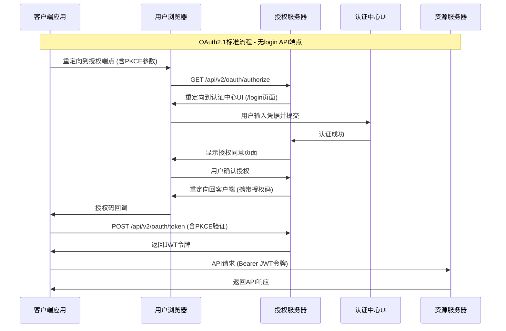

# OAuth2.1 认证授权中心 & 微服务平台详细设计文档

**版本**: v5.1.0
**创建日期**: 2025-06-27
**更新日期**: 2025-06-27
**状态**: 正式版
**维护团队**: 架构团队
**实现状态**: ⚠️ 核心功能完成，存在集成问题

## 文档摘要

本文档是基于 Turborepo 的 OAuth2.1 认证授权中心和微服务平台的统一详细设计文档，整合了系统架构、API 设计、权限体系和安全机制。采用 Next.js 15 + TypeScript 5 技术栈，实现了完整的 OAuth2.1 + OIDC 认证授权体系和企业级 RBAC 权限管理系统。

**⚠️ 当前状态**: 核心OAuth2.1功能已实现，但存在API端点集成问题需要解决。

**核心特色**：

- ✅ **OAuth2.1 认证中心**: 完整实现 OAuth2.1 + OIDC 标准，支持授权码流程 + PKCE
- ✅ **企业级 RBAC**: 四级权限控制（菜单、API、数据、操作），灵活的角色权限体系
- ✅ **微服务架构**: 5个独立微服务 + 3个共享包，统一认证授权
- ✅ **现代技术栈**: Next.js 15.3.2 + React 19 + TypeScript 5 + Prisma 6.10.1
- ✅ **JWT 安全**: jose 6.0.11 + RS256 算法，支持密钥轮换和令牌撤销
- ✅ **标准化流程**: 无直接登录 API，所有认证必须通过标准 OAuth2.1 流程
- ⚠️ **管理后台**: 基础功能完成，存在集成问题
- ❌ **审计日志**: 后端实现缺失

## 1. 系统架构

### 1.1 技术栈详情

#### 🎯 核心技术栈

- **Monorepo**: Turborepo 2.3.3 (构建系统)
- **运行时**: Node.js 22.x LTS
- **包管理**: pnpm 9.x (工作区支持)
- **语言**: TypeScript 5.x (严格模式)

#### 🎨 前端技术栈

- **框架**: Next.js 15.3.2 (App Router + React 19)
- **UI框架**:
  - shadcn/ui (组件库)
  - Tailwind CSS 4.1.5 (样式系统)
  - Radix UI (无障碍组件基础)
- **状态管理**:
  - Zustand + Immer (全局状态)
  - @tanstack/react-query (服务端状态)
- **表单处理**:
  - React Hook Form 7.x
  - Zod 3.24.1 (验证模式)
- **图标**: Lucide React 0.513.0
- **工具库**:
  - date-fns (日期处理)
  - class-variance-authority (样式变体)
  - tailwind-merge (样式合并)

#### ⚙️ 后端技术栈

- **API框架**: Next.js 15.3.2 API Routes
- **数据库**:
  - SQLite (开发环境)
  - PostgreSQL (生产环境)
- **ORM**: Prisma 6.10.1
  - Prisma Client (类型安全查询)
  - Prisma Migrate (数据库迁移)
  - Prisma Studio (数据库管理)
- **认证授权**:
  - OAuth2.1 + OIDC 标准实现
  - jose 6.0.11 (JWT 处理)
  - bcrypt 6.0.0 (密码加密)
- **验证**: Zod 3.24.1 (API 数据验证)
- **日志**: winston (结构化日志)

#### 🛠️ 开发工具栈

- **代码质量**:
  - ESLint 9.x (代码检查)
  - Prettier 3.x (代码格式化)
  - TypeScript 5.x (类型检查)
- **测试**:
  - Jest 29.x (单元测试)
  - @testing-library/react (组件测试)
  - Playwright (E2E 测试)
- **构建**:
  - Turborepo (Monorepo 构建)
  - SWC (快速编译)
  - PostCSS (CSS 处理)

### 1.2 数据库设计

#### 核心模型

```prisma
// schema.prisma

model User {
  id           String    @id @default(cuid())
  username     String    @unique
  passwordHash String    @map("password_hash")
  isActive     Boolean   @default(true) @map("is_active")
  createdAt    DateTime  @default(now()) @map("created_at")
  updatedAt    DateTime  @updatedAt @map("updated_at")

  roles              UserRole[]
  authorizationCodes AuthorizationCode[]
  accessTokens       AccessToken[]
  refreshTokens      RefreshToken[]

  @@map("users")
}

model OAuthClient {
  id                String     @id @default(cuid())
  clientId          String     @unique @map("client_id")
  clientSecret      String?    @map("client_secret")
  name              String
  redirectUris      String[]   @map("redirect_uris")
  allowedScopes     String[]   @map("allowed_scopes")
  createdAt         DateTime   @default(now()) @map("created_at")
  updatedAt         DateTime   @updatedAt @map("updated_at")

  authorizationCodes AuthorizationCode[]
  accessTokens       AccessToken[]
  refreshTokens      RefreshToken[]

  @@map("oauth_clients")
}

model Role {
  id          String     @id @default(cuid())
  name        String     @unique
  description String?
  createdAt   DateTime   @default(now()) @map("created_at")
  updatedAt   DateTime   @updatedAt @map("updated_at")

  users       UserRole[]
  permissions RolePermission[]

  @@map("roles")
}

model Permission {
  id          String           @id @default(cuid())
  name        String           @unique
  resource    String
  action      String
  description String?
  createdAt   DateTime         @default(now()) @map("created_at")

  roles       RolePermission[]

  @@map("permissions")
}

model UserRole {
  id     String @id @default(cuid())
  userId String @map("user_id")
  roleId String @map("role_id")

  user User @relation(fields: [userId], references: [id], onDelete: Cascade)
  role Role @relation(fields: [roleId], references: [id], onDelete: Cascade)

  @@unique([userId, roleId])
  @@map("user_roles")
}

model RolePermission {
  id           String @id @default(cuid())
  roleId       String @map("role_id")
  permissionId String @map("permission_id")

  role       Role       @relation(fields: [roleId], references: [id], onDelete: Cascade)
  permission Permission @relation(fields: [permissionId], references: [id], onDelete: Cascade)

  @@unique([roleId, permissionId])
  @@map("role_permissions")
}

model AuthorizationCode {
  id              String   @id @default(cuid())
  codeHash        String   @unique @map("code_hash")
  clientId        String   @map("client_id")
  userId          String   @map("user_id")
  redirectUri     String   @map("redirect_uri")
  scope           String?
  codeChallenge   String?  @map("code_challenge")
  codeChallengeMethod String? @map("code_challenge_method")
  expiresAt       DateTime @map("expires_at")
  createdAt       DateTime @default(now()) @map("created_at")

  client OAuthClient @relation(fields: [clientId], references: [id], onDelete: Cascade)
  user   User        @relation(fields: [userId], references: [id], onDelete: Cascade)

  @@map("authorization_codes")
}

model AccessToken {
  id        String   @id @default(cuid())
  tokenHash String   @unique @map("token_hash")
  clientId  String   @map("client_id")
  userId    String?  @map("user_id")
  scope     String?
  expiresAt DateTime @map("expires_at")
  createdAt DateTime @default(now()) @map("created_at")

  client OAuthClient @relation(fields: [clientId], references: [id], onDelete: Cascade)
  user   User?       @relation(fields: [userId], references: [id], onDelete: Cascade)

  @@map("access_tokens")
}

model RefreshToken {
  id        String   @id @default(cuid())
  tokenHash String   @unique @map("token_hash")
  clientId  String   @map("client_id")
  userId    String   @map("user_id")
  scope     String?
  expiresAt DateTime @map("expires_at")
  createdAt DateTime @default(now()) @map("created_at")

  client OAuthClient @relation(fields: [clientId], references: [id], onDelete: Cascade)
  user   User        @relation(fields: [userId], references: [id], onDelete: Cascade)

  @@map("refresh_tokens")
}
```

## 2. API 设计

### 2.1 OAuth2.1 认证授权流程

本系统严格遵循 OAuth2.1 标准，不提供任何独立的登录 API 端点。所有认证操作必须通过标准的 OAuth2.1 授权码流程完成，并强制使用 PKCE (S256)。



### 2.2 API 端点

#### OAuth2.1 & OIDC 端点

| 端点路径                            | HTTP方法 | 功能描述              | 状态 | 集成状态           |
| ----------------------------------- | -------- | --------------------- | ---- | ------------------ |
| `/api/v2/oauth/authorize`           | GET      | 启动OAuth2.1授权流程  | ✅   | ✅ 正常使用        |
| `/api/v2/oauth/token`               | POST     | 交换授权码获取JWT令牌 | ✅   | ✅ 正常使用        |
| `/api/v2/oauth/userinfo`            | GET      | OIDC用户信息端点      | ✅   | ⚠️ 与/users/me重复 |
| `/api/v2/oauth/revoke`              | POST     | 撤销访问令牌          | ✅   | ⚠️ 前端未集成      |
| `/.well-known/jwks.json`            | GET      | JWT验证公钥           | ✅   | ✅ 正常使用        |
| `/.well-known/openid-configuration` | GET      | OIDC发现信息          | ✅   | ⚠️ 前端未使用      |

#### 管理端 API

##### 用户管理

| 端点                       | 方法   | 描述     | 后端状态 | 前端集成 | 问题                  |
| -------------------------- | ------ | -------- | -------- | -------- | --------------------- |
| `/api/v2/users`            | GET    | 用户列表 | ✅       | ✅       | -                     |
| `/api/v2/users`            | POST   | 创建用户 | ✅       | ✅       | -                     |
| `/api/v2/users/{id}`       | GET    | 用户详情 | ✅       | ✅       | -                     |
| `/api/v2/users/{id}`       | PUT    | 更新用户 | ✅       | ✅       | -                     |
| `/api/v2/users/{id}`       | DELETE | 删除用户 | ✅       | ✅       | -                     |
| `/api/v2/users/me`         | GET    | 当前用户 | ✅       | ✅       | 与/oauth/userinfo重复 |
| `/api/v2/users/me/profile` | PUT    | 更新资料 | ❌       | ✅       | **后端未实现**        |

##### 角色管理

| 端点                 | 方法   | 描述     | 后端状态 | 前端集成 | 问题 |
| -------------------- | ------ | -------- | -------- | -------- | ---- |
| `/api/v2/roles`      | GET    | 角色列表 | ✅       | ✅       | -    |
| `/api/v2/roles`      | POST   | 创建角色 | ✅       | ✅       | -    |
| `/api/v2/roles/{id}` | GET    | 角色详情 | ✅       | ✅       | -    |
| `/api/v2/roles/{id}` | PUT    | 更新角色 | ✅       | ✅       | -    |
| `/api/v2/roles/{id}` | DELETE | 删除角色 | ✅       | ✅       | -    |

##### 客户端管理

| 端点                                 | 方法   | 描述       | 后端状态 | 前端集成 | 问题           |
| ------------------------------------ | ------ | ---------- | -------- | -------- | -------------- |
| `/api/v2/clients`                    | GET    | 客户端列表 | ✅       | ✅       | -              |
| `/api/v2/clients`                    | POST   | 创建客户端 | ✅       | ✅       | -              |
| `/api/v2/clients/{id}`               | GET    | 客户端详情 | ✅       | ✅       | -              |
| `/api/v2/clients/{id}`               | PUT    | 更新客户端 | ✅       | ✅       | -              |
| `/api/v2/clients/{id}`               | DELETE | 删除客户端 | ✅       | ✅       | -              |
| `/api/v2/clients/{id}/secret`        | POST   | 轮换密钥   | ✅       | ❌       | **路径不匹配** |
| `/api/v2/clients/{id}/rotate-secret` | POST   | 轮换密钥   | ❌       | ✅       | 前端调用此路径 |

##### 认证管理

| 端点                   | 方法 | 描述     | 后端状态 | 前端集成 | 问题             |
| ---------------------- | ---- | -------- | -------- | -------- | ---------------- |
| `/api/v2/auth/logout`  | POST | 会话注销 | ❌       | ✅       | **后端未实现**   |
| `/api/v2/oauth/revoke` | POST | 令牌撤销 | ✅       | ❌       | 应统一使用此端点 |

##### 审计日志

| 端点                 | 方法 | 描述     | 后端状态 | 前端集成 | 问题           |
| -------------------- | ---- | -------- | -------- | -------- | -------------- |
| `/api/v2/audit/logs` | GET  | 审计日志 | ❌       | ❌       | **完全缺失**   |
| `/api/v2/audit-logs` | GET  | 审计日志 | ❌       | ✅       | 前端调用此路径 |

## 3. 权限体系设计

### 3.1 权限模型

采用基于 RBAC（Role-Based Access Control）的权限模型，结合 OAuth2.1 的 `scope`，实现四级权限控制：

- **菜单权限**：控制用户可访问的管理界面菜单。
- **API权限**：控制用户可调用的 API 接口。
- **数据权限**：控制用户可访问的数据范围。
- **操作权限**：控制用户在页面上可执行的具体操作（如：创建、编辑、删除按钮的可见性）。

### 3.2 权限标识符规范

权限标识符采用 `resource:action` 的格式，例如 `users:create`、`roles:read`。

## 4. 安全机制

### 4.1 JWT 安全

- **库**: `jose@6.0.11`
- **算法**: `RS256`
- **密钥管理**: 通过 JWKS 端点 `/.well-known/jwks.json` 提供公钥，支持密钥轮换。
- **声明**: JWT `payload` 包含标准声明 (`iss`, `aud`, `sub`, `exp`) 以及自定义的权限声明 (`permissions`)。

### 4.2 PKCE

强制所有客户端在授权码流程中使用 PKCE (Proof Key for Code Exchange) 并采用 `S256` 算法，以防止授权码被截获攻击。

### 4.3 密码安全

- **哈希算法**: `bcrypt`
- **策略**: 强制密码复杂度、定期更换、历史密码校验等。

## 5. 测试策略更新

### 单元测试

- **覆盖率目标**: 80%+
- **测试框架**: Jest + @testing-library/react
- **测试范围**: 核心业务逻辑、组件功能
- **当前状态**: ⚠️ 基础测试已配置，需要扩展覆盖率

### 集成测试

- **API测试**: 使用 Postman/Newman
- **E2E测试**: 使用 Playwright
- **数据库测试**: 使用测试数据库
- **当前状态**: ⚠️ 需要针对发现的集成问题编写测试用例

### 安全测试

- **OAuth2.1流程测试**: 授权码、PKCE验证 ✅
- **JWT安全测试**: 签名验证、过期检查 ✅
- **权限测试**: RBAC权限验证 ✅
- **端点安全测试**: ⚠️ 需要测试路径不匹配问题

### 集成问题测试

- **路径一致性测试**: 验证前后端API路径匹配
- **功能完整性测试**: 确保所有前端调用的API都有后端实现
- **错误处理测试**: 统一错误响应格式验证

基于新的详细设计，测试策略将进行如下调整：

- **集成测试**: 重点测试完整的 OAuth2.1 授权码 + PKCE 流程，覆盖从授权请求到令牌获取，再到使用令牌访问受保护资源的全过程。
- **API 测试**: 为 `/api/v2/*` 下的所有管理端点编写单元和集成测试，验证其增删改查功能和权限控制逻辑。
- **权限测试**: 编写专门的测试用例，验证不同角色的用户访问菜单、API 和数据时的权限是否符合预期。
- **安全测试**: 增加针对 PKCE、JWT 签名、令牌过期和撤销等安全机制的测试用例。
- **移除陈旧测试**: 删除针对已废弃 API（如 `/api/v1/*`）的测试代码。
