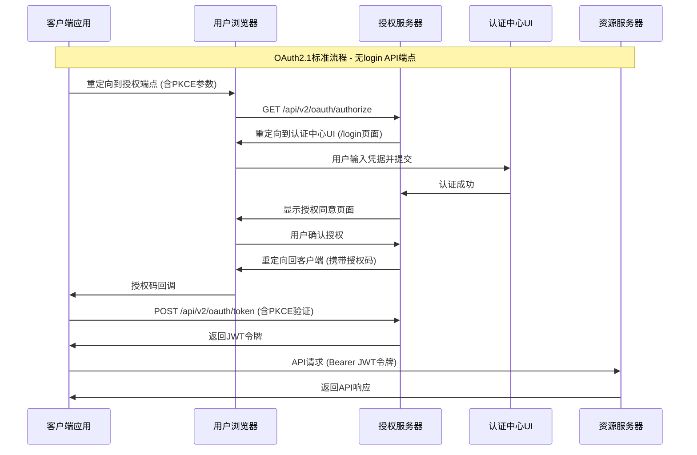

# Monorepo 微服务平台详细设计文档

**版本**: 4.0
**创建日期**: 2024-12-22
**状态**: 正式版
**维护团队**: 架构团队

## 文档摘要

本文档是 Monorepo 微服务平台的统一详细设计文档，整合了系统架构、API 设计、权限体系和安全机制。本文档旨在为开发、测试和运维团队提供一份全面、准确的技术参考。

**核心特色**：
- ✅ **中心化认证**: `oauth-service` 为所有微服务提供统一的认证和授权。
- ✅ **OAuth2.1 & OIDC**: 完整支持 OAuth2.1 授权码模式（含PKCE）和 OpenID Connect。
- ✅ **企业级 RBAC**: 采用灵活的 RBAC 模型，支持菜单、API、数据和操作四级权限控制。
- ✅ **JWT 安全**: 使用 Jose 库生成和验证 JWT，确保通信安全。
- ✅ **无直接登录API**: 系统内不存在任何独立的 login 端点，所有认证必须通过标准 OAuth2.1 流程。

## 1. 系统架构

### 1.1 技术栈

#### 前端技术栈

- **框架**: Next.js ^15.3.2 (App Router)
- **语言**: TypeScript ^5
- **样式**: Tailwind CSS ^4.0.0
- **UI组件**: Shadcn/ui (基于 Radix UI)
  - `@radix-ui/react-*`: ^1.1.x
  - `lucide-react`: ^0.513.0
- **状态管理**: Zustand (根据需要添加)
- **表单处理**: React Hook Form (根据需要添加) + Zod ^3.24.2
- **HTTP客户端**: Fetch API (原生)

#### 后端技术栈

- **运行时**: Node.js ^22
- **框架**: Next.js ^15.3.2 API Routes
- **语言**: TypeScript ^5
- **数据库**: SQLite (通过 Prisma)
- **ORM**: Prisma ^6.10.1
- **认证**: JWT (jose ^6.0.11) + OAuth 2.1
- **加密**: bcrypt ^6.0.0
- **验证**: Zod ^3.24.2

### 1.2 数据库设计

#### 核心模型

```prisma
// schema.prisma

model User {
  id           String    @id @default(cuid())
  username     String    @unique
  passwordHash String    @map("password_hash")
  isActive     Boolean   @default(true) @map("is_active")
  createdAt    DateTime  @default(now()) @map("created_at")
  updatedAt    DateTime  @updatedAt @map("updated_at")

  roles              UserRole[]
  authorizationCodes AuthorizationCode[]
  accessTokens       AccessToken[]
  refreshTokens      RefreshToken[]

  @@map("users")
}

model OAuthClient {
  id                String     @id @default(cuid())
  clientId          String     @unique @map("client_id")
  clientSecret      String?    @map("client_secret")
  name              String
  redirectUris      String[]   @map("redirect_uris")
  allowedScopes     String[]   @map("allowed_scopes")
  createdAt         DateTime   @default(now()) @map("created_at")
  updatedAt         DateTime   @updatedAt @map("updated_at")

  authorizationCodes AuthorizationCode[]
  accessTokens       AccessToken[]
  refreshTokens      RefreshToken[]

  @@map("oauth_clients")
}

model Role {
  id          String     @id @default(cuid())
  name        String     @unique
  description String?
  createdAt   DateTime   @default(now()) @map("created_at")
  updatedAt   DateTime   @updatedAt @map("updated_at")

  users       UserRole[]
  permissions RolePermission[]

  @@map("roles")
}

model Permission {
  id          String           @id @default(cuid())
  name        String           @unique
  resource    String
  action      String
  description String?
  createdAt   DateTime         @default(now()) @map("created_at")

  roles       RolePermission[]

  @@map("permissions")
}

model UserRole {
  id     String @id @default(cuid())
  userId String @map("user_id")
  roleId String @map("role_id")

  user User @relation(fields: [userId], references: [id], onDelete: Cascade)
  role Role @relation(fields: [roleId], references: [id], onDelete: Cascade)

  @@unique([userId, roleId])
  @@map("user_roles")
}

model RolePermission {
  id           String @id @default(cuid())
  roleId       String @map("role_id")
  permissionId String @map("permission_id")

  role       Role       @relation(fields: [roleId], references: [id], onDelete: Cascade)
  permission Permission @relation(fields: [permissionId], references: [id], onDelete: Cascade)

  @@unique([roleId, permissionId])
  @@map("role_permissions")
}

model AuthorizationCode {
  id              String   @id @default(cuid())
  codeHash        String   @unique @map("code_hash")
  clientId        String   @map("client_id")
  userId          String   @map("user_id")
  redirectUri     String   @map("redirect_uri")
  scope           String?
  codeChallenge   String?  @map("code_challenge")
  codeChallengeMethod String? @map("code_challenge_method")
  expiresAt       DateTime @map("expires_at")
  createdAt       DateTime @default(now()) @map("created_at")

  client OAuthClient @relation(fields: [clientId], references: [id], onDelete: Cascade)
  user   User        @relation(fields: [userId], references: [id], onDelete: Cascade)

  @@map("authorization_codes")
}

model AccessToken {
  id        String   @id @default(cuid())
  tokenHash String   @unique @map("token_hash")
  clientId  String   @map("client_id")
  userId    String?  @map("user_id")
  scope     String?
  expiresAt DateTime @map("expires_at")
  createdAt DateTime @default(now()) @map("created_at")

  client OAuthClient @relation(fields: [clientId], references: [id], onDelete: Cascade)
  user   User?       @relation(fields: [userId], references: [id], onDelete: Cascade)

  @@map("access_tokens")
}

model RefreshToken {
  id        String   @id @default(cuid())
  tokenHash String   @unique @map("token_hash")
  clientId  String   @map("client_id")
  userId    String   @map("user_id")
  scope     String?
  expiresAt DateTime @map("expires_at")
  createdAt DateTime @default(now()) @map("created_at")

  client OAuthClient @relation(fields: [clientId], references: [id], onDelete: Cascade)
  user   User        @relation(fields: [userId], references: [id], onDelete: Cascade)

  @@map("refresh_tokens")
}
```

## 2. API 设计

### 2.1 OAuth2.1 认证授权流程

本系统严格遵循 OAuth2.1 标准，不提供任何独立的登录 API 端点。所有认证操作必须通过标准的 OAuth2.1 授权码流程完成，并强制使用 PKCE (S256)。



### 2.2 API 端点

#### OAuth2.1 & OIDC 端点

| 端点路径 | HTTP方法 | 功能描述 |
|---|---|---|
| `/api/v2/oauth/authorize` | GET | 启动OAuth2.1授权流程 |
| `/api/v2/oauth/token` | POST | 交换授权码获取JWT令牌 |
| `/api/v2/oauth/userinfo` | GET | OIDC用户信息端点 |
| `/api/v2/oauth/revoke` | POST | 撤销访问令牌 |
| `/.well-known/jwks.json` | GET | JWT验证公钥 |
| `/.well-known/openid-configuration` | GET | OIDC发现信息 |

#### 管理端 API

| 资源 | API 路径 | 支持方法 |
|---|---|---|
| 用户管理 | `/api/v2/users` | GET, POST, PUT, DELETE |
| 角色管理 | `/api/v2/roles` | GET, POST, PUT, DELETE |
| 权限管理 | `/api/v2/permissions` | GET, POST, PUT, DELETE |
| 客户端管理 | `/api/v2/clients` | GET, POST, PUT, DELETE |
| 审计日志 | `/api/v2/audit/logs` | GET |
| 系统配置 | `/api/v2/system/configurations` | GET, PUT |

## 3. 权限体系设计

### 3.1 权限模型

采用基于 RBAC（Role-Based Access Control）的权限模型，结合 OAuth2.1 的 `scope`，实现四级权限控制：

- **菜单权限**：控制用户可访问的管理界面菜单。
- **API权限**：控制用户可调用的 API 接口。
- **数据权限**：控制用户可访问的数据范围。
- **操作权限**：控制用户在页面上可执行的具体操作（如：创建、编辑、删除按钮的可见性）。

### 3.2 权限标识符规范

权限标识符采用 `resource:action` 的格式，例如 `users:create`、`roles:read`。

## 4. 安全机制

### 4.1 JWT 安全

- **库**: `jose@6.0.11`
- **算法**: `RS256`
- **密钥管理**: 通过 JWKS 端点 `/.well-known/jwks.json` 提供公钥，支持密钥轮换。
- **声明**: JWT `payload` 包含标准声明 (`iss`, `aud`, `sub`, `exp`) 以及自定义的权限声明 (`permissions`)。

### 4.2 PKCE

强制所有客户端在授权码流程中使用 PKCE (Proof Key for Code Exchange) 并采用 `S256` 算法，以防止授权码被截获攻击。

### 4.3 密码安全

- **哈希算法**: `bcrypt`
- **策略**: 强制密码复杂度、定期更换、历史密码校验等。

## 5. 测试策略更新

基于新的详细设计，测试策略将进行如下调整：

- **集成测试**: 重点测试完整的 OAuth2.1 授权码 + PKCE 流程，覆盖从授权请求到令牌获取，再到使用令牌访问受保护资源的全过程。
- **API 测试**: 为 `/api/v2/*` 下的所有管理端点编写单元和集成测试，验证其增删改查功能和权限控制逻辑。
- **权限测试**: 编写专门的测试用例，验证不同角色的用户访问菜单、API 和数据时的权限是否符合预期。
- **安全测试**: 增加针对 PKCE、JWT 签名、令牌过期和撤销等安全机制的测试用例。
- **移除陈旧测试**: 删除针对已废弃 API（如 `/api/v1/*`）的测试代码。