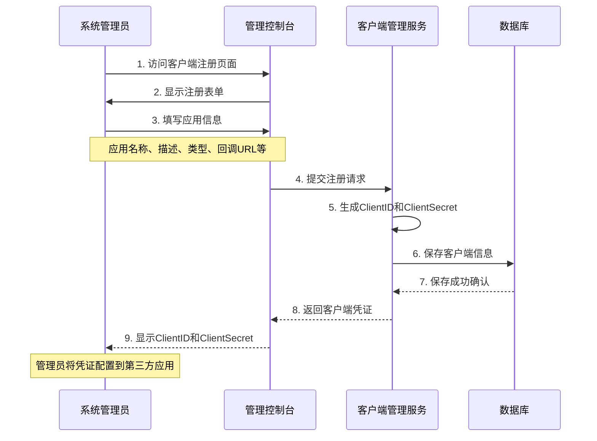
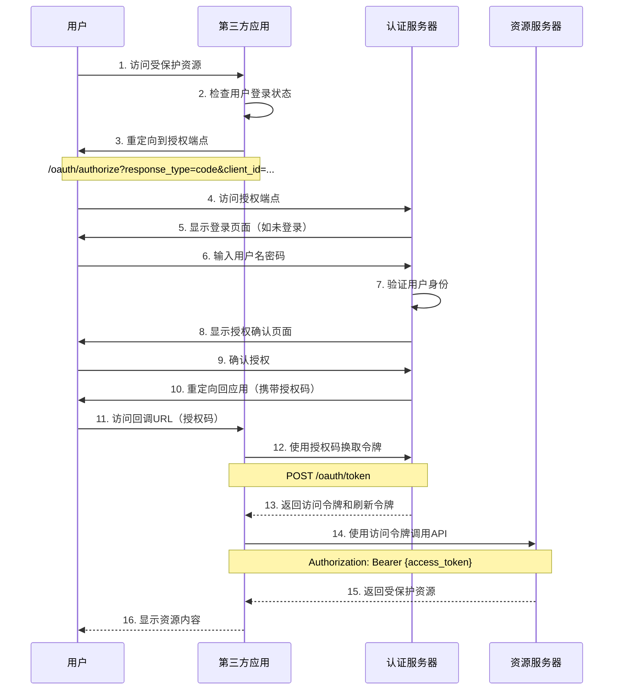
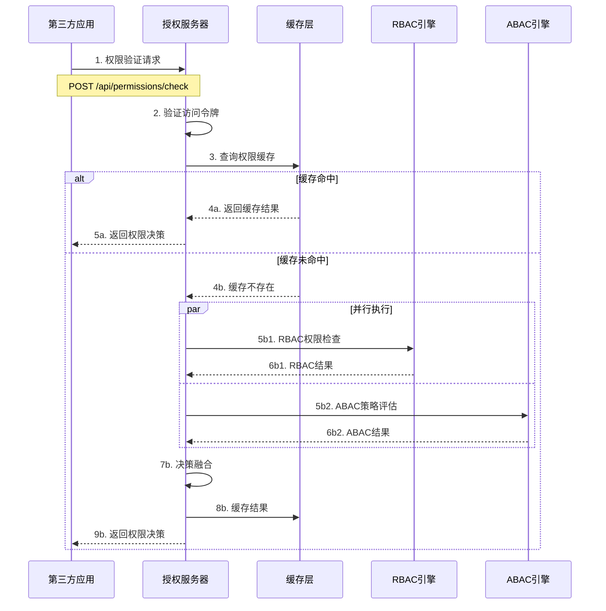
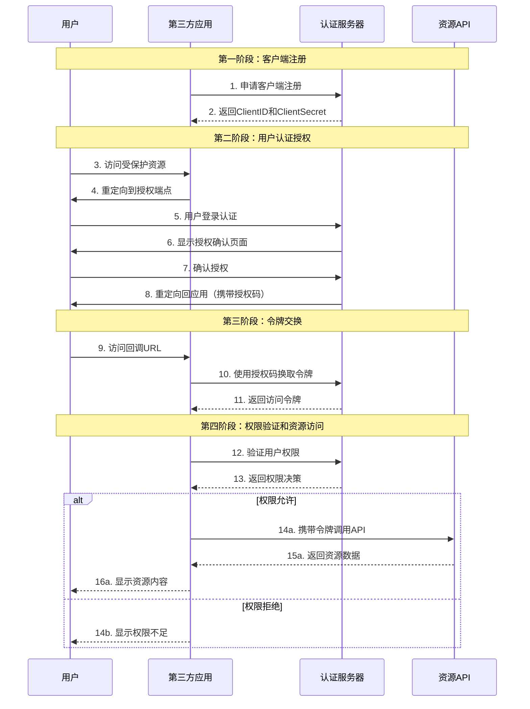

# OAuth2.1 + RBAC + ABAC 统一权限管理系统设计文档

## 1. 系统概述

### 1.1 系统目标
构建一个高性能、可扩展的OAuth2.1 + RBAC + ABAC统一权限管理系统，为企业提供标准化的SSO和细粒度权限控制服务。

### 1.2 核心特性
- **OAuth2.1标准实现**：完整的OAuth2.1和OpenID Connect支持
- **RBAC角色权限**：基于角色的访问控制，支持角色层次和继承
- **ABAC策略引擎**：基于属性的访问控制，支持复杂策略表达式
- **统一权限决策**：OAuth→RBAC→ABAC的分层验证架构
- **高性能缓存**：多级缓存策略，支持高并发访问
- **实时同步**：权限变更的实时同步和通知机制

### 1.3 系统边界
- **内部范围**：用户认证、权限授权、令牌管理、策略评估
- **外部接口**：OAuth2.1标准接口、权限验证API、管理接口
- **集成点**：第三方应用、企业SSO、外部身份提供者

---

## 2. 架构设计

### 2.1 整体架构

```
┌─────────────────────┐    ┌─────────────────────┐    ┌─────────────────────┐
│    客户端应用       │    │    第三方应用       │    │    管理控制台       │
└─────────────────────┘    └─────────────────────┘    └─────────────────────┘
             │                         │                         │
             └─────────────────────────┼─────────────────────────┘
                                      │
             ┌─────────────────────────┼─────────────────────────┐
             │                        │                         │
             │              API Gateway & Load Balancer         │
             │                                                  │
             └─────────────────────────┼─────────────────────────┘
                                      │
┌─────────────────────┬────────────────┼────────────────┬─────────────────────┐
│   认证服务          │   授权服务      │   用户管理     │   策略引擎          │
│ (OAuth2.1/OIDC)    │ (RBAC/ABAC)    │   服务         │   服务              │
│                    │                │                │                     │
│ • 用户认证         │ • 权限验证     │ • 用户管理     │ • 策略评估          │
│ • 令牌管理         │ • 角色检查     │ • 角色管理     │ • 规则引擎          │
│ • OIDC端点         │ • 策略执行     │ • 权限管理     │ • 属性计算          │
└─────────────────────┴────────────────┴────────────────┴─────────────────────┘
                                      │
             ┌─────────────────────────┼─────────────────────────┐
             │                    数据层                        │
             │                                                  │
             │  ┌─────────────┐  ┌─────────────┐  ┌───────────┐ │
             │  │   MySQL     │  │    Redis    │  │   MQ      │ │
             │  │  (主数据)   │  │   (缓存)    │  │ (消息队列) │ │
             │  └─────────────┘  └─────────────┘  └───────────┘ │
             └─────────────────────────────────────────────────┘
```

### 2.2 核心组件

#### 2.2.1 认证服务 (Authentication Service)
**职责**：
- OAuth2.1授权码流程处理
- OpenID Connect用户信息服务
- 访问令牌和刷新令牌管理
- 客户端注册和验证

**主要接口**：
- `/oauth/authorize` - 授权端点
- `/oauth/token` - 令牌端点
- `/oauth/userinfo` - 用户信息端点
- `/oauth/revoke` - 令牌撤销端点

#### 2.2.2 授权服务 (Authorization Service)
**职责**：
- 统一权限决策处理
- RBAC角色权限验证
- ABAC策略评估
- 权限结果缓存

**主要接口**：
- `/api/permissions/check` - 权限验证
- `/api/permissions/batch` - 批量权限验证
- `/api/authz/evaluate` - 授权评估

#### 2.2.3 用户管理服务 (User Management Service)
**职责**：
- 用户生命周期管理
- 角色分配和管理
- 权限分配和管理
- 用户属性管理

**主要接口**：
- `/admin/users` - 用户管理
- `/admin/roles` - 角色管理
- `/admin/permissions` - 权限管理

#### 2.2.4 策略引擎服务 (Policy Engine Service)
**职责**：
- ABAC策略定义和管理
- 策略表达式解析和执行
- 属性值计算和缓存
- 策略版本控制

**主要接口**：
- `/admin/policies` - 策略管理
- `/admin/attributes` - 属性管理
- `/api/policies/evaluate` - 策略评估

---

## 3. 权限决策流程

### 3.1 统一权限决策引擎 (UPDE)

权限验证采用四层验证架构：

```
请求 → OAuth2.1验证 → RBAC验证 → ABAC验证 → 最终决策
```

#### 3.1.1 第一层：OAuth2.1令牌验证
```typescript
interface OAuth2Validation {
  // 令牌有效性验证
  validateToken(token: string): Promise<TokenInfo>
  
  // 作用域验证
  validateScope(requiredScope: string, tokenScopes: string[]): boolean
  
  // 客户端权限验证
  validateClientPermission(clientId: string, resource: string): boolean
}
```

#### 3.1.2 第二层：RBAC角色权限验证
```typescript
interface RBACValidation {
  // 用户角色验证
  validateUserRoles(userId: string): Promise<Role[]>
  
  // 角色权限验证
  validateRolePermissions(roles: Role[], permission: string): boolean
  
  // 层次化角色检查
  checkRoleHierarchy(userRoles: Role[], requiredRole: Role): boolean
}
```

#### 3.1.3 第三层：ABAC策略评估
```typescript
interface ABACValidation {
  // 策略评估
  evaluatePolicy(policy: Policy, context: Context): Promise<PolicyResult>
  
  // 属性获取
  getAttributes(subject: string, resource: string, action: string): Promise<Attributes>
  
  // 表达式计算
  evaluateExpression(expression: string, attributes: Attributes): boolean
}
```

#### 3.1.4 第四层：最终决策融合
```typescript
interface DecisionEngine {
  // 决策融合
  fuseDecisions(oauth2: boolean, rbac: boolean, abac: boolean): AccessDecision
  
  // 决策权重
  calculateWeightedDecision(decisions: DecisionInput[]): AccessDecision
}
```

### 3.2 决策算法

```typescript
async function makeAccessDecision(request: AccessRequest): Promise<AccessDecision> {
  // 第一层：OAuth2.1验证
  const oauth2Result = await validateOAuth2Token(request.token)
  if (!oauth2Result.valid) {
    return { allow: false, reason: 'Invalid OAuth2 token' }
  }

  // 第二层：RBAC验证
  const rbacResult = await validateRBAC(request.userId, request.permission)
  
  // 第三层：ABAC验证
  const abacResult = await evaluateABAC(request.context, request.policies)
  
  // 第四层：决策融合
  const finalDecision = fuseDecisions({
    oauth2: oauth2Result.valid,
    rbac: rbacResult.allow,
    abac: abacResult.allow,
    context: request.context
  })
  
  return finalDecision
}
```

---

## 4. 数据模型设计

### 4.1 核心实体关系

```
User ──┐
       ├── UserRole ──── Role ──── RolePermission ──── Permission
       │                 │
       └── UserAttribute  └── RoleHierarchy
       
Client ──── ClientScope ──── Scope

Policy ──── PolicyVersion
  │
  └── PolicyRule ──── Attribute

AccessToken ──── RefreshToken
```

### 4.2 权限模型

#### 4.2.1 RBAC模型
```sql
-- 角色表
CREATE TABLE roles (
  id VARCHAR(36) PRIMARY KEY,
  name VARCHAR(100) NOT NULL UNIQUE,
  description TEXT,
  level INT DEFAULT 0,
  is_active BOOLEAN DEFAULT TRUE,
  created_at TIMESTAMP DEFAULT CURRENT_TIMESTAMP
);

-- 权限表
CREATE TABLE permissions (
  id VARCHAR(36) PRIMARY KEY,
  name VARCHAR(100) NOT NULL UNIQUE,
  resource VARCHAR(100) NOT NULL,
  action VARCHAR(50) NOT NULL,
  description TEXT,
  created_at TIMESTAMP DEFAULT CURRENT_TIMESTAMP
);

-- 角色权限关联表
CREATE TABLE role_permissions (
  role_id VARCHAR(36),
  permission_id VARCHAR(36),
  PRIMARY KEY (role_id, permission_id),
  FOREIGN KEY (role_id) REFERENCES roles(id) ON DELETE CASCADE,
  FOREIGN KEY (permission_id) REFERENCES permissions(id) ON DELETE CASCADE
);
```

#### 4.2.2 ABAC模型
```sql
-- 策略表
CREATE TABLE policies (
  id VARCHAR(36) PRIMARY KEY,
  name VARCHAR(100) NOT NULL UNIQUE,
  description TEXT,
  expression TEXT NOT NULL,
  effect ENUM('ALLOW', 'DENY') DEFAULT 'ALLOW',
  is_active BOOLEAN DEFAULT TRUE,
  created_at TIMESTAMP DEFAULT CURRENT_TIMESTAMP
);

-- 属性表
CREATE TABLE attributes (
  id VARCHAR(36) PRIMARY KEY,
  name VARCHAR(100) NOT NULL UNIQUE,
  data_type ENUM('STRING', 'NUMBER', 'BOOLEAN', 'JSON') DEFAULT 'STRING',
  category ENUM('USER', 'RESOURCE', 'ENVIRONMENT', 'ACTION') NOT NULL,
  is_required BOOLEAN DEFAULT FALSE,
  created_at TIMESTAMP DEFAULT CURRENT_TIMESTAMP
);
```

---

## 5. 性能优化设计

### 5.1 多级缓存架构

```
┌─────────────────────────────────────────────────────────────┐
│                    缓存层次架构                             │
├─────────────────────────────────────────────────────────────┤
│ L1: 应用内存缓存 (LRU, 1000个条目, TTL 5分钟)               │
│ • 热点权限结果缓存                                          │
│ • 用户角色缓存                                              │
│ • 策略评估结果缓存                                          │
├─────────────────────────────────────────────────────────────┤
│ L2: Redis分布式缓存 (TTL 30分钟)                            │
│ • 权限验证结果                                              │
│ • 用户会话信息                                              │
│ • OAuth2令牌信息                                            │
├─────────────────────────────────────────────────────────────┤
│ L3: 数据库查询缓存                                          │
│ • 查询结果集缓存                                            │
│ • 连接池优化                                                │
└─────────────────────────────────────────────────────────────┘
```

### 5.2 缓存策略

#### 5.2.1 权限缓存键设计
```typescript
// 权限验证结果缓存
const permissionKey = `perm:${userId}:${resource}:${action}:${hash(context)}`

// 角色权限缓存
const rolePermKey = `role_perm:${roleId}:${hash(permissions)}`

// ABAC策略评估缓存
const policyKey = `policy:${policyId}:${hash(attributes)}`
```

#### 5.2.2 缓存失效策略
```typescript
interface CacheInvalidation {
  // 用户权限变更时的级联失效
  invalidateUserPermissions(userId: string): Promise<void>
  
  // 角色权限变更时的级联失效
  invalidateRolePermissions(roleId: string): Promise<void>
  
  // 策略变更时的精准失效
  invalidatePolicyCache(policyId: string): Promise<void>
}
```

### 5.3 并发优化

#### 5.3.1 权限验证并行处理
```typescript
async function parallelPermissionCheck(request: AccessRequest): Promise<AccessDecision> {
  // RBAC和ABAC并行执行
  const [rbacResult, abacResult] = await Promise.all([
    checkRBACPermission(request),
    evaluateABACPolicy(request)
  ])
  
  return fuseDecisions(rbacResult, abacResult)
}
```

#### 5.3.2 批量权限验证
```typescript
interface BatchPermissionCheck {
  // 批量权限验证接口
  checkPermissions(requests: AccessRequest[]): Promise<AccessDecision[]>
  
  // 权限预加载
  preloadPermissions(userId: string): Promise<void>
}
```

---

## 6. 安全设计

### 6.1 令牌安全

#### 6.1.1 访问令牌设计
```typescript
interface AccessTokenPayload {
  sub: string              // 用户ID
  aud: string              // 客户端ID
  scope: string[]          // 作用域列表
  iat: number              // 签发时间
  exp: number              // 过期时间
  jti: string              // 令牌ID
  
  // 扩展字段
  roles?: string[]         // 用户角色
  permissions?: string[]   // 权限列表
  device_id?: string       // 设备ID
}
```

#### 6.1.2 令牌安全措施
- **短期有效期**：访问令牌15分钟，刷新令牌30天
- **令牌轮换**：刷新令牌使用后立即失效并生成新的
- **令牌撤销**：支持实时令牌撤销和黑名单机制
- **设备绑定**：令牌与设备指纹绑定防止跨设备使用

### 6.2 权限安全

#### 6.2.1 最小权限原则
- **角色权限分离**：角色和权限分离设计，支持细粒度控制
- **权限继承控制**：层次化角色的权限继承限制
- **临时权限**：支持临时权限授予和自动回收
- **权限审计**：完整的权限变更审计日志

#### 6.2.2 策略安全
- **策略沙箱**：ABAC策略表达式在安全沙箱中执行
- **策略验证**：策略语法和逻辑的静态分析
- **策略影响分析**：策略变更的影响范围分析
- **策略版本控制**：策略的版本管理和回滚机制

---

## 7. 监控和观测

### 7.1 关键指标

#### 7.1.1 性能指标
- **响应时间**：权限验证、认证、令牌验证的P50/P95/P99
- **吞吐量**：每秒处理的权限验证请求数
- **缓存性能**：各级缓存的命中率和失效率
- **并发数**：同时在线用户数和并发请求数

#### 7.1.2 业务指标
- **认证成功率**：用户认证的成功率
- **权限验证准确率**：权限验证结果的准确性
- **错误率**：各类错误的发生率和分布
- **用户活跃度**：用户登录和访问的活跃度统计

#### 7.1.3 安全指标
- **异常登录**：异常登录行为的检测和统计
- **权限异常**：权限异常访问的检测和告警
- **令牌异常**：令牌异常使用的监控
- **安全事件**：各类安全事件的统计和分析

### 7.2 监控架构

```
应用服务 → Metrics收集 → Prometheus → Grafana Dashboard
    ↓           ↓              ↓
 日志收集 → ELK Stack → 日志分析和告警
    ↓
 链路追踪 → Jaeger → 分布式调用分析
```

---

## 8. 第三方应用集成设计

### 8.1 集成架构概览

```
┌─────────────────────┐    ┌─────────────────────┐    ┌─────────────────────┐
│   第三方应用A       │    │   第三方应用B       │    │   第三方应用C       │
│  (Web Application)  │    │  (Mobile App)       │    │  (API Service)      │
└─────────────────────┘    └─────────────────────┘    └─────────────────────┘
            │                         │                         │
            │                         │                         │
            ▼                         ▼                         ▼
┌─────────────────────────────────────────────────────────────────────────────┐
│                       OAuth2.1 授权服务器                                   │
│                                                                             │
│  ┌─────────────────┐  ┌─────────────────┐  ┌─────────────────┐            │
│  │  /oauth/authorize│  │  /oauth/token   │  │ /oauth/userinfo │            │
│  │   授权端点       │  │   令牌端点      │  │  用户信息端点   │            │
│  └─────────────────┘  └─────────────────┘  └─────────────────┘            │
│                                                                             │
│  ┌─────────────────┐  ┌─────────────────┐  ┌─────────────────┐            │
│  │客户端管理服务    │  │权限验证服务     │  │令牌管理服务     │            │
│  └─────────────────┘  └─────────────────┘  └─────────────────┘            │
└─────────────────────────────────────────────────────────────────────────────┘
                                    │
                                    ▼
                        ┌─────────────────────┐
                        │   统一权限决策引擎   │
                        │   (RBAC + ABAC)    │
                        └─────────────────────┘
```

### 8.2 客户端注册流程

#### 8.2.1 注册时序图



#### 8.2.2 客户端配置参数

```typescript
interface ClientRegistration {
  // 基本信息
  clientName: string           // 应用名称
  clientDescription?: string   // 应用描述
  clientType: 'WEB_APP' | 'MOBILE_APP' | 'API_SERVICE' | 'SPA'
  
  // OAuth2.1配置
  redirectUris: string[]       // 回调URL列表
  allowedScopes: string[]      // 允许的作用域
  grantTypes: GrantType[]      // 支持的授权类型
  
  // 安全配置
  requirePkce: boolean         // 是否强制PKCE
  accessTokenTtl: number       // 访问令牌有效期（秒）
  refreshTokenTtl: number      // 刷新令牌有效期（秒）
  
  // 权限配置
  defaultRoles?: string[]      // 默认角色
  allowedResources?: string[]  // 可访问资源
}
```

### 8.3 OAuth2.1认证流程

#### 8.3.1 授权码流程时序图



#### 8.3.2 PKCE增强安全

```typescript
// 第三方应用端PKCE实现
class PKCEHelper {
  // 生成code_verifier
  generateCodeVerifier(): string {
    const array = new Uint8Array(32)
    crypto.getRandomValues(array)
    return base64UrlEncode(array)
  }
  
  // 生成code_challenge
  async generateCodeChallenge(verifier: string): Promise<string> {
    const encoder = new TextEncoder()
    const data = encoder.encode(verifier)
    const digest = await crypto.subtle.digest('SHA-256', data)
    return base64UrlEncode(new Uint8Array(digest))
  }
  
  // 构建授权URL
  buildAuthorizationUrl(params: {
    clientId: string
    redirectUri: string
    scope: string
    state: string
  }): { url: string, verifier: string } {
    const verifier = this.generateCodeVerifier()
    const challenge = await this.generateCodeChallenge(verifier)
    
    const url = `/oauth/authorize?` +
      `response_type=code&` +
      `client_id=${params.clientId}&` +
      `redirect_uri=${encodeURIComponent(params.redirectUri)}&` +
      `scope=${encodeURIComponent(params.scope)}&` +
      `state=${params.state}&` +
      `code_challenge=${challenge}&` +
      `code_challenge_method=S256`
    
    return { url, verifier }
  }
}
```

### 8.4 权限验证集成

#### 8.4.1 权限验证时序图



#### 8.4.2 权限验证API规范

```typescript
// 权限验证请求
interface PermissionCheckRequest {
  resource: string      // 资源标识，如 "document:doc123"
  action: string        // 操作类型，如 "read", "write", "delete"
  context?: {           // 上下文信息
    ip?: string
    userAgent?: string
    timestamp?: string
    department?: string
    [key: string]: any
  }
}

// 权限验证响应
interface PermissionCheckResponse {
  allow: boolean        // 是否允许访问
  reason?: string       // 拒绝原因
  ttl?: number          // 缓存有效期（秒）
  metadata?: {          // 元数据
    userId: string
    roles: string[]
    appliedPolicies: string[]
    evaluationTime: number
  }
}

// 批量权限验证
interface BatchPermissionRequest {
  requests: PermissionCheckRequest[]
}

interface BatchPermissionResponse {
  results: PermissionCheckResponse[]
  summary: {
    total: number
    allowed: number
    denied: number
    evaluationTime: number
  }
}
```

### 8.5 错误处理和状态码

#### 8.5.1 OAuth2.1标准错误

```typescript
interface OAuth2Error {
  error: string                    // 错误代码
  error_description?: string       // 错误描述
  error_uri?: string              // 错误详情链接
  state?: string                  // 状态参数（如果提供）
}

// 常见错误代码
const OAuth2ErrorCodes = {
  // 授权端点错误
  INVALID_REQUEST: 'invalid_request',
  UNAUTHORIZED_CLIENT: 'unauthorized_client',
  ACCESS_DENIED: 'access_denied',
  UNSUPPORTED_RESPONSE_TYPE: 'unsupported_response_type',
  INVALID_SCOPE: 'invalid_scope',
  SERVER_ERROR: 'server_error',
  TEMPORARILY_UNAVAILABLE: 'temporarily_unavailable',
  
  // 令牌端点错误
  INVALID_CLIENT: 'invalid_client',
  INVALID_GRANT: 'invalid_grant',
  UNSUPPORTED_GRANT_TYPE: 'unsupported_grant_type',
  
  // 资源服务器错误
  INVALID_TOKEN: 'invalid_token',
  INSUFFICIENT_SCOPE: 'insufficient_scope'
}
```

#### 8.5.2 权限验证错误

```typescript
interface AuthorizationError {
  error: string
  error_description: string
  error_code: number
  timestamp: string
  trace_id: string
}

// 权限验证错误代码
const AuthzErrorCodes = {
  INVALID_TOKEN: { code: 4001, message: 'Invalid or expired access token' },
  INSUFFICIENT_SCOPE: { code: 4003, message: 'Insufficient scope for the requested resource' },
  ACCESS_DENIED: { code: 4003, message: 'Access denied by policy' },
  RESOURCE_NOT_FOUND: { code: 4004, message: 'Requested resource not found' },
  RATE_LIMITED: { code: 4029, message: 'Rate limit exceeded' },
  SERVER_ERROR: { code: 5000, message: 'Internal server error' }
}
```

### 8.6 SDK集成示例

#### 8.6.1 JavaScript SDK

```typescript
// OAuth2.1客户端SDK
class OAuth2Client {
  constructor(
    private clientId: string,
    private clientSecret: string,
    private baseUrl: string
  ) {}
  
  // 获取授权URL
  async getAuthorizationUrl(params: {
    redirectUri: string
    scope: string
    state?: string
  }): Promise<{ url: string, verifier: string }> {
    const pkce = new PKCEHelper()
    const verifier = pkce.generateCodeVerifier()
    const challenge = await pkce.generateCodeChallenge(verifier)
    
    const url = `${this.baseUrl}/oauth/authorize?` +
      `response_type=code&` +
      `client_id=${this.clientId}&` +
      `redirect_uri=${encodeURIComponent(params.redirectUri)}&` +
      `scope=${encodeURIComponent(params.scope)}&` +
      `state=${params.state || ''}&` +
      `code_challenge=${challenge}&` +
      `code_challenge_method=S256`
    
    return { url, verifier }
  }
  
  // 交换访问令牌
  async exchangeToken(params: {
    code: string
    redirectUri: string
    verifier: string
  }): Promise<TokenResponse> {
    const response = await fetch(`${this.baseUrl}/oauth/token`, {
      method: 'POST',
      headers: {
        'Content-Type': 'application/x-www-form-urlencoded',
        'Authorization': `Basic ${btoa(`${this.clientId}:${this.clientSecret}`)}`
      },
      body: new URLSearchParams({
        grant_type: 'authorization_code',
        code: params.code,
        redirect_uri: params.redirectUri,
        code_verifier: params.verifier
      })
    })
    
    if (!response.ok) {
      throw new OAuth2Error(await response.json())
    }
    
    return await response.json()
  }
  
  // 验证权限
  async checkPermission(
    accessToken: string,
    resource: string,
    action: string,
    context?: Record<string, any>
  ): Promise<PermissionCheckResponse> {
    const response = await fetch(`${this.baseUrl}/api/permissions/check`, {
      method: 'POST',
      headers: {
        'Authorization': `Bearer ${accessToken}`,
        'Content-Type': 'application/json'
      },
      body: JSON.stringify({
        resource,
        action,
        context
      })
    })
    
    if (!response.ok) {
      throw new AuthorizationError(await response.json())
    }
    
    return await response.json()
  }
}
```

#### 8.6.2 使用示例

```typescript
// 初始化客户端
const oauth2Client = new OAuth2Client(
  'your-client-id',
  'your-client-secret',
  'https://auth.example.com'
)

// 1. 获取授权URL
const { url, verifier } = await oauth2Client.getAuthorizationUrl({
  redirectUri: 'https://yourapp.com/callback',
  scope: 'openid profile email read write',
  state: 'random-state'
})

// 2. 重定向用户到授权URL
window.location.href = url

// 3. 在回调处理中交换令牌
const urlParams = new URLSearchParams(window.location.search)
const code = urlParams.get('code')
const state = urlParams.get('state')

if (code) {
  const tokens = await oauth2Client.exchangeToken({
    code,
    redirectUri: 'https://yourapp.com/callback',
    verifier // 从步骤1保存的verifier
  })
  
  // 保存访问令牌
  localStorage.setItem('access_token', tokens.access_token)
  localStorage.setItem('refresh_token', tokens.refresh_token)
}

// 4. 使用访问令牌验证权限
const accessToken = localStorage.getItem('access_token')
const permission = await oauth2Client.checkPermission(
  accessToken,
  'document:doc123',
  'read',
  {
    ip: '192.168.1.100',
    department: 'engineering'
  }
)

if (permission.allow) {
  // 允许访问，显示资源
  console.log('Access granted')
} else {
  // 拒绝访问，显示错误
  console.log('Access denied:', permission.reason)
}
```

### 8.7 集成最佳实践

#### 8.7.1 安全建议
- **使用HTTPS**：所有OAuth2.1通信必须使用HTTPS
- **验证State参数**：防止CSRF攻击
- **实施PKCE**：对于公共客户端强制使用PKCE
- **令牌安全存储**：使用安全的令牌存储机制
- **定期令牌轮换**：实施访问令牌和刷新令牌的定期轮换

#### 8.7.2 性能优化
- **令牌缓存**：在客户端合理缓存令牌信息
- **权限预加载**：预加载用户常用权限
- **批量验证**：使用批量API减少网络请求
- **缓存权限结果**：在允许的TTL内缓存权限验证结果

#### 8.7.3 错误处理
- **优雅降级**：权限服务不可用时的降级策略
- **重试机制**：网络错误的指数退避重试
- **错误日志**：完整的错误日志记录和监控
- **用户体验**：友好的错误提示和处理流程

### 8.8 完整集成流程指南

#### 8.8.1 快速集成步骤

**步骤1：申请客户端凭证**
```bash
# 1. 联系系统管理员注册应用
# 2. 获得以下信息：
CLIENT_ID="your-client-id"
CLIENT_SECRET="your-client-secret"
AUTH_SERVER_URL="https://auth.example.com"
REDIRECT_URI="https://yourapp.com/callback"
```

**步骤2：实现OAuth2.1授权流程**
```typescript
// 生成授权URL
const authUrl = `${AUTH_SERVER_URL}/oauth/authorize?` +
  `response_type=code&` +
  `client_id=${CLIENT_ID}&` +
  `redirect_uri=${encodeURIComponent(REDIRECT_URI)}&` +
  `scope=openid%20profile%20email%20read%20write&` +
  `state=random-state-string&` +
  `code_challenge=${codeChallenge}&` +
  `code_challenge_method=S256`

// 重定向用户到授权页面
window.location.href = authUrl
```

**步骤3：处理授权回调**
```typescript
// 在回调页面解析授权码
const urlParams = new URLSearchParams(window.location.search)
const code = urlParams.get('code')
const state = urlParams.get('state')

// 验证state参数防止CSRF
if (state !== savedState) {
  throw new Error('Invalid state parameter')
}

// 交换访问令牌
const tokenResponse = await fetch(`${AUTH_SERVER_URL}/oauth/token`, {
  method: 'POST',
  headers: {
    'Content-Type': 'application/x-www-form-urlencoded',
    'Authorization': `Basic ${btoa(`${CLIENT_ID}:${CLIENT_SECRET}`)}`
  },
  body: new URLSearchParams({
    grant_type: 'authorization_code',
    code: code,
    redirect_uri: REDIRECT_URI,
    code_verifier: codeVerifier
  })
})

const tokens = await tokenResponse.json()
// 保存访问令牌
localStorage.setItem('access_token', tokens.access_token)
```

**步骤4：验证用户权限**
```typescript
// 验证具体资源访问权限
async function checkPermission(resource: string, action: string) {
  const accessToken = localStorage.getItem('access_token')
  
  const response = await fetch(`${AUTH_SERVER_URL}/api/permissions/check`, {
    method: 'POST',
    headers: {
      'Authorization': `Bearer ${accessToken}`,
      'Content-Type': 'application/json'
    },
    body: JSON.stringify({
      resource: resource,  // 如 "document:doc123"
      action: action,      // 如 "read", "write"
      context: {
        ip: await getUserIP(),
        userAgent: navigator.userAgent,
        timestamp: new Date().toISOString()
      }
    })
  })
  
  const result = await response.json()
  return result.allow
}

// 在访问受保护资源前检查权限
if (await checkPermission('document:doc123', 'read')) {
  // 显示文档内容
  showDocument()
} else {
  // 显示权限不足提示
  showAccessDenied()
}
```

#### 8.8.2 完整集成时序图



#### 8.8.3 错误处理示例

```typescript
class OAuth2IntegrationError extends Error {
  constructor(
    public code: string,
    public description: string,
    public statusCode: number = 400
  ) {
    super(description)
  }
}

// 统一错误处理函数
async function handleOAuth2Request<T>(
  requestFn: () => Promise<Response>
): Promise<T> {
  try {
    const response = await requestFn()
    
    if (!response.ok) {
      const error = await response.json()
      throw new OAuth2IntegrationError(
        error.error || 'unknown_error',
        error.error_description || 'Unknown error occurred',
        response.status
      )
    }
    
    return await response.json()
  } catch (error) {
    if (error instanceof OAuth2IntegrationError) {
      throw error
    }
    
    throw new OAuth2IntegrationError(
      'network_error',
      'Network request failed',
      500
    )
  }
}

// 使用示例
try {
  const tokens = await handleOAuth2Request(() =>
    fetch(`${AUTH_SERVER_URL}/oauth/token`, {
      method: 'POST',
      headers: { 'Content-Type': 'application/x-www-form-urlencoded' },
      body: tokenRequestBody
    })
  )
} catch (error) {
  if (error instanceof OAuth2IntegrationError) {
    switch (error.code) {
      case 'invalid_client':
        console.error('客户端认证失败，请检查ClientID和ClientSecret')
        break
      case 'invalid_grant':
        console.error('授权码无效或已过期，请重新授权')
        break
      case 'invalid_request':
        console.error('请求参数错误：', error.description)
        break
      default:
        console.error('OAuth2错误：', error.description)
    }
  }
}
```

#### 8.8.4 生产环境部署建议

**安全配置清单：**
- ✅ 使用HTTPS协议进行所有通信
- ✅ 实施PKCE防止授权码拦截攻击
- ✅ 验证state参数防止CSRF攻击
- ✅ 使用安全的令牌存储方案（避免localStorage存储敏感信息）
- ✅ 实施令牌刷新机制
- ✅ 配置合理的令牌过期时间
- ✅ 实施请求频率限制
- ✅ 记录和监控安全事件

**性能优化建议：**
- 🚀 缓存用户权限信息（遵循TTL）
- 🚀 使用批量权限验证API减少请求次数
- 🚀 实施客户端令牌预刷新
- 🚀 优化网络请求（连接池、HTTP/2）
- 🚀 监控API响应时间和错误率

**监控和日志：**
```typescript
// 集成监控和日志记录
class OAuth2Monitor {
  static logEvent(event: string, data: any) {
    console.log(`[OAuth2] ${event}:`, {
      timestamp: new Date().toISOString(),
      ...data
    })
  }
  
  static trackPerformance(operation: string, startTime: number) {
    const duration = Date.now() - startTime
    this.logEvent('performance', {
      operation,
      duration: `${duration}ms`
    })
  }
}

// 使用示例
const startTime = Date.now()
try {
  const result = await checkPermission('document:123', 'read')
  OAuth2Monitor.trackPerformance('permission_check', startTime)
  OAuth2Monitor.logEvent('permission_granted', { resource: 'document:123' })
} catch (error) {
  OAuth2Monitor.logEvent('permission_error', { error: error.message })
}
```

---

## 9. 开发规范

### 9.1 API设计规范

#### 9.1.1 RESTful API
```typescript
// 权限验证API
POST /api/permissions/check
{
  "userId": "user123",
  "resource": "document:doc123",
  "action": "read",
  "context": {
    "ip": "192.168.1.100",
    "userAgent": "Mozilla/5.0...",
    "time": "2024-01-01T10:00:00Z"
  }
}

// 批量权限验证API
POST /api/permissions/batch
{
  "requests": [
    {
      "userId": "user123",
      "resource": "document:doc123",
      "action": "read"
    },
    {
      "userId": "user123",
      "resource": "document:doc456",
      "action": "write"
    }
  ]
}
```

#### 9.1.2 错误处理规范
```typescript
interface APIError {
  error: string           // 错误代码
  error_description: string  // 错误描述
  error_uri?: string      // 错误详情链接
  timestamp: string       // 错误时间
  trace_id: string        // 追踪ID
}

// OAuth2.1标准错误
{
  "error": "invalid_token",
  "error_description": "The access token provided is expired, revoked, malformed, or invalid",
  "timestamp": "2024-01-01T10:00:00Z",
  "trace_id": "abc123"
}
```

### 9.2 代码质量规范

#### 9.2.1 测试覆盖率要求
- **单元测试覆盖率**：> 80%
- **集成测试覆盖率**：> 70%
- **API测试覆盖率**：100%
- **性能测试**：关键接口性能基准测试

#### 9.2.2 代码审查清单
- [ ] OAuth2.1标准合规性检查
- [ ] 安全漏洞检查 (SAST/DAST)
- [ ] 性能影响评估
- [ ] 错误处理完整性
- [ ] 日志记录规范性
- [ ] 文档更新完整性

---

## 10. 总结

本设计文档描述了一个现代化的OAuth2.1 + RBAC + ABAC统一权限管理系统的完整架构。系统采用微服务架构，通过分层权限验证、多级缓存优化、实时同步机制等技术手段，实现了高性能、高可用、高安全性的权限管理服务。

### 10.1 核心优势
- **标准合规**：严格遵循OAuth2.1和OpenID Connect标准
- **架构合理**：清晰的分层架构和微服务设计
- **性能优化**：多级缓存和并发优化设计
- **安全可靠**：全面的安全机制和防护措施
- **可扩展性**：良好的水平扩展能力和模块化设计

### 10.2 技术创新
- **统一权限决策引擎**：OAuth→RBAC→ABAC的分层验证架构
- **多级缓存策略**：基于访问模式的自适应缓存机制
- **实时权限同步**：事件驱动的权限变更传播机制
- **高性能计算引擎**：并行权限验证和批量处理优化 